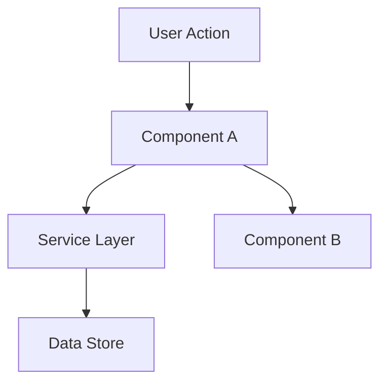

# Track C — Surface deck (usefulness)

> run: 2026-08-19-full
> generated: 2026-08-19T13:39:59.475097+00:00
> model note: usefulness is model-sensitive; record judge model ids in score files.

## Rubric (score every surface including S9xx)

Counterfactual: if this surface were deleted, and the agent could still list the repo and open 1–2 canonical examples, would behavior change?

| Overall class | Meaning |
|---------------|---------|
| KEEP-CORE | Majority of substance is BEHAVIOR-CHANGING (wrong file placement, wrong API, skipped gates without it) |
| MIXED | Meaningful keep-core core + large slimable theory/examples/overlap |
| SLIM | Mostly THEORY, REPO-DEMONSTRATED, or OVERLAP — compress or delete body |
| ROUTING-ONLY | Trigger/purpose/pointers only; keep short |
| UNCLEAR | Insufficient evidence (use when model prior is doing the work) |

Section tags to use inside Keep-core / Slim columns: `BEHAVIOR-CHANGING`, `REPO-DEMONSTRATED`, `THEORY`, `OVERLAP`, `ROUTING-ONLY`.

Hard rules:
- Evidence-or-zero: cite paths (harness or example code). No README as evidence.
- OVERLAP must cite the other harness surface path.
- REPO-DEMONSTRATED must cite a concrete example file an agent would open (score Evidence only — not a path to paste into the skill when trimming).
- Default UNCLEAR when unsure. Do not mark SLIM on methodology skills without evidence.
- Score every ID including S9xx with the same rubric.

## Surfaces (31)

### S001 | T0 | AGENTS.md

- path: `AGENTS.md`
- chars: 9567
- outline:
- AGENTS.md — Diagnos Data App
  - 1. Project Overview
  - 2. Tech Stack
  - 3. Repository Layout
  - 4. The Harness Contract
    - 4.1 Public API (`harness/index.ts`)
    - 4.2 Pipeline stages (`harness/core/pipeline.ts`)
    - 4.3 Data flow
  - 5. Domain Model (DAMA-DMBOK)
  - 6. Ollama Cloud Integration
    - Environment variables
  - 7. Conventions
    - Code style
    - Harness purity
    - Validation
    - Errors
    - Testing
    - Commands
  - 8. Working with OpenCode
  - 9. Definition of Done

```markdown
# AGENTS.md — Diagnos Data App

This file is the **system prompt** for any code agent (OpenCode, Claude Code, Cursor, etc.) working on this repository. Read it fully before making changes. It defines the product, the architecture, the harness contract, and the conventions every agent must follow.

---

## 1. Project Overview

**Diagnos Data App** is a Next.js web application that runs a **data maturity diagnostic** for companies.

The product flow is:

1. **Chatbot questionnaire** — The user answers **8 to 12 questions** presented as a conversational chat form. Questions assess data management & governance maturity, modeled on the **DAMA-DMBOK** framework and other leading data governance/management frameworks.
2. **Harness processing** — The answers are sent to a well-defined **agent harness** that orchestrates an LLM evaluation.
3. **LLM inference** — The harness calls **Ollama Cloud** via its HTTP API to run the evaluation.
4. **PDF report** — The harness produces a **PDF report** with diagnostic analysis, charts, metrics, and an overall data maturity assessment for the company.

---

## 2. Tech Stack

| Concern | Choice |
| --- | --- |
| Framework | **Next.js** (App Router) |
| Language | **TypeScript** (strict) |
| UI | React + Tailwind CSS |
| Chat UI | Custom conversational form (no heavy chatbot SDK unless justified) |
| LLM provider | **Ollama Cloud** (HTTP API) |
| Report generation | PDF (server-side) via **@react-pdf/renderer** |
| Charts | SVG rendered into the PDF via `@react-pdf/renderer` |
| Database + Storage | **Supabase** (PostgreSQL gerenciado, `pgvector` para futura RAG) |
| Email | **Resend** (envio do PDF ao time comercial) |
| Auth | **Token de acesso único** (hash SHA-256, consumido no primeiro uso) |

> **Note:** The PDF library (`@react-pdf/renderer`) is React-based. To preserve harness purity, the concrete PDF implementation lives in `src/lib/report/` and is injected into the pipeline via the `ReportGenerator` interface — `harness/**` never imports React/Next. See `docs/decisions/`.

---

## 3. Repository Layout

```
diagnos-data-app/
├── AGENTS.md                     # This file — agent system prompt
├── .opencode/                    # OpenCode harness configuration
│   ├── opencode.json             # OpenCode project config
│   └── command/init.md           # /init command (scaffold + bootstrap)
├── harness/                      # The agent harness (framework-agnostic core)
│   ├── README.md                 # Harness documentation
│   ├── config/
│   │   ├── questionnaire.ts      # Question definitions (8–12 items)
│   │   └── maturity-model.ts     # DAMA-DMBOK scoring model & levels
│   ├── prompts/
│   │   ├── system.ts             # System prompt for the evaluator LLM
│   │   └── user.ts               # User prompt builder (injects answers)
│   ├── core/
│   │   ├── types.ts              # Shared domain types (Question, Answer, Result…)
│   │   ├── schema.ts             # Zod schemas for validation
│   │   ├── pipeline.ts           # Orchestrates: validate → evaluate → report
│   │   └── errors.ts             # Typed error classes
│   ├── providers/
│   │   └── ollama/
│   │       ├── client.ts         # Ollama Cloud HTTP client
│   │       └── types.ts          # Ollama API request/response types
│   ├── evaluator/
│   │   └── evaluator.ts          # Runs the LLM evaluation, parses structured output
│   ├── report/
│   │   ├── generator.ts          # Builds the PDF report
│   │   └── charts.ts             # Chart data preparation
│   └── index.ts                  # Public harness API (single entry point)
├── src/                          # Next.js application
│   ├── app/
│   │   ├── page.tsx              # Landing / start screen
│   │   ├── access/               # Token validation route
│   │   ├── chat/                # Chatbot questionnaire route
│   │   │   └── page.tsx
│   │   └── api/
│   │       └── evaluate/route.ts # POST answers → harness → report
│   ├── components/               # React components (chat, question, report)
│   ├── lib/
│   │   ├── report/               # Concrete PDF generator (@react-pdf/renderer)
│   │   ├── email/                # Resend email sending
│   │   └── supabase/             # Supabase client + data access
│   └── styles/
├── docs/
│   ├── decisions/                # ADRs (Architecture Decision Records)
│   └── architecture.md           # High-level architecture notes
├── .env.example                  # Environment variable template
├── package.json
└── tsconfig.json
```

---

## 4. The Harness Contract

The **harness** is the heart of the system. It is **framework-agnostic** (pure TypeScript, no React/Next imports) so it can be tested and reused independently. The Next.js app only calls the harness through its public API.

### 4.1 Public API (`harness/index.ts`)

```ts
export async function runDiagnostic(input: DiagnosticInput): Promise<DiagnosticResult>
```

- `DiagnosticInput` — validated questionnaire answers + company context.
- `DiagnosticResult` — the full evaluation: per-dimension scores, overall maturity level, narrative analysis, and chart data.

### 4.2 Pipeline stages (`harness/core/pipeline.ts`)

1. **Validate** — validate `DiagnosticInput` against Zod schemas.
2. **Evaluate** — call the evaluator (LLM via Ollama) to score dimensions and produce narrative.
3. **Report** — generate the PDF report from the structured result.

### 4.3 Data flow

```
Next.js (src/app/api/evaluate/route.ts)
        │  POST { answers, company }
        ▼
harness.runDiagnostic(input)
        │
        ├─ core/pipeline.ts  (validate → evaluate → report)
        │        │
        │        ├─ providers/ollama/client.ts  (HTTP → Ollama Cloud)
        │        │
        │        └─ report/generator.ts  (PDF)
        ▼
DiagnosticResult  →  PDF file + JSON payload returned to the client
```

---

## 5. Domain Model (DAMA-DMBOK)

Maturity is assessed across **DAMA-DMBOK knowledge areas** (dimensions). The model lives in `harness/config/maturity-model.ts`.

- **Dimensions** (subset of DAMA-DMBOK knowledge areas): Data Governance, Data Architecture, Data Quality, Data Modeling & Design, Data Storage & Operations, Data Security, Data Integration & Interoperability, Data & Analytics, Metadata, Reference & Master Data.
- **Maturity levels** (0–5, CMMI-style):
  - `0` Non-existent
  - `1` Initial / Ad hoc
  - `2` Repeatable
  - `3` Defined
  - `4` Managed
  - `5` Optimized
- **Overall maturity** = weighted aggregate of dimension scores.

The questionnaire (`harness/config/questionnaire.ts`) maps each question to a dimension and a weight. Keep the question count between **8 and 12**.

---

## 6. Ollama Cloud Integration

- Provider client: `harness/providers/ollama/client.ts`.
- Base URL and model are configured via environment variables (see `.env.example`).
- The client must:
  - Send the system + user prompts (from `harness/prompts/`).
  - Request **structured JSON output** (the evaluator parses it).
  - Handle timeouts, retries, and non-2xx responses with typed errors.
- **Never hardcode secrets.** Read them from `process.env`.

### Environment variables

```
OLLAMA_BASE_URL=https://ollama.example.com/api
OLLAMA_MODEL=your-model-name
OLLAMA_API_KEY=your-api-key
```

---

## 7. Conventions

### Code style
- **TypeScript strict mode.** No `any` unless explicitly justified.
- **No comments unless they explain *why*.** Prefer self-documenting code.
- Use **named exports** for functions/types; default exports only for React pages/components.
- Follow existing patterns in the file you are editing.

### Harness purity
- `harness/**` must **not** import from `src/**` or any React/Next module.
- All I/O (HTTP, filesystem, PDF) happens inside the harness's own modules, behind clear boundaries.
- The concrete PDF generator (`@react-pdf/renderer`) lives in `src/lib/report/` and is injected into the pipeline via the `ReportGenerator` interface (`PipelineDeps`). `harness/**` only defines the interface and contract.

### Validation
- Use **Zod** for all runtime validation (request bodies, LLM output, config).
- Validate at the boundary: API route → harness input; LLM output → structured result.

### Errors
- Use the typed errors in `harness/core/errors.ts` (`ValidationError`, `ProviderError`, `ReportError`).
- Map errors to proper HTTP status codes in the API route.

### Testing
- Unit tests for the harness core (pipeline, evaluator parsing, scoring).
- Mock the Ollama client in tests — never hit the real API.
- Run tests with the project's test runner (add one if not present; document it).

### Commands
- `npm run dev` — start Next.js dev server.
- `npm run build` — production build.
- `npm run lint` — lint (add ESLint config if missing).
- `npm run test` — run tests (add a runner if missing).

---

## 8. Working with OpenCode

- OpenCode config lives in `.opencode/opencode.json`.
- The `/init` command (`.opencode/command/init.md`) scaffolds the harness and bootstraps the project. Run it when starting fresh.
- After editing any `.opencode/**` file, **restart OpenCode** for changes to take effect.

---

## 9. Definition of Done

A task is done when:
- [ ] Code follows the conventions in section 7.
- [ ] Harness purity is preserved (`harness/**` has no app imports).
- [ ] Inputs and LLM output are validated with Zod.
- [ ] Errors are typed and mapped to HTTP status codes.
- [ ] Tests pass (if tests exist for the touched area).
- [ ] `npm run lint` and `npm run build` pass.
- [ ] No secrets are committed; env vars are documented in `.env.example`.
```

### S002 | T1 | create-adr

- path: `.opencode/skills/create-adr/SKILL.md`
- chars: 13840
- outline:
- ADR Creator
  - When to Use This Skill
  - ADR vs RFC — Critical Distinction
  - Language Adaptation
  - ADR Format Selection
  - Interactive Workflow
    - Step 1: Gather Context (if not provided)
    - Step 2: Validate Mandatory Fields
    - Step 3: Assign ADR Number
    - Step 4: Generate the ADR
    - Step 5: Offer File Placement
  - Document Templates
    - MADR Format (Default)
- ADR-{NNN}: {Title}
  - Context and Problem Statement
  - Decision Drivers
  - Considered Options
  - Decision Outcome
    - Positive Consequences
    - Negative Consequences
  - Pros and Cons of the Options
    - {Option A} ✅ Chosen
    - {Option B}
    - {Option C}
  - Links
    - Nygard Format (Minimal)
- ADR-{NNN}: {Title}
  - Status
  - Context
  - Decision
  - Consequences
    - Y-Statement Format (Compact)
- ADR-{NNN}: {Title}
  - ADR Quality Checklist
  - ADR File Naming Convention
  - Common Anti-Patterns to Avoid
    - Title as a Question
    - Vague Context
    - Consequences Without Trade-offs
  - Consequences
- …

```markdown
---
name: create-adr
description: Creates Architecture Decision Records (ADRs) to document significant architectural choices and their rationale for future team members. Use when the user says "write an ADR", "document this decision", "record why we chose X", "add an architecture decision record", "create an ADR for", or wants to capture the reasoning behind a technical choice so the team understands it later. Do NOT use when the decision hasn't been made yet (use create-rfc instead), for implementation planning (use technical-design-doc-creator), or for general documentation.
license: CC-BY-4.0
metadata:
  author: Tech Leads Club - github.com/tech-leads-club
  version: '1.0.0'
---

# ADR Creator

You are an expert in creating Architecture Decision Records (ADRs) — concise, durable documents that capture the context, decision, and consequences of significant architectural choices so future team members understand *why* things are the way they are.

## When to Use This Skill

Use this skill when:

- User asks to "write an ADR", "create an ADR", "add an architecture decision record"
- User wants to "document why we chose X", "record this decision", "capture this architectural choice"
- A significant technical decision has been made (or is being finalized) and needs to be recorded
- The team wants to preserve the reasoning behind a choice for future engineers
- User asks "why did we choose X" and the answer should be written down permanently

Do NOT use for:

- Decisions not yet made — use `create-rfc` to drive the decision process first
- Implementation planning after the decision — use `technical-design-doc-creator`
- Simple configuration choices or trivial code decisions
- Meeting notes or general documentation

## ADR vs RFC — Critical Distinction

| Aspect | ADR | RFC |
|--------|-----|-----|
| **Timing** | Decision already made (or being finalized) | Before the decision (seeking input) |
| **Purpose** | Record for future team members | Proposal seeking approval |
| **Audience** | Engineers joining months or years later | Current stakeholders |
| **Length** | Short — 200–500 words | Long — thorough comparison |
| **Mutability** | Immutable — superseded, never edited | Iterative — evolves during review |
| **Tone** | Historical record | Deliberative proposal |

If the user says "I need to decide whether to do X" → use `create-rfc`.
If the user says "We decided to do X, let me document it" → use this skill.

## Language Adaptation

**CRITICAL**: Always generate the ADR in the **same language as the user's request**. Detect the language automatically.

- Keep technical terms in English when appropriate (e.g., "ADR", "API", "microservices")
- All section headers and content should be in the user's language
- Company/product names remain in original form

## ADR Format Selection

Three formats are widely used. Detect the right one from context, or ask:

| Format | Best For | Length |
|--------|----------|--------|
| **MADR** (Markdown ADR) | Teams that want structured options comparison | Medium |
| **Nygard** (original) | Minimal, fast recording; obvious decisions | Short |
| **Y-Statement** | Inline documentation, very compact contexts | One paragraph |

Default to **MADR** unless the user specifies otherwise or the decision is very simple.

---

## Interactive Workflow

### Step 1: Gather Context (if not provided)

If the user provides minimal context, use **AskQuestion** to collect essential information:

```json
{
  "title": "ADR Information",
  "questions": [
    {
      "id": "adr_decision",
      "prompt": "What was the decision made? (e.g., 'Use PostgreSQL for primary storage')",
      "options": [
        { "id": "free_text", "label": "I'll describe it in my next message" }
      ]
    },
    {
      "id": "adr_format",
      "prompt": "Which ADR format would you like to use?",
      "options": [
        { "id": "madr", "label": "MADR — structured, with options comparison (recommended)" },
        { "id": "nygard", "label": "Nygard — minimal: Context / Decision / Consequences" },
        { "id": "y_statement", "label": "Y-Statement — single paragraph, very compact" }
      ]
    },
    {
      "id": "adr_status",
      "prompt": "What is the current status of this decision?",
      "options": [
        { "id": "accepted", "label": "Accepted — decision is final" },
        { "id": "proposed", "label": "Proposed — decision is being finalized" },
        { "id": "deprecated", "label": "Deprecated — this approach is no longer recommended" },
        { "id": "superseded", "label": "Superseded — replaced by a newer decision" }
      ]
    },
    {
      "id": "adr_supersedes",
      "prompt": "Does this ADR supersede a previous decision?",
      "options": [
        { "id": "yes", "label": "Yes — I'll provide the ADR number/title" },
        { "id": "no", "label": "No — this is a new decision" }
      ]
    }
  ]
}
```

### Step 2: Validate Mandatory Fields

**MANDATORY fields — ask if missing**:

- **Decision title** (noun phrase, not a question — e.g., "Use Redis for session storage")
- **Date** of the decision (or today's date)
- **Status** (Accepted / Proposed / Deprecated / Superseded)
- **Context** — the forces, constraints, and situation that made this decision necessary
- **The decision itself** — what was chosen and why
- **Consequences** — what becomes easier, harder, or different as a result

**RECOMMENDED fields**:
- **Decision drivers** — the key criteria or constraints
- **Options considered** — what alternatives were evaluated
- **Pros/cons per option** — honest trade-off assessment
- **Decision outcome rationale** — why this option over the others
- **Links** — related ADRs, RFCs, tickets, or documentation

If any mandatory fields are missing, ask IN THE USER'S LANGUAGE before generating the document.

### Step 3: Assign ADR Number

Scan the existing ADR directory for the next sequential number:

1. Check if an ADR directory exists (`docs/adr/`, `docs/decisions/`, `.adr/`, or `adr/`)
2. Find the highest existing number
3. Assign the next number (e.g., if ADR-007 exists, this becomes ADR-008)
4. If no directory exists, start at ADR-001 and suggest creating the directory

### Step 4: Generate the ADR

Generate the ADR following the format selected in Step 1.

### Step 5: Offer File Placement

After generating, ask where to save it:

```
ADR Created: "ADR-{NNN}: {Title}"

Suggested file path: docs/adr/{NNN}-{kebab-case-title}.md

Would you like me to:
1. Save it to docs/adr/ (recommended convention)
2. Save it to a different location
3. Just show the content (I'll place it manually)
```

---

## Document Templates

### MADR Format (Default)

```markdown
# ADR-{NNN}: {Title}

- **Date**: YYYY-MM-DD
- **Status**: Accepted | Proposed | Deprecated | Superseded by [ADR-NNN]({link})
- **Deciders**: {who was involved in the decision}
- **Tags**: {optional: architecture, security, performance, database, etc.}

## Context and Problem Statement

{Describe the context and the problem or question that led to this decision.
2–4 sentences. What situation forced this choice?}

## Decision Drivers

- {Driver 1 — e.g., "Must support 10k concurrent users"}
- {Driver 2 — e.g., "Team has no Go experience"}
- {Driver 3 — e.g., "Must be deployable on-premise"}

## Considered Options

- {Option A}
- {Option B}
- {Option C — "Do nothing / status quo" when relevant}

## Decision Outcome

Chosen option: **"{Option A}"**, because {concise rationale tied to decision drivers}.

### Positive Consequences

- {Benefit 1}
- {Benefit 2}

### Negative Consequences

- {Trade-off 1 — be honest}
- {Trade-off 2}

## Pros and Cons of the Options

### {Option A} ✅ Chosen

- ✅ {Pro 1}
- ✅ {Pro 2}
- ❌ {Con 1}

### {Option B}

- ✅ {Pro 1}
- ❌ {Con 1}
- ❌ {Con 2}

### {Option C}

- ✅ {Pro 1}
- ❌ {Con 1}

## Links

- {Related ADR, RFC, ticket, or documentation}
- Supersedes: [ADR-{NNN}: {Title}]({link}) (if applicable)
- Superseded by: [ADR-{NNN}: {Title}]({link}) (if applicable)
```

---

### Nygard Format (Minimal)

```markdown
# ADR-{NNN}: {Title}

## Status

Accepted | Proposed | Deprecated | Superseded by ADR-{NNN}

## Context

{What is the situation that led to this decision?
What forces are at play — technical, business, organizational?
What constraints exist? 2–5 sentences.}

## Decision

{What did we decide to do?
State it directly, in active voice: "We will use X" or "We decided to adopt Y."
Include a brief rationale — why this option over the alternatives.}

## Consequences

{What becomes easier or better as a result?}
{What becomes harder or worse? Be honest about trade-offs.}
{What new concerns or constraints does this introduce?}
```

---

### Y-Statement Format (Compact)

```markdown
# ADR-{NNN}: {Title}

**Date**: YYYY-MM-DD | **Status**: Accepted

In the context of **{situation/use case}**,
facing **{concern or constraint}**,
we decided **{the option chosen}**,
to achieve **{quality attribute or goal}**,
accepting **{the downside or trade-off}**.

**Deciders**: {names or roles}
**Links**: {related ADRs, tickets}
```

---

## ADR Quality Checklist

Before finalizing, verify:

- [ ] **Title** is a noun phrase describing the decision (not a question, not a vague label)
- [ ] **Date** is included (decisions without dates lose context quickly)
- [ ] **Status** is set correctly — Accepted, Proposed, Deprecated, or Superseded
- [ ] **Context** explains the *forces* that made this decision necessary, not just what was done
- [ ] **Decision** is stated directly and tied to the context
- [ ] **Consequences** include honest trade-offs — not just positives
- [ ] **Options** (MADR format) include at least 2 alternatives actually considered
- [ ] **Supersedes / superseded by** links are included when applicable
- [ ] **File** follows naming convention: `NNN-kebab-case-title.md`
- [ ] **Number** is sequential in the ADR directory

---

## ADR File Naming Convention

```
docs/adr/
├── 001-use-postgresql-for-primary-storage.md
├── 002-adopt-event-driven-architecture.md
├── 003-replace-jenkins-with-github-actions.md   ← supersedes ADR-001 if relevant
└── README.md                                     ← optional index
```

- Zero-padded numbers: `001`, `002`, ... `099`, `100`
- Kebab-case title
- `.md` extension
- Common directories: `docs/adr/`, `docs/decisions/`, `adr/`, `.adr/`

---

## Common Anti-Patterns to Avoid

### Title as a Question

**BAD**: `# ADR-001: Should we use PostgreSQL?`

**GOOD**: `# ADR-001: Use PostgreSQL for Primary Storage`

Titles should record the decision, not the question. Future readers need to know *what was decided*, not what was considered.

---

### Vague Context

**BAD**:
```
We needed a database and chose PostgreSQL.
```

**GOOD**:
```
Our application requires a relational database with strong ACID guarantees.
The team has deep PostgreSQL experience. MySQL was evaluated but lacks
native support for JSONB columns, which our schema design requires.
Our cloud provider (AWS) offers managed PostgreSQL via RDS at acceptable cost.
```

Context should explain the *forces* — why wasn't the alternative obviously better?

---

### Consequences Without Trade-offs

**BAD**:
```
## Consequences
PostgreSQL is fast and reliable.
```

**GOOD**:
```
## Consequences
- Enables JSONB columns and advanced indexing for our query patterns
- Team expertise means fast onboarding and fewer operational surprises
- Adds operational burden compared to a managed NoSQL service
- Schema migrations require careful planning in a relational model
```

Honest trade-offs are what make ADRs valuable years later.

---

### Editing Instead of Superseding

**BAD**: Editing an old ADR to change the decision after the fact.

**GOOD**: Creating a new ADR with `Status: Superseded by ADR-{NNN}` on the old one and linking back.

ADRs are historical records. The old decision was correct *given what was known at the time*. Superseding preserves that context.

---

### Missing the "Why Not" Rationale

**BAD**:
```
## 

…[truncated for deck; judge must read full file on disk]…
```

### S003 | T1 | frontend-design

- path: `.opencode/skills/frontend-design/SKILL.md`
- chars: 9788
- outline:
  - Design Direction
  - Frontend Aesthetics Guidelines
    - Typography
    - Color & Theme
    - Layout & Space
    - Visual Details
    - Motion
    - Interaction
    - Responsive
    - UX Writing
  - The AI Slop Test
  - Examples
    - Example 1: Landing page with strong aesthetic
    - Example 2: Dashboard or app UI
    - Example 3: Poster or marketing artifact
  - Implementation Principles

```markdown
---
name: frontend-design
description: Create distinctive, production-grade frontend interfaces with high design quality. Use this skill when the user asks to build web components, pages, artifacts, posters, or applications. Generates creative, polished code that avoids generic AI aesthetics. Do NOT use for design review or audit (use web-design-guidelines or web-quality-audit).
metadata:
  author: Impeccable (Paul Bakaus), based on Anthropic frontend-design
  version: '1.0.0'
source: https://github.com/pbakaus/impeccable
---

This skill guides creation of distinctive, production-grade frontend interfaces that avoid generic "AI slop" aesthetics. Implement real working code with exceptional attention to aesthetic details and creative choices.

## Design Direction

Commit to a BOLD aesthetic direction:
- **Purpose**: What problem does this interface solve? Who uses it?
- **Tone**: Pick an extreme: brutally minimal, maximalist chaos, retro-futuristic, organic/natural, luxury/refined, playful/toy-like, editorial/magazine, brutalist/raw, art deco/geometric, soft/pastel, industrial/utilitarian, etc. There are so many flavors to choose from. Use these for inspiration but design one that is true to the aesthetic direction.
- **Constraints**: Technical requirements (framework, performance, accessibility).
- **Differentiation**: What makes this UNFORGETTABLE? What's the one thing someone will remember?

**CRITICAL**: Choose a clear conceptual direction and execute it with precision. Bold maximalism and refined minimalism both work—the key is intentionality, not intensity.

Then implement working code that is:
- Production-grade and functional
- Visually striking and memorable
- Cohesive with a clear aesthetic point-of-view
- Meticulously refined in every detail

## Frontend Aesthetics Guidelines

### Typography
→ *Consult [typography reference](references/typography.md) for scales, pairing, and loading strategies.*

Choose fonts that are beautiful, unique, and interesting. Pair a distinctive display font with a refined body font.

**DO**: Use a modular type scale with fluid sizing (clamp)
**DO**: Vary font weights and sizes to create clear visual hierarchy
**DON'T**: Use overused fonts—Inter, Roboto, Arial, Open Sans, system defaults
**DON'T**: Use monospace typography as lazy shorthand for "technical/developer" vibes
**DON'T**: Put large icons with rounded corners above every heading—they rarely add value and make sites look templated

### Color & Theme
→ *Consult [color reference](references/color-and-contrast.md) for OKLCH, palettes, and dark mode.*

Commit to a cohesive palette. Dominant colors with sharp accents outperform timid, evenly-distributed palettes.

**DO**: Use modern CSS color functions (oklch, color-mix, light-dark) for perceptually uniform, maintainable palettes
**DO**: Tint your neutrals toward your brand hue—even a subtle hint creates subconscious cohesion
**DON'T**: Use gray text on colored backgrounds—it looks washed out; use a shade of the background color instead
**DON'T**: Use pure black (#000) or pure white (#fff)—always tint; pure black/white never appears in nature
**DON'T**: Use the AI color palette: cyan-on-dark, purple-to-blue gradients, neon accents on dark backgrounds
**DON'T**: Use gradient text for "impact"—especially on metrics or headings; it's decorative rather than meaningful
**DON'T**: Default to dark mode with glowing accents—it looks "cool" without requiring actual design decisions

### Layout & Space
→ *Consult [spatial reference](references/spatial-design.md) for grids, rhythm, and container queries.*

Create visual rhythm through varied spacing—not the same padding everywhere. Embrace asymmetry and unexpected compositions. Break the grid intentionally for emphasis.

**DO**: Create visual rhythm through varied spacing—tight groupings, generous separations
**DO**: Use fluid spacing with clamp() that breathes on larger screens
**DO**: Use asymmetry and unexpected compositions; break the grid intentionally for emphasis
**DON'T**: Wrap everything in cards—not everything needs a container
**DON'T**: Nest cards inside cards—visual noise, flatten the hierarchy
**DON'T**: Use identical card grids—same-sized cards with icon + heading + text, repeated endlessly
**DON'T**: Use the hero metric layout template—big number, small label, supporting stats, gradient accent
**DON'T**: Center everything—left-aligned text with asymmetric layouts feels more designed
**DON'T**: Use the same spacing everywhere—without rhythm, layouts feel monotonous

### Visual Details
**DO**: Use intentional, purposeful decorative elements that reinforce brand
**DON'T**: Use glassmorphism everywhere—blur effects, glass cards, glow borders used decoratively rather than purposefully
**DON'T**: Use rounded elements with thick colored border on one side—a lazy accent that almost never looks intentional
**DON'T**: Use sparklines as decoration—tiny charts that look sophisticated but convey nothing meaningful
**DON'T**: Use rounded rectangles with generic drop shadows—safe, forgettable, could be any AI output
**DON'T**: Use modals unless there's truly no better alternative—modals are lazy

### Motion
→ *Consult [motion reference](references/motion-design.md) for timing, easing, and reduced motion.*

Focus on high-impact moments: one well-orchestrated page load with staggered reveals creates more delight than scattered micro-interactions.

**DO**: Use motion to convey state changes—entrances, exits, feedback
**DO**: Use exponential easing (ease-out-quart/quint/expo) for natural deceleration
**DO**: For height animations, use grid-template-rows transitions instead of animating height directly
**DON'T**: Animate layout properties (width, height, padding, margin)—use transform and opacity only
**DON'T**: Use bounce or elastic easing—they feel dated and tacky; real objects decelerate smoothly

### Interaction
→ *Consult [interaction reference](references/interaction-design.md) for forms, focus, and loading patterns.*

Make interactions feel fast. Use optimistic UI—update immediately, sync later.

**DO**: Use progressive disclosure—start simple, reveal sophistication through interaction (basic options first, advanced behind expandable sections; hover states that reveal secondary actions)
**DO**: Design empty states that teach the interface, not just say "nothing here"
**DO**: Make every interactive surface feel intentional and responsive
**DON'T**: Repeat the same information—redundant headers, intros that restate the heading
**DON'T**: Make every button primary—use ghost buttons, text links, secondary styles; hierarchy matters

### Responsive
→ *Consult [responsive reference](references/responsive-design.md) for mobile-first, fluid design, and container queries.*

**DO**: Use container queries (@container) for component-level responsiveness
**DO**: Adapt the interface for different contexts—don't just shrink it
**DON'T**: Hide critical functionality on mobile—adapt the interface, don't amputate it

### UX Writing
→ *Consult [ux-writing reference](references/ux-writing.md) for labels, errors, and empty states.*

**DO**: Make every word earn its place
**DON'T**: Repeat information users can already see

---

## The AI Slop Test

**Critical quality check**: If you showed this interface to someone and said "AI made this," would they believe you immediately? If yes, that's the problem.

A distinctive interface should make someone ask "how was this made?" not "which AI made this?"

Review the DON'T guidelines above—they are the fingerprints of AI-generated work from 2024-2025.

---

## Examples

### Example 1: Landing page with strong aesthetic
User says: "Build a landing page for a developer tools product, something that doesn't look like every other SaaS."
Actions: Pick a bold direction (e.g. brutalist or editorial); choose a distinctive type pairing and a cohesive palette; implement with fluid spacing and one clear focal point; avoid cards-in-cards and hero-metric clichés.
Result: A single-page layout with clear hierarchy, memorable typography, and no generic AI tells (no purple gradients, no rounded cards with thick accent borders).

### Example 2: Dashboard or app UI
User says: "Create a dashboard for viewing analytics with a dark theme."
Actions: Commit to a specific dark aesthetic (e.g. refined dark with tinted neutrals, not default glow-on-black); use container queries for panels; add one considered motion moment (e.g. staggered list load); ensure empty states are helpful.
Result: Functional dashboard that feels intentionally designed—distinct palette, no cyan/purple glow, clear data hierarchy and responsive behavior.

### Example 3: Poster or marketing artifact
User says: "Make a poster for a conference talk about frontend performance."
Actions: Choose a strong typographic or visual concept; use a modular type scale and limited palette; avoid generic stock-photo + headline layout.
Result: A poster that could stand alone as a designed artifact—memorable type and composition, not a template fill-in.

---

## Implementation Principles

Match implementation complexity to the aesthetic vision. Maximalist designs need elaborate code with extensive animations and effects. Minimalist or refined designs need restraint, precision, and careful attention to spacing, typography, and subtle details.

Interpret creatively and make unexpected choices that feel genuinely designed for the context. No design should be the same. Vary between light and dark themes, different fonts, different aesthetics. NEVER converge on common choices across generations.

Remember: the AI is capable of extraordinary creative work. Don't hold back—show what can truly be created when thinking outside the box and committing fully to a distinctive vision.
```

### S004 | T1 | harness-eval

- path: `.opencode/skills/harness-eval/SKILL.md`
- chars: 15459
- outline:
- Harness Eval
  - User questionnaires (HIGH PRIORITY)
    - Q1 — Optional project docs (after inventory)
    - Q2 — Tracks B and C (before Track A — budget)
  - Loading this skill's files
  - Critical rules
  - Instructions
    - Step 1: Resolve SKILL_DIR
    - Step 2: Inventory + claim deck
- Optional scope: AGENTS.md + one-hop related skills only
- python3 "$SKILL_DIR/scripts/inventory_extract.py" --root . --run-id "$RUN_ID" --seed AGENTS.md
    - Step 2b: Optional docs — **Q1** (see top)
    - Step 2c: Track budget — **Q2** (see top)
    - Step 3: Track A (deterministic) — always run
    - Step 4: Track B — Judge1
    - Step 5: Track B — Judge2 (blind)
    - Step 6: Merge Track B agreement
    - Step 7: Track C — surface deck
    - Step 8: Track C — Usefulness Judge1
    - Step 9: Track C — Usefulness Judge2 (blind)
    - Step 10: Merge Track C agreement
    - Step 11: Present results
  - Examples
    - Example 1: Full harness eval
    - Example 2: Usefulness only (existing run)
    - Example 3: Wrong skill
  - Troubleshooting
    - Trap gate FAIL (Track B or C)
    - Track A false missing `.agents/...`
    - Subagent blocked
    - Track C Slim looks wrong after model change
    - Mixed apply rewrote conventions / removed modules
    - T2 empty / skill `references/` missing from inventory
    - ADRs appeared in Track C
    - Slim stub broke another skill that loads that file
    - Scripts missing

```markdown
---
name: harness-eval
description: "Evaluate a repo agent harness (AGENTS.md, rules, skills, skill refs) for broken paths/commands, redundant instructions, and usefulness using a stack-agnostic dual-judge protocol with planted traps. HIGH PRIORITY questionnaires at top: Q1 optional docs, Q2 B/C budget before Track A (certainty/tokens). A always runs after Q2; B/C opt-in. ADRs/RFCs excluded from T2. Mixed apply uses 11-mixed-apply.md (KEEP/CUT). Use when the user says harness eval, harness-eval, harness debug, audit AGENTS.md, audit skills/rules, instruction audit, redundancy of agent instructions, usefulness of skills, Ship/Review/Hold/Slim/Keep-core for harness, or wants Track A/B/C harness evaluation. Do NOT use for harness setup or init, feature spec-driven work (tlc-spec-driven), or applying Ship/Slim trims unless the user explicitly asks after the report."
license: CC-BY-4.0
metadata:
  author: Tech Leads Club - github.com/tech-leads-club
  version: 1.8.2
---

# Harness Eval

Run a full, stack-agnostic harness evaluation and stop at reports. Do not auto-edit AGENTS.md or skills unless the user explicitly asks after reviewing Ship/Slim.

## User questionnaires (HIGH PRIORITY)

**Stop and ask before continuing.** Do not skip these gates. Do not silently include optional docs or spawn B/C judges.

Order after inventory: **Q1 (if needed) → Q2 → then Track A** (A always runs) → B/C only if approved.

### Q1 — Optional project docs (after inventory)

When `optional-docs-candidates.md` lists optional types, ask before Q2 / Track A:

```markdown
Inventory found cited project docs outside the agent skill trees.

- **Always in scope:** skill-tree files (`.agents/skills`, `.cursor/skills`, `.claude/skills`)
- **Always excluded:** ADRs / RFCs / decision-record trees (never scored as T2)
- **Optional (default: omit):** see types/paths in `optional-docs-candidates.md`

Include any optional doc types or paths in this run?
Reply with: `none` (default), type ids (e.g. `docs`), and/or specific paths.
```

Re-run inventory with `--include-doc-type` / `--include-doc` only after the user answers. If no optional types, skip Q1.

### Q2 — Tracks B and C (before Track A — budget)

Ask **before** Track A so the user sets spend up front. Track **A always runs** next (deterministic, ~0 model tokens). B/C run only if approved.

```markdown
Choose eval scope for this run (before Track A).

| Track | Question | Certainty | Token consumption |
|-------|----------|-----------|-------------------|
| **A — Correctness** | Cited path/command exists? | **Highest** — script only, no LLM. Prefers false negatives over false BROKEN. | **~0 model tokens** (always runs next) |
| **B — Redundancy** | Would an agent rediscover this cheaply without the harness? | **Medium** — dual LLM + plants; Ship only if trap PASS and both agree. Disagree → Hold. Less model-sensitive than C. | **High** — 2 judges × every claim (~N in this inventory). Each may spot-check the repo. |
| **C — Usefulness** | Does this surface change behavior vs theory/demo/overlap? | **Lowest / most subjective** — dual LLM + plants + fan-in; **model-sensitive**. Slim/Mixed need gates; prefer second-model check before large deletes. | **Highest** — 2 judges × every surface (whole files; often dominates the run). |

Notes: Ship (B) ≠ Slim (C). Rediscoverable ≠ useless. A always runs; B/C are optional.

Reply with one of: `A only`, `B`, `C`, or `B+C`.
```

Fill claim count from `claims.md` when known; surface count ≈ T0+T1+T2 markdown after extract (or say “after surfaces_extract” if not run yet).

- **`A only`:** run Track A; present `04`; stop (no B/C judges).
- **`B`:** Track A, then Steps 4–6.
- **`C`:** Track A, then Steps 7–10 (C does not need B).
- **`B+C`:** Track A, then Steps 4–11.

If the user already requested B/C/`full eval` in the triggering message, treat as approval — still show the Q2 table once so costs are visible.

## Loading this skill's files

This skill is **self-contained**. Protocol, scripts, and judge prompts live under this skill directory (the folder that contains this `SKILL.md`). Resolve `SKILL_DIR` as that directory — never assume another install path.

- Read [references/PROTOCOL.md](references/PROTOCOL.md) **completely** before the first run in a session (and again if scripts fail).
- Read [references/judge-prompts.md](references/judge-prompts.md) when spawning Track B or Track C judges.
- Plain-language terms: [references/GLOSSARY.md](references/GLOSSARY.md) (also embedded at the top of `04` / `07` / `10` reports).
- Claim record shape: [references/claims.schema.json](references/claims.schema.json) (for tooling; agents do not need to load it every run).
- Run scripts as `python3 "$SKILL_DIR/scripts/<name>.py" ...`.

Run **outputs** (not protocol) go to the target repo at `.harness-eval/runs/<run-id>/`.

## Critical rules

1. **Report-only by default.** Judgment ≠ remediation.
2. **README out of scope** as harness surface and as rediscovery/usefulness evidence.
3. **Stack-agnostic.** Never hard-code package managers, DBs, frameworks, or folder layouts in prompts or plants. Discover manifests that exist (JS, Python, Make/Task, Rust, Go, PHP, Ruby/Rails, Java/Gradle/Maven, plus `bin/*`).
4. **Doc scope.** T2 always includes agent skill-tree refs (`.agents/skills`, `.cursor/skills`, `.claude/skills`). **ADRs / RFCs (decision-record trees) are always excluded** from T2 surfaces. Other cited project docs are **optional** — default omit; ask via **Q1** at the top of this skill, then re-run with `--include-doc-type` / `--include-doc`.
5. **Track A always runs** after inventory (deterministic, high-precision). Prefer false negatives over false BROKEN. Placeholders (`SPEC_FOLDER`, `{x}`, `[feature]`) are never BROKEN. Never normalize paths with `str.lstrip('./')`.
6. **Tracks B and C require user approval via Q2 before Track A.** Do not spawn B/C judges until the user opts in. User may approve B only, C only, both, or A only.
7. **Track B needs dual judges + plants.** Judge2 is blind (must not read Judge1 scores or `trap-key.json`). Ship only if trap gate PASS and dual REDUNDANT with Judge2 cost ≤ 1.
8. **Track C needs dual judges + plants.** Blind Judge2 must not read `08-usefulness-j1.md` or `usefulness-trap-key.json`. Slim only if trap PASS, dual SLIM/ROUTING-ONLY, **and fan-in PASS** (no other harness surface hard-loads the path as SoT — merge enforces this on the full skill tree, not just `--seed`). **Usefulness is model-sensitive** — record `model: <id>` in both score files; prefer same model within a run; re-judge on a second model before large Slim deletes.
9. **KEEP / KEEP-CORE plants must not be verbatim copies** of claims/surfaces already in the deck.
10. **Subagents:** use an allowlisted non-fast model (prefer the same family as the parent when policy allows). Do not use `*-fast` models.
11. **Do not equate tracks.** Track B Ship ≠ Track C Slim. Rediscoverable ≠ useless; useful ≠ non-redundant.
12. **Slim apply / fan-in.** Never stub or delete a Slim path listed under “Slim fan-in blocked” (or when `python3 "$SKILL_DIR/scripts/slim_fanin.py" --path <P>` reports citers) unless those consumers are updated in the same change.
13. **Mixed/Slim apply stays self-contained.** Cutting REPO-DEMONSTRATED / THEORY means delete or compress that bulk in the harness surface. Never replace a fenced teaching snippet (or the contract it carried) with `See app/...` / `lib/...` / `test/...` — that swaps SoT for a code-tree pointer. Judge evidence paths stay in score tables only; if the behavior-changing contract must survive, keep a short in-skill rule or snippet.
14. **Mixed apply is mechanical.** Dual MIXED alone is not enough. Merge emits `11-mixed-apply.md` with per-ID **KEEP** (from Keep-core columns) and **CUT** (from Slim columns). Apply agents must follow that file only — do not re-judge, redesign, or invent a different pattern than KEEP. Empty Keep-core/Slim cells → skip that path (Hold).

## Instructions

### Step 1: Resolve SKILL_DIR

Set `SKILL_DIR` to the directory containing this `SKILL.md`. Verify:

- `$SKILL_DIR/references/PROTOCOL.md`
- `$SKILL_DIR/scripts/inventory_extract.py`
- `$SKILL_DIR/scripts/track_a_correctness.py`
- `$SKILL_DIR/scripts/merge_agreement.py`
- `$SKILL_DIR/scripts/surfaces_extract.py`
- `$SKILL_DIR/scripts/merge_usefulness.py`
- `$SKILL_DIR/scripts/slim_fanin.py`
- `$SKILL_DIR/scripts/doc_scope.py`

If missing, the skill install is broken — stop.

### Step 2: Inventory + claim deck

From the **target repo root**:

```bash
RUN_ID=$(date -u +%Y-%m-%d)-full
python3 "$SKILL_DIR/scripts/inventory_extract.py" --root . --run-id "$RUN_ID"
# Optional scope: AGENTS.md + one-hop related skills only
# python3 "$SKILL_DIR/scripts/inventory_extract.py" --root . --run-id "$RUN_ID" --seed AGENTS.md
```

Expected under `.harness-eval/runs/$RUN_ID/`: `inventory.json`, `claims.jsonl`, `claims.md`, `trap-key.json`, `optional-docs-candidates.md` (+ `.json`).

### Step 2b: Optional docs — **Q1** (see top)

Read `optional-docs-candidates.md`. If optional types exist, run **Q1** from [User questionnaires](#user-questionnaires-high-priority). Re-run inventory only after approval:

```bash
python3 "$SKILL_DIR/scripts/inventory_extract.py" --root . --run-id "$RUN_ID" \
  --include-doc-type docs   # and/or --include-doc path
```

### Step 2c: Track budget — **Q2** (see top)

Run **Q2** from [User questionnaires](#user-questionnaires-high-priority) **before** Track A. Record the answer (`A only` / `B` / `C` / `B+C`). Do not start Steps 4+ unless B and/or C were approved.

### Step 3: Track A (deterministic) — always run

```bash
python3 "$SKILL_DIR/scripts/track_a_correctness.py" --root . --run-id "$RUN_ID"
```

Expected: `04-correctness.md` (includes term definitions at top). Spot-check that `.agents/...` cites resolve (not `agents/...`).

Summarize Track A (broken count + notable clusters). If Q2 was `A only`, stop. Otherwise continue to the approved B and/or C steps.

### Step 4: Track B — Judge1

Read `references/judge-prompts.md` (Track B Judge1). Spawn an independent subagent with an allowlisted model. Point it at `.harness-eval/runs/$RUN_ID/claims.md`. It writes `05-redundancy-j1.md` (include `model: <id>`).

Judge1 may read `inventory.json`. Must not read `trap-key.json`.

### Step 5: Track B — Judge2 (blind)

Read `references/judge-prompts.md` (Track B Judge2). Spawn a second subagent. Writes `06-blind-scores.md`.

Forbidden for Judge2: `trap-key.json`, `05-redundancy-j1.md`, `07-agreement.md`, prior agreement reports.

Prefer Steps 4 and 5 in parallel.

### Step 6: Merge Track B agreement

```bash
python3 "$SKILL_DIR/scripts/merge_agreement.py" --run-dir .harness-eval/runs/$RUN_ID
```

Expected: `07-agreement.md` (Ship/Review/Hold + **What these words mean**). On trap FAIL: fix plants per PROTOCOL, rescore P00x, re-merge — do not Ship.

### Step 7: Track C — surface deck

```bash
python3 "$SKILL_DIR/scripts/surfaces_extract.py" --root . --run-id "$RUN_ID"
```

Expected: `surfaces.md`, `surfaces.json`, `usefulness-trap-key.json`.

### Step 8: Track C — Usefulness Judge1

Read `references/judge-prompts.md` (Usefulness Judge1). Spawn subagent with allowlisted model (record same id in header). Writes `08-usefulness-j1.md`.

Must not read `usefulness-trap-key.json`.

### Step 9: Track C — Usefulness Judge2 (blind)

Read Usefulness Judge2 prompt. Prefer **same model** as Step 8 for agreement stability. Writes `09-usefulness-j2.md`.

Forbidden: `usefulness-trap-key.json`, `08-usefulness-j1.md`, `10-usefulness-agreement.md`, and using Track B 05/06/07 to decide usefulness classes.

Prefer Steps 8 and 9 in parallel.

### Step 10: Merge Track C agreement

```bash
python3 "$SKILL_DIR/scripts/merge_usefulness.py" --run-dir .harness-eval/runs/$RUN_ID
```

Expected: `10-usefulness-agreement.md` (Slim/Keep-core/Mixed/Hold + **What these words mean**), `11-mixed-apply.md` (KEEP/CUT per Mixed ID), plus `slim-fanin.json`. On t

…[truncated for deck; judge must read full file on disk]…
```

### S005 | T1 | tlc-spec-driven

- path: `.opencode/skills/tlc-spec-driven/SKILL.md`
- chars: 17199
- outline:
- Tech Lead's Club - Spec-Driven Development
  - Critical Rules (read before acting)
  - Auto-Sizing: The Core Principle
  - .specs Structure
  - Workflow
  - Context Loading Strategy
  - Sub-Agent Delegation
  - Commands
  - Knowledge Verification Chain
  - Output Behavior
  - Code Analysis

```markdown
---
name: tlc-spec-driven
description: Feature planning and implementation with 4 adaptive phases (Specify, Design, Tasks, Execute). Auto-sizes depth by complexity. Writes testable requirements in EARS notation, atomic tasks, atomic Conventional Commits, and requirement traceability. Ships deterministic Python validation scripts so structural gates are enforced by code, not memory. Features an independent Verifier (author != verifier, evidence-or-zero), a discrimination sensor, a decision log (STATE.md), a test-coverage matrix, and a self-improving lessons layer. Stack-agnostic and tool-agnostic. Use when (1) planning features, (2) implementing with verification and atomic commits, (3) validating an implementation against a spec. Triggers on "specify feature", "discuss feature", "design", "tasks", "implement", "validate", "verify work", "UAT", "record decision", "pause work", "resume work". Do NOT use for pure architecture decomposition analysis or standalone technical design documents.
license: CC-BY-4.0
metadata:
  author: Felipe Rodrigues - github.com/felipfr
  version: 3.3.0
---

# Tech Lead's Club - Spec-Driven Development

Plan and implement features with precision. Granular tasks. Clear dependencies. Right tools. Zero ceremony.

```
┌──────────┐   ┌──────────┐   ┌─────────┐   ┌─────────┐
│ SPECIFY  │ → │  DESIGN  │ → │  TASKS  │ → │ EXECUTE │
└──────────┘   └──────────┘   └─────────┘   └─────────┘
   required      optional*      optional*     required

* Agent auto-skips when scope doesn't need it
```

## Critical Rules (read before acting)

**Loading this skill's files.** Reference files live under `references/` in this skill's own directory (where this `SKILL.md` resides). Resolve them relative to the skill directory - never the workspace root - and load them through the active skill by name; never assume a fixed install path. When a step tells you to read a reference, **read it completely (to EOF)** before acting - never act on a partial/truncated read.

**Running this skill's scripts.** Every `scripts/*.py` shipped with this skill lives under that same skill directory. Resolve the skill directory first, then invoke `python3 <skill-dir>/scripts/<name>.py ...`. Never run `python3 scripts/...` from the consuming project root - that looks for a project-local `scripts/` tree that is not this skill. Project data under `.specs/` is still read/written relative to the project root (pass `--root` when the cwd is elsewhere). Below, `<skill-dir>` means the directory that contains this `SKILL.md`.

**Execution contract - every task, non-negotiable (holds even if you do not open the reference files):**

1. Tests derive from the spec's acceptance criteria and assert spec-defined outcomes - they never mirror the implementation.
2. The gate must pass (tests pass) before a task is done - the test runner decides, not self-assessment.
3. One atomic commit per task. Mark the task complete in `tasks.md` (and update spec traceability when used) **before** that commit, and include those updates in the same commit. Never batch tasks; never weaken, skip, or delete tests to make them pass.
4. After the LAST task, a fresh **Verifier always runs automatically** (author ≠ verifier) - spec-anchored outcome check + discrimination sensor. It is never optional and never prompted. See Sub-Agent Delegation.
5. **Blast radius:** approving a spec or tasks authorizes local implementation and local commits only. `git push`, force-push, deploy, production DB changes, and other remote / externally visible / destructive operations require an explicit go-ahead for that action.

**Deterministic gates run before human review - not from memory.** The structural gates for the spec and tasks are enforced by scripts in this skill's `scripts/` directory, so they cannot silently drift when the model forgets a step:

- Before confirming a spec: `python3 <skill-dir>/scripts/validate_spec.py <spec-path-or-feature>` (closure gate: EARS-shaped ACs, filled assumptions, well-formed requirement IDs, required sections).
- Before presenting tasks for approval: `python3 <skill-dir>/scripts/validate_tasks.py <tasks-path-or-feature>` (granularity smell, diagram-vs-`Depends on` parity within a phase, no forward-phase dependency, every task carries `Tests` + `Gate`).
- On each commit: `python3 <skill-dir>/scripts/check_commit.py --message "<msg>"` (Conventional Commits). Optionally wire it as a git `commit-msg` guard (git only, no agent dependency) - see [implement.md](references/implement.md).
- Before declaring a feature done: `python3 <skill-dir>/scripts/validate_state.py <feature>` (completion gate: the Verifier's `validation.md` exists, its verdict is filled to PASS, and it cites `file:line` evidence - a missing, FAIL, placeholder, or evidence-free report fails). The closing step of Execute runs this automatically, the same way the lessons layer runs at distillation; it is not a manual step.

A non-zero exit means STOP and fix before proceeding. Skip a script only when no code-execution tool is available; then perform the same checks by reading the artifact.

**Before Execute:** read [implement.md](references/implement.md) completely and run `<skill-dir>/scripts/validate_tasks.py`; if a formal `tasks.md` packs into more than one task-budgeted batch (> ~8 tasks), present the sub-agent offer first (see Sub-Agent Delegation).

## Auto-Sizing: The Core Principle

**The complexity determines the depth, not a fixed pipeline.** Before starting any feature, assess its scope and apply only what's needed:

| Scope       | What                     | Specify                                                 | Design                                          | Tasks                         | Execute                                               |
| ----------- | ------------------------ | ------------------------------------------------------- | ----------------------------------------------- | ----------------------------- | ----------------------------------------------------- |
| **Small**   | ≤3 files, one sentence   | One-liner spec (inline)                                 | Skip                                            | Skip                          | Implement + verify inline                             |
| **Medium**  | Clear feature, <10 tasks | Spec (brief)                                            | Skip - design inline                            | Skip - tasks implicit         | Implement + verify                                    |
| **Large**   | Multi-component feature  | Full spec + requirement IDs                             | Architecture + components                       | Full breakdown + dependencies | Implement + verify per task                           |
| **Complex** | Ambiguity, new domain    | Full spec + [discuss gray areas](references/discuss.md) | [Research](references/design.md) + architecture | Breakdown + phase plan        | Implement + [interactive UAT](references/validate.md) |

**Rules:**

- **Specify and Execute are always required** - you always need to know WHAT and DO it
- **Design is skipped** when the change is straightforward (no architectural decisions, no new patterns)
- **Tasks is skipped** when there are ≤3 obvious steps (they become implicit in Execute)
- **Discuss is triggered within Specify** when the agent detects ambiguous gray areas that need user input, or when the feature has any implicit-requirement dimension present (persistence/state, external calls, auth, payments, concurrency, state transitions)
- **Interactive UAT is triggered within Execute** only for user-facing features with complex behavior

**Safety valve:** Even when Tasks is skipped, Execute ALWAYS starts by listing atomic steps inline (see [implement.md](references/implement.md)). If that listing reveals >5 steps or complex dependencies, STOP and create a formal `tasks.md` - the Tasks phase was wrongly skipped.

## .specs Structure

```
.specs/
├── STATE.md            # Project memory: Decisions log (AD-NNN) + Handoff snapshot
├── LESSONS.md          # Self-improving lessons playbook (rendered by scripts/lessons.py - do not hand-edit)
├── lessons.json        # Canonical lessons state (machine-owned)
└── features/           # Feature specifications
    └── [feature]/
        ├── spec.md         # Requirements with traceable IDs
        ├── context.md      # User decisions for gray areas (only when discuss is triggered)
        ├── design.md       # Architecture & components (only for Large/Complex)
        ├── tasks.md        # Atomic tasks with verification (only for Large/Complex)
        └── validation.md   # Verifier report: PASS/FAIL, per-AC evidence, sensor result, diff range
```

**Create artifacts lazily.** Write each file only when its phase actually produces content - never scaffold empty `context.md`, `design.md`, or `tasks.md` up front. An empty file signals a phase happened when it did not; absence is the correct state for a skipped phase. The deterministic validators (`scripts/validate_spec.py`, `scripts/validate_tasks.py`, `scripts/check_commit.py`, `scripts/validate_state.py`) ship inside this skill's own `scripts/` directory, alongside `lessons.py`.

## Workflow

**New feature:**

1. Specify → (Design) → (Tasks) → Execute (depth auto-sized)

**Resume work:**

1. Read `.specs/STATE.md` (Handoff + Decisions).
2. Reconcile Handoff against git (`branch`, `status --porcelain`, recent commits) and `tasks.md` - evidence wins over a stale snapshot. Full procedure: [memory.md](references/memory.md).
3. Propose the reconciled next step before writing code.

## Context Loading Strategy

**On-demand load (only what the current task needs):**

- `.specs/STATE.md` - Decisions section (read at Design, re-read on resume); Handoff section (read on resume only)
- confirmed lessons - load at Specify and Design via `python3 <skill-dir>/scripts/lessons.py list --status confirmed` ([lessons.md](references/lessons.md)); confirmed only, never candidates
- spec.md (when working on a specific feature)
- context.md (when designing or implementing from user decisions)
- design.md (when implementing from design)
- tasks.md (when executing tasks)

**Never load simultaneously:**

- Multiple feature specs
- Multiple architecture docs

**Target:** <40k tokens total context
**Reserve:** 160k+ tokens for work, reasoning, outputs
**Monitoring:** Display status when >40k (see [context-limits.md](references/context-limits.md))

## Sub-Agent Delegation

**Trigger:** count total tasks. If the feature packs into more than one task-budgeted batch (> ~8 tasks) → offer sub-agents; if it fits a single batch (≤ ~8 tasks) → execute inline.

**Offer-then-confirm** - never auto-spawn. The user must accept before any sub-agent is dispatched.

**One worker per task-budgeted batch (~7 tasks, whole phases):** Phases stay the semantic/dependency unit; a **batch** is the execution unit - one or more *consecutive whole phases* packed to ~7 tasks. Walk phases in order, accumulate whole phases into the current batch until it reaches the budget, then start the next - **never split a phase** across workers. ~20 tasks → ~3 workers; scales linearly (40 → ~6). Each worker executes all its tasks in order (implement → gate → atomic commit), then reports a compact summary (tasks done, commit hashes, test counts, deviations). Batches run sequentially - a batch never starts until the previous one reports all tasks complete. Workers never spawn further sub-agents.

**Verifier (always-on, never prompted):** After the final task is committed, the orchestrator dispatches a fresh Verifier sub-agent automatically - regardless of phase count. Validation never requires a user prompt; it is the closing step of Execute. **Author ≠ verifier**: the Verifier re-derives coverage independently using evidence-or-zero; it does not inherit the author's mental model. The Verifier: (1) performs a **spec-anchored outcome check** - confirms each test's asserted value matches the spec-

…[truncated for deck; judge must read full file on disk]…
```

### S006 | T2 | init.md

- path: `.opencode/command/init.md`
- chars: 2829
- outline:
  - Goal
  - Steps
  - Constraints

```markdown
---
description: Scaffold the harness and bootstrap the Diagnos Data App project.
agent: build
---

You are bootstrapping the **Diagnos Data App** project. Follow the conventions in `AGENTS.md` strictly.

## Goal

Scaffold the framework-agnostic **harness** and bootstrap the Next.js application so the project is ready for iterative development.

## Steps

1. **Read `AGENTS.md`** and the existing repository layout. Do not overwrite `AGENTS.md` or `.opencode/**`.

2. **Scaffold the harness** (pure TypeScript, no React/Next imports). Create these files if they do not exist:
   - `harness/index.ts` — public API: `runDiagnostic(input: DiagnosticInput): Promise<DiagnosticResult>`.
   - `harness/core/types.ts` — domain types (`Question`, `Answer`, `DiagnosticInput`, `DiagnosticResult`, `DimensionScore`, `MaturityLevel`).
   - `harness/core/schema.ts` — Zod schemas for `DiagnosticInput` and the LLM structured output.
   - `harness/core/errors.ts` — `ValidationError`, `ProviderError`, `ReportError`.
   - `harness/core/pipeline.ts` — orchestrates validate → evaluate → report.
   - `harness/config/questionnaire.ts` — 8–12 questions mapped to DAMA-DMBOK dimensions with weights.
   - `harness/config/maturity-model.ts` — dimensions, maturity levels (0–5), weighted aggregate.
   - `harness/prompts/system.ts` and `harness/prompts/user.ts` — evaluator prompts.
   - `harness/providers/ollama/client.ts` and `harness/providers/ollama/types.ts` — Ollama Cloud HTTP client (env-driven, typed errors, timeout/retry).
   - `harness/evaluator/evaluator.ts` — runs the LLM evaluation and parses structured JSON output.
   - `harness/report/generator.ts` and `harness/report/charts.ts` — PDF report + chart data prep (stub the PDF library; document the choice).
   - `harness/README.md` — harness documentation.

3. **Bootstrap the Next.js app** (App Router, TypeScript strict, Tailwind):
   - `src/app/page.tsx` (landing), `src/app/chat/page.tsx` (chatbot questionnaire), `src/app/api/evaluate/route.ts` (POST → harness → report).
   - `src/components/` for chat/question/report components.
   - `package.json`, `tsconfig.json`, `next.config.*`, Tailwind config, `.env.example`, `.gitignore`.

4. **Add a test runner** (e.g. Vitest) and unit tests for the harness core (pipeline, evaluator parsing, scoring). Mock the Ollama client — never hit the real API.

5. **Verify**:
   - `npm install`
   - `npm run lint`
   - `npm run build`
   - `npm run test`

6. **Report** a concise summary of what was created, the PDF/chart library chosen (and why), and any env vars the user must set in `.env`.

## Constraints

- `harness/**` must never import from `src/**` or any React/Next module.
- No `any` unless justified. No secrets committed. All env vars documented in `.env.example`.
- Keep the questionnaire between 8 and 12 questions.
```

### S007 | T2 | color-and-contrast.md

- path: `.opencode/skills/frontend-design/references/color-and-contrast.md`
- chars: 5271
- outline:
- Color & Contrast
  - Color Spaces: Use OKLCH
  - Building Functional Palettes
    - The Tinted Neutral Trap
    - Palette Structure
    - The 60-30-10 Rule (Applied Correctly)
  - Contrast & Accessibility
    - WCAG Requirements
    - Dangerous Color Combinations
    - Never Use Pure Gray or Pure Black
    - Testing
  - Theming: Light & Dark Mode
    - Dark Mode Is Not Inverted Light Mode
    - Token Hierarchy
  - Alpha Is A Design Smell

```markdown
# Color & Contrast

## Color Spaces: Use OKLCH

**Stop using HSL.** Use OKLCH (or LCH) instead. It's perceptually uniform, meaning equal steps in lightness *look* equal—unlike HSL where 50% lightness in yellow looks bright while 50% in blue looks dark.

```css
/* OKLCH: lightness (0-100%), chroma (0-0.4+), hue (0-360) */
--color-primary: oklch(60% 0.15 250);      /* Blue */
--color-primary-light: oklch(85% 0.08 250); /* Same hue, lighter */
--color-primary-dark: oklch(35% 0.12 250);  /* Same hue, darker */
```

**Key insight**: As you move toward white or black, reduce chroma (saturation). High chroma at extreme lightness looks garish. A light blue at 85% lightness needs ~0.08 chroma, not the 0.15 of your base color.

## Building Functional Palettes

### The Tinted Neutral Trap

**Pure gray is dead.** Add a subtle hint of your brand hue to all neutrals:

```css
/* Dead grays */
--gray-100: oklch(95% 0 0);     /* No personality */
--gray-900: oklch(15% 0 0);

/* Warm-tinted grays (add brand warmth) */
--gray-100: oklch(95% 0.01 60);  /* Hint of warmth */
--gray-900: oklch(15% 0.01 60);

/* Cool-tinted grays (tech, professional) */
--gray-100: oklch(95% 0.01 250); /* Hint of blue */
--gray-900: oklch(15% 0.01 250);
```

The chroma is tiny (0.01) but perceptible. It creates subconscious cohesion between your brand color and your UI.

### Palette Structure

A complete system needs:

| Role | Purpose | Example |
|------|---------|---------|
| **Primary** | Brand, CTAs, key actions | 1 color, 3-5 shades |
| **Neutral** | Text, backgrounds, borders | 9-11 shade scale |
| **Semantic** | Success, error, warning, info | 4 colors, 2-3 shades each |
| **Surface** | Cards, modals, overlays | 2-3 elevation levels |

**Skip secondary/tertiary unless you need them.** Most apps work fine with one accent color. Adding more creates decision fatigue and visual noise.

### The 60-30-10 Rule (Applied Correctly)

This rule is about **visual weight**, not pixel count:

- **60%**: Neutral backgrounds, white space, base surfaces
- **30%**: Secondary colors—text, borders, inactive states
- **10%**: Accent—CTAs, highlights, focus states

The common mistake: using the accent color everywhere because it's "the brand color." Accent colors work *because* they're rare. Overuse kills their power.

## Contrast & Accessibility

### WCAG Requirements

| Content Type | AA Minimum | AAA Target |
|--------------|------------|------------|
| Body text | 4.5:1 | 7:1 |
| Large text (18px+ or 14px bold) | 3:1 | 4.5:1 |
| UI components, icons | 3:1 | 4.5:1 |
| Non-essential decorations | None | None |

**The gotcha**: Placeholder text still needs 4.5:1. That light gray placeholder you see everywhere? Usually fails WCAG.

### Dangerous Color Combinations

These commonly fail contrast or cause readability issues:

- Light gray text on white (the #1 accessibility fail)
- **Gray text on any colored background**—gray looks washed out and dead on color. Use a darker shade of the background color, or transparency
- Red text on green background (or vice versa)—8% of men can't distinguish these
- Blue text on red background (vibrates visually)
- Yellow text on white (almost always fails)
- Thin light text on images (unpredictable contrast)

### Never Use Pure Gray or Pure Black

Pure gray (`oklch(50% 0 0)`) and pure black (`#000`) don't exist in nature—real shadows and surfaces always have a color cast. Even a chroma of 0.005-0.01 is enough to feel natural without being obviously tinted. (See tinted neutrals example above.)

### Testing

Don't trust your eyes. Use tools:

- [WebAIM Contrast Checker](https://webaim.org/resources/contrastchecker/)
- Browser DevTools → Rendering → Emulate vision deficiencies
- [Polypane](https://polypane.app/) for real-time testing

## Theming: Light & Dark Mode

### Dark Mode Is Not Inverted Light Mode

You can't just swap colors. Dark mode requires different design decisions:

| Light Mode | Dark Mode |
|------------|-----------|
| Shadows for depth | Lighter surfaces for depth (no shadows) |
| Dark text on light | Light text on dark (reduce font weight) |
| Vibrant accents | Desaturate accents slightly |
| White backgrounds | Never pure black—use dark gray (oklch 12-18%) |

```css
/* Dark mode depth via surface color, not shadow */
:root[data-theme="dark"] {
  --surface-1: oklch(15% 0.01 250);
  --surface-2: oklch(20% 0.01 250);  /* "Higher" = lighter */
  --surface-3: oklch(25% 0.01 250);

  /* Reduce text weight slightly */
  --body-weight: 350;  /* Instead of 400 */
}
```

### Token Hierarchy

Use two layers: primitive tokens (`--blue-500`) and semantic tokens (`--color-primary: var(--blue-500)`). For dark mode, only redefine the semantic layer—primitives stay the same.

## Alpha Is A Design Smell

Heavy use of transparency (rgba, hsla) usually means an incomplete palette. Alpha creates unpredictable contrast, performance overhead, and inconsistency. Define explicit overlay colors for each context instead. Exception: focus rings and interactive states where see-through is needed.

---

**Avoid**: Relying on color alone to convey information. Creating palettes without clear roles for each color. Using pure black (#000) for large areas. Skipping color blindness testing (8% of men affected).
```

### S008 | T2 | interaction-design.md

- path: `.opencode/skills/frontend-design/references/interaction-design.md`
- chars: 4198
- outline:
- Interaction Design
  - The Eight Interactive States
  - Focus Rings: Do Them Right
  - Form Design: The Non-Obvious
  - Loading States
  - Modals: The Inert Approach
  - The Popover API
  - Destructive Actions: Undo > Confirm
  - Keyboard Navigation Patterns
    - Roving Tabindex
    - Skip Links
  - Gesture Discoverability

```markdown
# Interaction Design

## The Eight Interactive States

Every interactive element needs these states designed:

| State | When | Visual Treatment |
|-------|------|------------------|
| **Default** | At rest | Base styling |
| **Hover** | Pointer over (not touch) | Subtle lift, color shift |
| **Focus** | Keyboard/programmatic focus | Visible ring (see below) |
| **Active** | Being pressed | Pressed in, darker |
| **Disabled** | Not interactive | Reduced opacity, no pointer |
| **Loading** | Processing | Spinner, skeleton |
| **Error** | Invalid state | Red border, icon, message |
| **Success** | Completed | Green check, confirmation |

**The common miss**: Designing hover without focus, or vice versa. They're different. Keyboard users never see hover states.

## Focus Rings: Do Them Right

**Never `outline: none` without replacement.** It's an accessibility violation. Instead, use `:focus-visible` to show focus only for keyboard users:

```css
/* Hide focus ring for mouse/touch */
button:focus {
  outline: none;
}

/* Show focus ring for keyboard */
button:focus-visible {
  outline: 2px solid var(--color-accent);
  outline-offset: 2px;
}
```

**Focus ring design**:
- High contrast (3:1 minimum against adjacent colors)
- 2-3px thick
- Offset from element (not inside it)
- Consistent across all interactive elements

## Form Design: The Non-Obvious

**Placeholders aren't labels**—they disappear on input. Always use visible `<label>` elements. **Validate on blur**, not on every keystroke (exception: password strength). Place errors **below** fields with `aria-describedby` connecting them.

## Loading States

**Optimistic updates**: Show success immediately, rollback on failure. Use for low-stakes actions (likes, follows), not payments or destructive actions. **Skeleton screens > spinners**—they preview content shape and feel faster than generic spinners.

## Modals: The Inert Approach

Focus trapping in modals used to require complex JavaScript. Now use the `inert` attribute:

```html
<!-- When modal is open -->
<main inert>
  <!-- Content behind modal can't be focused or clicked -->
</main>
<dialog open>
  <h2>Modal Title</h2>
  <!-- Focus stays inside modal -->
</dialog>
```

Or use the native `<dialog>` element:

```javascript
const dialog = document.querySelector('dialog');
dialog.showModal();  // Opens with focus trap, closes on Escape
```

## The Popover API

For tooltips, dropdowns, and non-modal overlays, use native popovers:

```html
<button popovertarget="menu">Open menu</button>
<div id="menu" popover>
  <button>Option 1</button>
  <button>Option 2</button>
</div>
```

**Benefits**: Light-dismiss (click outside closes), proper stacking, no z-index wars, accessible by default.

## Destructive Actions: Undo > Confirm

**Undo is better than confirmation dialogs**—users click through confirmations mindlessly. Remove from UI immediately, show undo toast, actually delete after toast expires. Use confirmation only for truly irreversible actions (account deletion), high-cost actions, or batch operations.

## Keyboard Navigation Patterns

### Roving Tabindex

For component groups (tabs, menu items, radio groups), one item is tabbable; arrow keys move within:

```html
<div role="tablist">
  <button role="tab" tabindex="0">Tab 1</button>
  <button role="tab" tabindex="-1">Tab 2</button>
  <button role="tab" tabindex="-1">Tab 3</button>
</div>
```

Arrow keys move `tabindex="0"` between items. Tab moves to the next component entirely.

### Skip Links

Provide skip links (`<a href="#main-content">Skip to main content</a>`) for keyboard users to jump past navigation. Hide off-screen, show on focus.

## Gesture Discoverability

Swipe-to-delete and similar gestures are invisible. Hint at their existence:

- **Partially reveal**: Show delete button peeking from edge
- **Onboarding**: Coach marks on first use
- **Alternative**: Always provide a visible fallback (menu with "Delete")

Don't rely on gestures as the only way to perform actions.

---

**Avoid**: Removing focus indicators without alternatives. Using placeholder text as labels. Touch targets <44x44px. Generic error messages. Custom controls without ARIA/keyboard support.
```

### S009 | T2 | motion-design.md

- path: `.opencode/skills/frontend-design/references/motion-design.md`
- chars: 4729
- outline:
- Motion Design
  - Duration: The 100/300/500 Rule
  - Easing: Pick the Right Curve
  - The Only Two Properties You Should Animate
  - Staggered Animations
  - Reduced Motion
  - Perceived Performance
  - Performance

```markdown
# Motion Design

## Duration: The 100/300/500 Rule

Timing matters more than easing. These durations feel right for most UI:

| Duration | Use Case | Examples |
|----------|----------|----------|
| **100-150ms** | Instant feedback | Button press, toggle, color change |
| **200-300ms** | State changes | Menu open, tooltip, hover states |
| **300-500ms** | Layout changes | Accordion, modal, drawer |
| **500-800ms** | Entrance animations | Page load, hero reveals |

**Exit animations are faster than entrances**—use ~75% of enter duration.

## Easing: Pick the Right Curve

**Don't use `ease`.** It's a compromise that's rarely optimal. Instead:

| Curve | Use For | CSS |
|-------|---------|-----|
| **ease-out** | Elements entering | `cubic-bezier(0.16, 1, 0.3, 1)` |
| **ease-in** | Elements leaving | `cubic-bezier(0.7, 0, 0.84, 0)` |
| **ease-in-out** | State toggles (there → back) | `cubic-bezier(0.65, 0, 0.35, 1)` |

**For micro-interactions, use exponential curves**—they feel natural because they mimic real physics (friction, deceleration):

```css
/* Quart out - smooth, refined (recommended default) */
--ease-out-quart: cubic-bezier(0.25, 1, 0.5, 1);

/* Quint out - slightly more dramatic */
--ease-out-quint: cubic-bezier(0.22, 1, 0.36, 1);

/* Expo out - snappy, confident */
--ease-out-expo: cubic-bezier(0.16, 1, 0.3, 1);
```

**Avoid bounce and elastic curves.** They were trendy in 2015 but now feel tacky and amateurish. Real objects don't bounce when they stop—they decelerate smoothly. Overshoot effects draw attention to the animation itself rather than the content.

## The Only Two Properties You Should Animate

**transform** and **opacity** only—everything else causes layout recalculation. For height animations (accordions), use `grid-template-rows: 0fr → 1fr` instead of animating `height` directly.

## Staggered Animations

Use CSS custom properties for cleaner stagger: `animation-delay: calc(var(--i, 0) * 50ms)` with `style="--i: 0"` on each item. **Cap total stagger time**—10 items at 50ms = 500ms total. For many items, reduce per-item delay or cap staggered count.

## Reduced Motion

This is not optional. Vestibular disorders affect ~35% of adults over 40.

```css
/* Define animations normally */
.card {
  animation: slide-up 500ms ease-out;
}

/* Provide alternative for reduced motion */
@media (prefers-reduced-motion: reduce) {
  .card {
    animation: fade-in 200ms ease-out;  /* Crossfade instead of motion */
  }
}

/* Or disable entirely */
@media (prefers-reduced-motion: reduce) {
  *, *::before, *::after {
    animation-duration: 0.01ms !important;
    transition-duration: 0.01ms !important;
  }
}
```

**What to preserve**: Functional animations like progress bars, loading spinners (slowed down), and focus indicators should still work—just without spatial movement.

## Perceived Performance

**Nobody cares how fast your site is—just how fast it feels.** Perception can be as effective as actual performance.

**The 80ms threshold**: Our brains buffer sensory input for ~80ms to synchronize perception. Anything under 80ms feels instant and simultaneous. This is your target for micro-interactions.

**Active vs passive time**: Passive waiting (staring at a spinner) feels longer than active engagement. Strategies to shift the balance:

- **Preemptive start**: Begin transitions immediately while loading (iOS app zoom, skeleton UI). Users perceive work happening.
- **Early completion**: Show content progressively—don't wait for everything. Video buffering, progressive images, streaming HTML.
- **Optimistic UI**: Update the interface immediately, handle failures gracefully. Instagram likes work offline—the UI updates instantly, syncs later. Use for low-stakes actions; avoid for payments or destructive operations.

**Easing affects perceived duration**: Ease-in (accelerating toward completion) makes tasks feel shorter because the peak-end effect weights final moments heavily. Ease-out feels satisfying for entrances, but ease-in toward a task's end compresses perceived time.

**Caution**: Too-fast responses can decrease perceived value. Users may distrust instant results for complex operations (search, analysis). Sometimes a brief delay signals "real work" is happening.

## Performance

Don't use `will-change` preemptively—only when animation is imminent (`:hover`, `.animating`). For scroll-triggered animations, use Intersection Observer instead of scroll events; unobserve after animating once. Create motion tokens for consistency (durations, easings, common transitions).

---

**Avoid**: Animating everything (animation fatigue is real). Using >500ms for UI feedback. Ignoring `prefers-reduced-motion`. Using animation to hide slow loading.
```

### S010 | T2 | responsive-design.md

- path: `.opencode/skills/frontend-design/references/responsive-design.md`
- chars: 3458
- outline:
- Responsive Design
  - Mobile-First: Write It Right
  - Breakpoints: Content-Driven
  - Detect Input Method, Not Just Screen Size
  - Safe Areas: Handle the Notch
  - Responsive Images: Get It Right
    - srcset with Width Descriptors
    - Picture Element for Art Direction
  - Layout Adaptation Patterns
  - Testing: Don't Trust DevTools Alone

```markdown
# Responsive Design

## Mobile-First: Write It Right

Start with base styles for mobile, use `min-width` queries to layer complexity. Desktop-first (`max-width`) means mobile loads unnecessary styles first.

## Breakpoints: Content-Driven

Don't chase device sizes—let content tell you where to break. Start narrow, stretch until design breaks, add breakpoint there. Three breakpoints usually suffice (640, 768, 1024px). Use `clamp()` for fluid values without breakpoints.

## Detect Input Method, Not Just Screen Size

**Screen size doesn't tell you input method.** A laptop with touchscreen, a tablet with keyboard—use pointer and hover queries:

```css
/* Fine pointer (mouse, trackpad) */
@media (pointer: fine) {
  .button { padding: 8px 16px; }
}

/* Coarse pointer (touch, stylus) */
@media (pointer: coarse) {
  .button { padding: 12px 20px; }  /* Larger touch target */
}

/* Device supports hover */
@media (hover: hover) {
  .card:hover { transform: translateY(-2px); }
}

/* Device doesn't support hover (touch) */
@media (hover: none) {
  .card { /* No hover state - use active instead */ }
}
```

**Critical**: Don't rely on hover for functionality. Touch users can't hover.

## Safe Areas: Handle the Notch

Modern phones have notches, rounded corners, and home indicators. Use `env()`:

```css
body {
  padding-top: env(safe-area-inset-top);
  padding-bottom: env(safe-area-inset-bottom);
  padding-left: env(safe-area-inset-left);
  padding-right: env(safe-area-inset-right);
}

/* With fallback */
.footer {
  padding-bottom: max(1rem, env(safe-area-inset-bottom));
}
```

**Enable viewport-fit** in your meta tag:
```html
<meta name="viewport" content="width=device-width, initial-scale=1, viewport-fit=cover">
```

## Responsive Images: Get It Right

### srcset with Width Descriptors

```html

```

**How it works**:
- `srcset` lists available images with their actual widths (`w` descriptors)
- `sizes` tells the browser how wide the image will display
- Browser picks the best file based on viewport width AND device pixel ratio

### Picture Element for Art Direction

When you need different crops/compositions (not just resolutions):

```html
<picture>
  <source media="(min-width: 768px)" srcset="wide.jpg">
  <source media="(max-width: 767px)" srcset="tall.jpg">
  
</picture>
```

## Layout Adaptation Patterns

**Navigation**: Three stages—hamburger + drawer on mobile, horizontal compact on tablet, full with labels on desktop. **Tables**: Transform to cards on mobile using `display: block` and `data-label` attributes. **Progressive disclosure**: Use `<details>/<summary>` for content that can collapse on mobile.

## Testing: Don't Trust DevTools Alone

DevTools device emulation is useful for layout but misses:

- Actual touch interactions
- Real CPU/memory constraints
- Network latency patterns
- Font rendering differences
- Browser chrome/keyboard appearances

**Test on at least**: One real iPhone, one real Android, a tablet if relevant. Cheap Android phones reveal performance issues you'll never see on simulators.

---

**Avoid**: Desktop-first design. Device detection instead of feature detection. Separate mobile/desktop codebases. Ignoring tablet and landscape. Assuming all mobile devices are powerful.
```

### S011 | T2 | spatial-design.md

- path: `.opencode/skills/frontend-design/references/spatial-design.md`
- chars: 3517
- outline:
- Spatial Design
  - Spacing Systems
    - Use 4pt Base, Not 8pt
    - Name Tokens Semantically
  - Grid Systems
    - The Self-Adjusting Grid
  - Visual Hierarchy
    - The Squint Test
    - Hierarchy Through Multiple Dimensions
    - Cards Are Not Required
  - Container Queries
  - Optical Adjustments
    - Touch Targets vs Visual Size
  - Depth & Elevation

```markdown
# Spatial Design

## Spacing Systems

### Use 4pt Base, Not 8pt

8pt systems are too coarse—you'll frequently need 12px (between 8 and 16). Use 4pt for granularity: 4, 8, 12, 16, 24, 32, 48, 64, 96px.

### Name Tokens Semantically

Name by relationship (`--space-sm`, `--space-lg`), not value (`--spacing-8`). Use `gap` instead of margins for sibling spacing—it eliminates margin collapse and cleanup hacks.

## Grid Systems

### The Self-Adjusting Grid

Use `repeat(auto-fit, minmax(280px, 1fr))` for responsive grids without breakpoints. Columns are at least 280px, as many as fit per row, leftovers stretch. For complex layouts, use named grid areas (`grid-template-areas`) and redefine them at breakpoints.

## Visual Hierarchy

### The Squint Test

Blur your eyes (or screenshot and blur). Can you still identify:
- The most important element?
- The second most important?
- Clear groupings?

If everything looks the same weight blurred, you have a hierarchy problem.

### Hierarchy Through Multiple Dimensions

Don't rely on size alone. Combine:

| Tool | Strong Hierarchy | Weak Hierarchy |
|------|------------------|----------------|
| **Size** | 3:1 ratio or more | <2:1 ratio |
| **Weight** | Bold vs Regular | Medium vs Regular |
| **Color** | High contrast | Similar tones |
| **Position** | Top/left (primary) | Bottom/right |
| **Space** | Surrounded by white space | Crowded |

**The best hierarchy uses 2-3 dimensions at once**: A heading that's larger, bolder, AND has more space above it.

### Cards Are Not Required

Cards are overused. Spacing and alignment create visual grouping naturally. Use cards only when content is truly distinct and actionable, items need visual comparison in a grid, or content needs clear interaction boundaries. **Never nest cards inside cards**—use spacing, typography, and subtle dividers for hierarchy within a card.

## Container Queries

Viewport queries are for page layouts. **Container queries are for components**:

```css
.card-container {
  container-type: inline-size;
}

.card {
  display: grid;
  gap: var(--space-md);
}

/* Card layout changes based on its container, not viewport */
@container (min-width: 400px) {
  .card {
    grid-template-columns: 120px 1fr;
  }
}
```

**Why this matters**: A card in a narrow sidebar stays compact, while the same card in a main content area expands—automatically, without viewport hacks.

## Optical Adjustments

Text at `margin-left: 0` looks indented due to letterform whitespace—use negative margin (`-0.05em`) to optically align. Geometrically centered icons often look off-center; play icons need to shift right, arrows shift toward their direction.

### Touch Targets vs Visual Size

Buttons can look small but need large touch targets (44px minimum). Use padding or pseudo-elements:

```css
.icon-button {
  width: 24px;  /* Visual size */
  height: 24px;
  position: relative;
}

.icon-button::before {
  content: '';
  position: absolute;
  inset: -10px;  /* Expand tap target to 44px */
}
```

## Depth & Elevation

Create semantic z-index scales (dropdown → sticky → modal-backdrop → modal → toast → tooltip) instead of arbitrary numbers. For shadows, create a consistent elevation scale (sm → md → lg → xl). **Key insight**: Shadows should be subtle—if you can clearly see it, it's probably too strong.

---

**Avoid**: Arbitrary spacing values outside your scale. Making all spacing equal (variety creates hierarchy). Creating hierarchy through size alone - combine size, weight, color, and space.
```

### S012 | T2 | typography.md

- path: `.opencode/skills/frontend-design/references/typography.md`
- chars: 5487
- outline:
- Typography
  - Classic Typography Principles
    - Vertical Rhythm
    - Modular Scale & Hierarchy
    - Readability & Measure
  - Font Selection & Pairing
    - Choosing Distinctive Fonts
    - Pairing Principles
    - Web Font Loading
  - Modern Web Typography
    - Fluid Type
    - OpenType Features
  - Typography System Architecture
  - Accessibility Considerations

```markdown
# Typography

## Classic Typography Principles

### Vertical Rhythm

Your line-height should be the base unit for ALL vertical spacing. If body text has `line-height: 1.5` on `16px` type (= 24px), spacing values should be multiples of 24px. This creates subconscious harmony—text and space share a mathematical foundation.

### Modular Scale & Hierarchy

The common mistake: too many font sizes that are too close together (14px, 15px, 16px, 18px...). This creates muddy hierarchy.

**Use fewer sizes with more contrast.** A 5-size system covers most needs:

| Role | Typical Ratio | Use Case |
|------|---------------|----------|
| xs | 0.75rem | Captions, legal |
| sm | 0.875rem | Secondary UI, metadata |
| base | 1rem | Body text |
| lg | 1.25-1.5rem | Subheadings, lead text |
| xl+ | 2-4rem | Headlines, hero text |

Popular ratios: 1.25 (major third), 1.333 (perfect fourth), 1.5 (perfect fifth). Pick one and commit.

### Readability & Measure

Use `ch` units for character-based measure (`max-width: 65ch`). Line-height scales inversely with line length—narrow columns need tighter leading, wide columns need more.

**Non-obvious**: Increase line-height for light text on dark backgrounds. The perceived weight is lighter, so text needs more breathing room. Add 0.05-0.1 to your normal line-height.

## Font Selection & Pairing

### Choosing Distinctive Fonts

**Avoid the invisible defaults**: Inter, Roboto, Open Sans, Lato, Montserrat. These are everywhere, making your design feel generic. They're fine for documentation or tools where personality isn't the goal—but if you want distinctive design, look elsewhere.

**Better Google Fonts alternatives**:
- Instead of Inter → **Instrument Sans**, **Plus Jakarta Sans**, **Outfit**
- Instead of Roboto → **Onest**, **Figtree**, **Urbanist**
- Instead of Open Sans → **Source Sans 3**, **Nunito Sans**, **DM Sans**
- For editorial/premium feel → **Fraunces**, **Newsreader**, **Lora**

**System fonts are underrated**: `-apple-system, BlinkMacSystemFont, "Segoe UI", system-ui` looks native, loads instantly, and is highly readable. Consider this for apps where performance > personality.

### Pairing Principles

**The non-obvious truth**: You often don't need a second font. One well-chosen font family in multiple weights creates cleaner hierarchy than two competing typefaces. Only add a second font when you need genuine contrast (e.g., display headlines + body serif).

When pairing, contrast on multiple axes:
- Serif + Sans (structure contrast)
- Geometric + Humanist (personality contrast)
- Condensed display + Wide body (proportion contrast)

**Never pair fonts that are similar but not identical** (e.g., two geometric sans-serifs). They create visual tension without clear hierarchy.

### Web Font Loading

The layout shift problem: fonts load late, text reflows, and users see content jump. Here's the fix:

```css
/* 1. Use font-display: swap for visibility */
@font-face {
  font-family: 'CustomFont';
  src: url('font.woff2') format('woff2');
  font-display: swap;
}

/* 2. Match fallback metrics to minimize shift */
@font-face {
  font-family: 'CustomFont-Fallback';
  src: local('Arial');
  size-adjust: 105%;        /* Scale to match x-height */
  ascent-override: 90%;     /* Match ascender height */
  descent-override: 20%;    /* Match descender depth */
  line-gap-override: 10%;   /* Match line spacing */
}

body {
  font-family: 'CustomFont', 'CustomFont-Fallback', sans-serif;
}
```

Tools like [Fontaine](https://github.com/unjs/fontaine) calculate these overrides automatically.

## Modern Web Typography

### Fluid Type

Use `clamp(min, preferred, max)` for fluid typography. The middle value (e.g., `5vw + 1rem`) controls scaling rate—higher vw = faster scaling. Add a rem offset so it doesn't collapse to 0 on small screens.

**When NOT to use fluid type**: Button text, labels, UI elements (should be consistent), very short text, or when you need precise breakpoint control.

### OpenType Features

Most developers don't know these exist. Use them for polish:

```css
/* Tabular numbers for data alignment */
.data-table { font-variant-numeric: tabular-nums; }

/* Proper fractions */
.recipe-amount { font-variant-numeric: diagonal-fractions; }

/* Small caps for abbreviations */
abbr { font-variant-caps: all-small-caps; }

/* Disable ligatures in code */
code { font-variant-ligatures: none; }

/* Enable kerning (usually on by default, but be explicit) */
body { font-kerning: normal; }
```

Check what features your font supports at [Wakamai Fondue](https://wakamaifondue.com/).

## Typography System Architecture

Name tokens semantically (`--text-body`, `--text-heading`), not by value (`--font-size-16`). Include font stacks, size scale, weights, line-heights, and letter-spacing in your token system.

## Accessibility Considerations

Beyond contrast ratios (which are well-documented), consider:

- **Never disable zoom**: `user-scalable=no` breaks accessibility. If your layout breaks at 200% zoom, fix the layout.
- **Use rem/em for font sizes**: This respects user browser settings. Never `px` for body text.
- **Minimum 16px body text**: Smaller than this strains eyes and fails WCAG on mobile.
- **Adequate touch targets**: Text links need padding or line-height that creates 44px+ tap targets.

---

**Avoid**: More than 2-3 font families per project. Skipping fallback font definitions. Ignoring font loading performance (FOUT/FOIT). Using decorative fonts for body text.
```

### S013 | T2 | ux-writing.md

- path: `.opencode/skills/frontend-design/references/ux-writing.md`
- chars: 4320
- outline:
- UX Writing
  - The Button Label Problem
  - Error Messages: The Formula
    - Error Message Templates
    - Don't Blame the User
  - Empty States Are Opportunities
  - Voice vs Tone
  - Writing for Accessibility
  - Writing for Translation
    - Plan for Expansion
    - Translation-Friendly Patterns
  - Consistency: The Terminology Problem
  - Avoid Redundant Copy
  - Loading States
  - Confirmation Dialogs: Use Sparingly
  - Form Instructions

```markdown
# UX Writing

## The Button Label Problem

**Never use "OK", "Submit", or "Yes/No".** These are lazy and ambiguous. Use specific verb + object patterns:

| Bad | Good | Why |
|-----|------|-----|
| OK | Save changes | Says what will happen |
| Submit | Create account | Outcome-focused |
| Yes | Delete message | Confirms the action |
| Cancel | Keep editing | Clarifies what "cancel" means |
| Click here | Download PDF | Describes the destination |

**For destructive actions**, name the destruction:
- "Delete" not "Remove" (delete is permanent, remove implies recoverable)
- "Delete 5 items" not "Delete selected" (show the count)

## Error Messages: The Formula

Every error message should answer: (1) What happened? (2) Why? (3) How to fix it? Example: "Email address isn't valid. Please include an @ symbol." not "Invalid input".

### Error Message Templates

| Situation | Template |
|-----------|----------|
| **Format error** | "[Field] needs to be [format]. Example: [example]" |
| **Missing required** | "Please enter [what's missing]" |
| **Permission denied** | "You don't have access to [thing]. [What to do instead]" |
| **Network error** | "We couldn't reach [thing]. Check your connection and [action]." |
| **Server error** | "Something went wrong on our end. We're looking into it. [Alternative action]" |

### Don't Blame the User

Reframe errors: "Please enter a date in MM/DD/YYYY format" not "You entered an invalid date".

## Empty States Are Opportunities

Empty states are onboarding moments: (1) Acknowledge briefly, (2) Explain the value of filling it, (3) Provide a clear action. "No projects yet. Create your first one to get started." not just "No items".

## Voice vs Tone

**Voice** is your brand's personality—consistent everywhere.
**Tone** adapts to the moment.

| Moment | Tone Shift |
|--------|------------|
| Success | Celebratory, brief: "Done! Your changes are live." |
| Error | Empathetic, helpful: "That didn't work. Here's what to try..." |
| Loading | Reassuring: "Saving your work..." |
| Destructive confirm | Serious, clear: "Delete this project? This can't be undone." |

**Never use humor for errors.** Users are already frustrated. Be helpful, not cute.

## Writing for Accessibility

**Link text** must have standalone meaning—"View pricing plans" not "Click here". **Alt text** describes information, not the image—"Revenue increased 40% in Q4" not "Chart". Use `alt=""` for decorative images. **Icon buttons** need `aria-label` for screen reader context.

## Writing for Translation

### Plan for Expansion

German text is ~30% longer than English. Allocate space:

| Language | Expansion |
|----------|-----------|
| German | +30% |
| French | +20% |
| Finnish | +30-40% |
| Chinese | -30% (fewer chars, but same width) |

### Translation-Friendly Patterns

Keep numbers separate ("New messages: 3" not "You have 3 new messages"). Use full sentences as single strings (word order varies by language). Avoid abbreviations ("5 minutes ago" not "5 mins ago"). Give translators context about where strings appear.

## Consistency: The Terminology Problem

Pick one term and stick with it:

| Inconsistent | Consistent |
|--------------|------------|
| Delete / Remove / Trash | Delete |
| Settings / Preferences / Options | Settings |
| Sign in / Log in / Enter | Sign in |
| Create / Add / New | Create |

Build a terminology glossary and enforce it. Variety creates confusion.

## Avoid Redundant Copy

If the heading explains it, the intro is redundant. If the button is clear, don't explain it again. Say it once, say it well.

## Loading States

Be specific: "Saving your draft..." not "Loading...". For long waits, set expectations ("This usually takes 30 seconds") or show progress.

## Confirmation Dialogs: Use Sparingly

Most confirmation dialogs are design failures—consider undo instead. When you must confirm: name the action, explain consequences, use specific button labels ("Delete project" / "Keep project", not "Yes" / "No").

## Form Instructions

Show format with placeholders, not instructions. For non-obvious fields, explain why you're asking.

---

**Avoid**: Jargon without explanation. Blaming users ("You made an error" → "This field is required"). Vague errors ("Something went wrong"). Varying terminology for variety. Humor for errors.
```

### S014 | T2 | GLOSSARY.md

- path: `.opencode/skills/harness-eval/references/GLOSSARY.md`
- chars: 3789
- outline:
- Harness Eval — plain-language glossary
  - The three tracks
  - Shared terms
  - Track A
  - Track B (redundancy)
  - Track C (usefulness)

```markdown
# Harness Eval — plain-language glossary

Embedded at the top of `04-correctness.md`, `07-agreement.md`, and `10-usefulness-agreement.md`. Prefer verbs over jargon when talking to humans.

## The three tracks

| Track | Question it answers | Certainty | Tokens | Main report |
|-------|---------------------|-----------|--------|-------------|
| **A — Correctness** | Is a cited path or command broken? | Highest (script, no LLM) | ~0 model | `04-correctness.md` |
| **B — Redundancy** | Would an agent rediscover this cheaply without the harness text? | Medium (dual LLM + plants) | High (2 × claims) | `07-agreement.md` |
| **C — Usefulness** | Does this surface change agent behavior, or is it theory / demo / overlap? | Lowest / model-sensitive | Highest (2 × surfaces) | `10-usefulness-agreement.md` |

**Run gating:** After inventory → Q1 (optional docs) → Q2 (B/C budget) → A always → B/C if approved.

**Do not equate tracks:** Ship (B) ≠ Slim (C). Rediscoverable ≠ useless. Useful ≠ non-redundant.

## Shared terms

| Term | Meaning | What you should do |
|------|---------|-------------------|
| **Trap gate PASS** | Planted fake claims/surfaces were scored correctly — judges are calibrated | Trust Ship / Slim bands |
| **Trap gate FAIL** | Judges failed discrimination plants | **Ignore** Ship / Slim; fix plants and re-run |
| **Hold** | Judges disagreed, score missing, or both unclear | **Do nothing** until you decide manually |
| **T0 / T1 / T2** | Always-on rules / skills / cited harness refs | Priority: edit T0 first (always loaded) |
| **`--seed`** | Scope inventory to a starting file + one-hop related skills/refs | Only that subgraph was evaluated |
| **Optional docs** | Cited project docs outside skill trees (not ADRs/RFCs) | Default off; approve types via `optional-docs-candidates.md` |
| **ADR / RFC** | Decision-record docs | **Never** scored as T2 surfaces |

## Track A

| Term | Meaning | What you should do |
|------|---------|-------------------|
| **BROKEN** | Cited file/command does not exist (high-precision check) | Fix the cite or restore the file |

## Track B (redundancy)

| Term | Meaning | What you should do |
|------|---------|-------------------|
| **Ship** | Both judges: redundant **and** cheap to rediscover (cost ≤ 1) | **Safe to delete / trim** |
| **Review** | Both judges: keep (not redundant) | **Leave alone** for redundancy reasons |
| **REDUNDANT-CODE** | Echoes manifests/code layout | Candidate delete (only if Ship) |
| **REDUNDANT-GENERAL** | Generic advice, no repo-specific signal | Candidate delete (only if Ship) |
| **KEEP-POLICY / KEEP-CAVEAT / KEEP-ROUTING / KEEP-COMPRESSED** | Keep families | Leave alone |

## Track C (usefulness)

| Term | Meaning | What you should do |
|------|---------|-------------------|
| **Keep-core** | Most of the file **changes agent behavior** | **Do not slim** |
| **Mixed** | Real behavior-changing core **plus** large theory/examples/overlap | Follow **`11-mixed-apply.md`** (KEEP vs CUT) — do not re-judge |
| **Slim** | Mostly theory, repo-demo fluff, or overlap — **and** fan-in PASS | **Compress or delete body** (model-sensitive) |
| **Fan-in blocked** | Another harness surface hard-loads this path as SoT / required load | **Do not stub/delete** until those consumers are updated |
| **BEHAVIOR-CHANGING** | Without this text, agents likely do the wrong thing | Preserve |
| **REPO-DEMONSTRATED** | Already taught by opening 1–2 example files (judge cites those paths as evidence) | Safe to **cut** from the skill — do **not** replace with a `See app/...` pointer |
| **THEORY** | General software advice | Safe to cut |
| **OVERLAP** | Same rule already in another harness file | Cut here; keep the canonical copy |
| **ROUTING-ONLY** | Triggers / pointers | Keep short |
```

### S015 | T2 | PROTOCOL.md

- path: `.opencode/skills/harness-eval/references/PROTOCOL.md`
- chars: 11295
- outline:
- Harness Evaluation Protocol
  - Purpose
  - Surface inventory (tiers)
    - Doc scope (T2)
  - Agnostic constraints
  - Track A — Correctness
  - Track B — Redundancy
  - Track C — Usefulness
    - Model sensitivity (Track C)
  - Operator flow
- After optional-docs-candidates.md: ask user, then e.g.:
- python3 "$SKILL_DIR/scripts/inventory_extract.py" --root . --run-id "$RUN_ID" --include-doc-type docs
- Scope to AGENTS.md + one-hop related skills/refs:
- python3 "$SKILL_DIR/scripts/inventory_extract.py" --root . --run-id "$RUN_ID" --seed AGENTS.md
- STOP: Q1 optional docs (if candidates), then Q2 approve B/C (see skill questionnaires)
- If B approved:
- Track B judges → 05-redundancy-j1.md, 06-blind-scores.md
- If C approved:
- Track C judges → 08-usefulness-j1.md, 09-usefulness-j2.md
    - Certainty and token consumption
  - Safety

```markdown
# Harness Evaluation Protocol

> Platform- and codebase-agnostic. Version: 1.8.2
> Scripts and this file live inside the `harness-eval` skill. Run outputs go to the target repo under `.harness-eval/runs/<id>/`.

## Purpose

Evaluate a repository’s **agent harness** for:

- **Track A — Correctness:** broken paths, missing commands, dead links (deterministic).
- **Track B — Redundancy:** instructions rediscoverable cheaply without harness text (dual LLM judge + plants).
- **Track C — Usefulness:** which surfaces change agent behavior vs restating theory, repo demos, or overlapping harness text (dual LLM judge + plants; **model-sensitive**).

Judgment is separate from remediation. Reports suggest; humans approve Slim/Ship edits.

**Run gating (HIGH PRIORITY — skill opens with questionnaires):** After inventory: **Q1** (optional docs) → **Q2** (B/C budget, certainty + tokens) → **Track A always** → B/C only if approved. Do not spawn B/C judges until Q2 is answered (unless the user already requested those tracks — still show Q2 once).

## Surface inventory (tiers)

| Tier | Name | Discovery |
|------|------|-----------|
| **T0** | Always-on rules | `AGENTS.md`, `CLAUDE.md`, `.cursorrules`, `.cursor/rules/**`, `*.mdc` under repo / `.agents/` / `.cursor/` |
| **T1** | Skills | `SKILL.md` under `.agents/skills`, `.cursor/skills`, `.claude/skills` (presence-based) |
| **T2** | Referenced harness files | One-hop cites from T0/T1 after **doc scope** (below) |

**Out of scope:** `README*`, app source as instruction surface (evidence only), user-global rules outside the repo, recursive crawl of all project docs, **ADRs / RFCs / decision-record trees**.

### Doc scope (T2)

Stack-agnostic path policy (see `scripts/doc_scope.py`):

| Class | Rule |
|-------|------|
| **Agent harness refs** | Always T2 if cited — files under `.agents/skills/`, `.cursor/skills/`, `.claude/skills/` (including skill `references/`). Wins even if a skill folder is named `adr` (that is harness SoT for writing ADRs, not the decision-record corpus). |
| **Decision records** | **Never** T2 outside skill trees — path segments like `adr` / `adrs` / `rfc` / `rfcs` / `architecture-decision-records` / `request-for-comments`, or filenames `adr-*` / `rfc-*` (e.g. `docs/adr/**`) |
| **Other cited docs** | **Opt-in** — default omitted. Inventory writes `optional-docs-candidates.md`. Orchestrator **asks the user** which types/paths to include, then re-runs with `--include-doc-type` / `--include-doc` |

Track A may still flag a broken cite *to* an ADR path from AGENTS.md (correctness of the link). The ADR body is not scored as a harness surface.

## Agnostic constraints

- Do not hard-code package managers, databases, frameworks, or folder layouts.
- Discover manifests that exist across stacks (presence-based, no assumed runtime):
  - JS: `package.json`
  - Python: `pyproject.toml`
  - Make / Task: `Makefile`, `Taskfile.yml`
  - Rust: `Cargo.toml` (`[[bin]]`)
  - Go: `go.mod`, plus `bin/*` / Make / Taskfile
  - PHP: `composer.json`, `artisan`, `bin/console`
  - Ruby / Rails: `Gemfile`, `Rakefile`, `bin/*`
  - Java / JVM: `pom.xml`, `build.gradle(.kts)`, `settings.gradle(.kts)`
- Plants echo discovered script/task names or fixed stack-agnostic KEEP / usefulness templates.
- Track A command checks cover `yarn|npm|pnpm|bun`, `make`, `task`, `rake`/`rails`, `mvn`/`gradlew`, `go`, `composer`, `artisan`/`console`, and `bin/*`. Framework CLIs prefer false negatives over false BROKEN.

## Track A — Correctness

1. Path cites → case-sensitive existence (repo root or skill-relative).
2. Command cites → must exist in discovered manifest scripts when presented as runnable.
3. Skill-relative `references/` must resolve.
4. Dead skill names → BROKEN.

**Precision (prefer false negatives):**

- Never normalize with `str.lstrip('./')` — it turns a leading-dot dir like ".agents/…" into "agents/…". Strip only a "./" prefix.
- Skip placeholders: `SPEC_FOLDER`, `{module}`, `[feature]`, `path/to/...`, globs, `<angle>`.
- Only check concrete prefixes: `.agents/`, `.cursor/`, `docs/`, `.harness-eval/`, `.tlc/`, `references/`, `package/`, `app/`, `scripts/`.
- Skip package-manager builtins (`install`, `add`, …).
- Do not scan fenced code blocks for path cites (teaching examples stay in fences).
- Skill-relative `references/` may resolve under another skill named in the same surface (e.g. “load the `dev` skill and read `references/view.md`”).
- Missing `app/` / `lib/` / `test/` (and similar code-tree) cites are BROKEN only when mandate language (`load`, `open`, `must`, `required`, …) appears in the same paragraph — bare naming examples are not BROKEN.

## Track B — Redundancy

**Unit:** atomic claims (`claims.md`).

**Discovery cost:** 0 = exact manifest/config string; 1 = one listing/header; 2 = cross-module read; 3 = runtime/env/policy.

**Classes:** REDUNDANT-CODE | REDUNDANT-GENERAL | KEEP-POLICY | KEEP-CAVEAT | KEEP-ROUTING | KEEP-COMPRESSED | UNCLEAR.

**Hard rule:** cost ≥ 2 → never REDUNDANT-*.

**Plants (unlabeled in deck; orchestrator keeps `trap-key.json` private):**

| Template | Expected family |
|----------|-----------------|
| Manifest echo ×2 | REDUNDANT |
| Generic fluff ×2 | REDUNDANT |
| Fixed secrets policy | KEEP |
| Fixed local-vs-CI env caveat | KEEP |

KEEP plants must **not** be verbatim copies of claims already in the deck.

**Trap gate:** miss ≤ 1 plant family → PASS; else discard Ship band.

**Bands:** Ship = dual REDUNDANT + Judge2 cost≤1 + trap PASS; Review = dual KEEP; Hold = disagree.

## Track C — Usefulness

**Unit:** whole surfaces (`surfaces.md` from T0 + T1 + markdown T2), not atomic claims.

**Question:** If this surface were deleted, and the agent could still list the repo and open 1–2 canonical examples — **and any other harness surface that mandates loading this path still runs** — would behavior change?

**Overall classes:** KEEP-CORE | MIXED | SLIM | ROUTING-ONLY | UNCLEAR.

**Section tags (inside Keep-core / Slim columns):** BEHAVIOR-CHANGING | REPO-DEMONSTRATED | THEORY | OVERLAP | ROUTING-ONLY.

| Tag | Meaning |
|-----|---------|
| BEHAVIOR-CHANGING | Without it, wrong paths/APIs/gates are likely |
| REPO-DEMONSTRATED | Already taught by 1–2 concrete example files (judge evidence only — not a reason to add those paths into the skill) |
| THEORY | General SE knowledge; no repo-specific delta |
| OVERLAP | Same rule already in another harness surface (must cite path) |
| ROUTING-ONLY | Triggers / purpose / load pointers |

**Plants (`usefulness-trap-key.json`, private):**

| Template | Expected family |
|----------|-----------------|
| Generic clean-code theory surface | SLIM |
| Product-fluff surface | SLIM |
| Cross-module boundary / public-API policy surface | KEEP-CORE |

**Trap gate:** miss ≤ 1 plant family on Judge2 → PASS; else discard Slim band.

**Fan-in gate (deterministic, at merge — not judge-scored):** Before a dual SLIM/ROUTING-ONLY surface enters the Slim band, scan the **full** harness markdown corpus (T0 + all skill-tree `*.md` under `.agents/skills`, `.cursor/skills`, `.claude/skills` — not limited to `--seed` inventory). If another surface **hard-loads** the path (load/read/open mandate, “source of truth”, “extract … from”, Phase 0 load lists, etc.), move it to **Hold** with reason `slim-fanin-blocked`. Mere index-table mentions without mandate language do not block. Detail: `slim-fanin.json`.

**Bands:** Slim = dual SLIM/ROUTING-ONLY + trap PASS + fan-in PASS; Keep-core = dual KEEP-CORE; Mixed = dual MIXED; Hold = disagree / unclear / missing / slim-fanin-blocked.

**Mixed apply plan (deterministic, at merge):** For every dual-MIXED surface, `merge_usefulness.py` writes `11-mixed-apply.md` copying each judge’s Keep-core → **KEEP** and Slim → **CUT**. That file is the **only** Mixed apply input. Apply agents must not re-judge usefulness, redesign conventions, or invent cuts beyond CUT. If Keep-core/Slim cells are empty, skip the path (treat as Hold for apply).

### Model sensitivity (Track C)

Usefulness judgments depend on what the judge model treats as “general knowledge” vs repo-specific skill.

- **Always record** judge model ids in `08-usefulness-j1.md` and `09-usefulness-j2.md` headers (`model: <id>`).
- Prefer the **same allowlisted non-fast model** for C1 and C2 within one run (agreement stability).
- Before deleting large Slim bodies, **re-run Track C with a second model family** when available; treat cross-model disagreement as Hold.
- Track B (rediscovery cost) is less model-sensitive than Track C; never equate Ship (B) with Slim (C).

## Operator flow

Resolve `SKILL_DIR` = directory containing this skill’s `SKILL.md`.

```bash
RUN_ID=$(date -u +%Y-%m-%d)-full
python3 "$SKILL_DIR/scripts/inventory_extract.py" --root . --run-id "$RUN_ID"
# After optional-docs-candidates.md: ask user, then e.g.:
# python3 "$SKILL_DIR/scripts/inventory_extract.py" --root . --run-id "$RUN_ID" --include-doc-type docs
# Scope to AGENTS.md + one-hop related skills/refs:
# python3 "$SKILL_DIR/scripts/inventory_extract.py" --root . --run-id "$RUN_ID" --seed AGENTS.md
# STOP: Q1 optional docs (if candidates), then Q2 approve B/C (see skill questionnaires)
python3 "$SKILL_DIR/scripts/track_a_correctness.py" --root . --run-id "$RUN_ID"
# If B approved:
# Track B judges → 05-redundancy-j1.md, 06-blind-scores.md
python3 "$SKILL_DIR/scripts/merge_agreement.py" --run-dir .harness-eval/runs/$RUN_ID
# If C approved:
python3 "$SKILL_DIR/scripts/surfaces_extract.py" --root . --run-id "$RUN_ID"
# Track C judges → 08-usefulness-j1.md, 09-usefulness-j2.md
python3 "$SKILL_DIR/scripts/merge_usefulness.py" --run-dir .harness-eval/runs/$RUN_ID
```

### Certainty and token consumption

| Track | Certainty | Token consumption |
|-------|-----------|-------------------|
| **A** | Highest — deterministic script; no LLM | ~0 model tokens |
| **B** | Medium — dual LLM + plants; trap gate; disagree → Hold | High — 2 × every claim |
| **C** | Lowest / model-sensitive — dual LLM + plants + fan-in | Highest — 2 × every surface (whole files) |

Human-facing reports: `04-correctness.md`, `07-agreement.md`, `10-usefulness-agreement.md` — each starts with **What these words mean**. Mixed apply plan: `11-mixed-apply.md`. Full glossary: skill `references/GLOSSARY.md`.

## Safety

Evidence-or-zero for BROKEN, REDUNDANT, and SLIM/THEORY; author ≠ blind judges; plants before Ship/Slim; disagree → Hold; no auto-edit.

**Slim apply:** never stub/delete a path in the Slim band if `10-usefulness-agreement.md` lists it under fan-in blocked, or if a fresh `slim_fanin.py --path <P>` reports citers — update consumers in the same change first.

**Mixed apply:** follow `11-mixed-apply.md` only (KEEP/CUT per ID). Do not re-judge from the Mixed path table in `10`. KEEP contracts must survive as in-skill rules/snippets; CUT is the only removable bulk.

**Mixed/Slim apply (self-contained):** When cutting REPO-DEMONSTRATED, THEORY, or OVERLAP bulk, leave the remaining BEHAVIOR-CHANGING text self-contained in the harness surface. Never replace a fenced teaching snippet (or the contract it carried) with a soft/hard pointer into `app/`, `lib/`, `test/`, or other non-harness trees. Paths cited in usefulness Evidence / REPO-DEMONSTRATED tags are for judges only.
```

### S016 | T2 | judge-prompts.md

- path: `.opencode/skills/harness-eval/references/judge-prompts.md`
- chars: 6236
- outline:
- Judge spawn prompts
- Track B — Redundancy
  - Judge1 prompt (Track B)
- Redundancy Judge1
  - Judge2 prompt (Track B, blind)
- Blind scores Judge2
- Track C — Usefulness
  - Usefulness Judge1 prompt
- Usefulness Judge1
  - Usefulness Judge2 prompt (blind)
- Usefulness Judge2 (blind)

```markdown
# Judge spawn prompts

Load when dispatching Track B or Track C judges. Substitute:

- `REPO` = target repository root
- `RUN_DIR` = `$REPO/.harness-eval/runs/<run-id>`
- `MODEL_ID` = allowlisted non-fast model id used for this judge (required in output headers)

---

# Track B — Redundancy

Score table header (required by `merge_agreement.py`):

```markdown
| ID | Cost | Class | Evidence | Confidence | Trim suggestion |
```

Allowed Class values: `REDUNDANT-CODE`, `REDUNDANT-GENERAL`, `KEEP-POLICY`, `KEEP-CAVEAT`, `KEEP-ROUTING`, `KEEP-COMPRESSED`, `UNCLEAR`.

Hard rubric: cost ≥ 2 → never REDUNDANT-*. README out of scope. Default KEEP/UNCLEAR when unsure. Score every ID in `claims.md` including `P00x`.

## Judge1 prompt (Track B)

```
You are Judge1 for a stack-agnostic harness redundancy audit.

Score EVERY claim row in:
<RUN_DIR>/claims.md

Follow the rubric in that file exactly.

Rules:
- Verify rediscovery against the live repo. Do not assume a stack beyond what exists.
- README is OUT OF SCOPE — never cite README as evidence.
- Hard rule: cost ≥ 2 → never REDUNDANT-*.
- Default KEEP/UNCLEAR when unsure.
- Score ALL IDs including P00x (you do not know which are plants).
- You MAY read <RUN_DIR>/inventory.json. Do NOT read trap-key.json or claims.jsonl.

Write ONLY to:
<RUN_DIR>/05-redundancy-j1.md

Start with:
# Redundancy Judge1
> run: <run-id>
> model: <MODEL_ID>

Then a short counts summary, then the full table covering every ID from claims.md.
```

## Judge2 prompt (Track B, blind)

```
You are Judge2 (BLIND second scorer) for a stack-agnostic harness redundancy audit.

Score EVERY claim row in:
<RUN_DIR>/claims.md

Follow the rubric in that file exactly.

Hard blind constraints — do NOT read:
- trap-key.json
- claims.jsonl
- 05-redundancy-j1.md
- 07-agreement.md
- any prior harness-eval agreement/redundancy reports outside this claims.md + inventory.json

Rules:
- Verify rediscovery against the live repo. No stack assumptions.
- README out of scope — never cite it.
- cost ≥ 2 → never REDUNDANT-*.
- Default KEEP/UNCLEAR when unsure.
- Score ALL IDs including P00x.

Write ONLY to:
<RUN_DIR>/06-blind-scores.md

Start with:
# Blind scores Judge2
> run: <run-id>
> model: <MODEL_ID>

Then counts summary, then the full table.
```

---

# Track C — Usefulness

Score **surfaces** in `<RUN_DIR>/surfaces.md` (not claims.md).

Required table header (parsed by `merge_usefulness.py`):

```markdown
| ID | Overall | Keep-core | Slim | Overlap cites | Evidence | Confidence |
```

Allowed Overall values: `KEEP-CORE`, `MIXED`, `SLIM`, `ROUTING-ONLY`, `UNCLEAR`.

Section tags inside Keep-core / Slim cells: `BEHAVIOR-CHANGING`, `REPO-DEMONSTRATED`, `THEORY`, `OVERLAP`, `ROUTING-ONLY`.

**Keep-core / Slim cells must be actionable** (especially when Overall is MIXED): name the concrete sections, patterns, modules, or checklist items to keep vs cut (e.g. `KEEP: ApiErrors concern + error envelope`; `CUT: long BoardsController fences`). Vague cells block Mixed apply. Merge copies these cells into `11-mixed-apply.md`.

**Model sensitivity:** Your prior about “general knowledge” affects THEORY vs BEHAVIOR-CHANGING. Prefer UNCLEAR over SLIM when the call is mostly your prior. Always put `model: <MODEL_ID>` in the header.

## Usefulness Judge1 prompt

```
You are Usefulness Judge1 for a stack-agnostic harness audit (Track C).

Score EVERY surface in:
<RUN_DIR>/surfaces.md

Read the rubric at the top of that file. For each surface, open the real file on disk when the deck preview is truncated. If the path does not exist on disk, score from the fenced body only.

Question: if this surface were deleted, and an agent could still list the repo and open 1–2 canonical examples — and any other harness surface that mandates loading this path still runs — would behavior change?

Rules:
- Evidence-or-zero. Cite harness paths and/or example code paths.
- README out of scope — never cite it.
- OVERLAP must cite another harness surface path.
- REPO-DEMONSTRATED must cite a concrete example file in the Evidence / Overlap columns of the score table only. Do not recommend adding that path into the harness surface as a `See …` replacement when trimming.
- If another harness skill/doc hard-loads this path as source of truth or required Phase-0/load reading, prefer KEEP-CORE or MIXED (keep the checklist body) over SLIM — do not assume seed inventory is the full consumer set; search skill trees when unsure.
- Default UNCLEAR when unsure (especially when relying on model general knowledge).
- Score ALL IDs including S9xx (you do not know which are plants).
- Do NOT read usefulness-trap-key.json, surfaces.json, 09-usefulness-j2.md, or 10-usefulness-agreement.md.
- You MAY read inventory.json and other harness files for overlap checks.
- A merge-time fan-in gate also blocks Slim apply when mandate citers exist; still score honestly.
- For MIXED rows, Keep-core and Slim cells must name what to preserve vs remove so merge can build `11-mixed-apply.md`.

Write ONLY to:
<RUN_DIR>/08-usefulness-j1.md

Start with:
# Usefulness Judge1
> run: <run-id>
> model: <MODEL_ID>

Then a counts summary by Overall class, then the full table covering every surface ID.
```

## Usefulness Judge2 prompt (blind)

```
You are Usefulness Judge2 (BLIND) for a stack-agnostic harness audit (Track C).

Score EVERY surface in:
<RUN_DIR>/surfaces.md

Read the rubric at the top of that file. Open real files when previews are truncated; if a path is missing on disk, score from the fenced body only.

Hard blind constraints — do NOT read:
- usefulness-trap-key.json
- surfaces.json
- 08-usefulness-j1.md
- 10-usefulness-agreement.md
- Track B score/agreement files (05/06/07) for deciding usefulness classes

Rules:
- Same counterfactual and evidence rules as Judge1 (including hard-load / SoT consumers outside a seeded inventory).
- README out of scope.
- Default UNCLEAR when unsure.
- Score ALL IDs including S9xx.
- Record your model id.
- For MIXED rows, Keep-core and Slim cells must be actionable (named keep vs cut) like Judge1.

Write ONLY to:
<RUN_DIR>/09-usefulness-j2.md

Start with:
# Usefulness Judge2 (blind)
> run: <run-id>
> model: <MODEL_ID>

Then counts summary, then the full table.
```
```

### S017 | T2 | code-analysis.md

- path: `.opencode/skills/tlc-spec-driven/references/code-analysis.md`
- chars: 2212
- outline:
- Code Analysis Tools
  - Tool Priority
  - Detection
- Check for ast-grep
- Use ast-grep for structural search
- Fall back to ripgrep
- Use standard grep as final fallback
  - Usage Examples
- ast-grep (best - structural)
- ripgrep (fallback - fast text)
- grep (last resort - basic)
- ast-grep
- ripgrep
- grep
- ast-grep
- ripgrep
- grep
  - Search Scope
  - Fallback Notice
  - When to Use

```markdown
# Code Analysis Tools

Use graceful degradation for code search and structural analysis.

## Tool Priority

1. **ast-grep** (`sg`) - Structural pattern-based search
2. **ripgrep** (`rg`) - Fast context-aware text search
3. **grep** - Standard text search (always available)

## Detection

Check tool availability before use:

```bash
# Check for ast-grep
if command -v sg >/dev/null 2>&1; then
  # Use ast-grep for structural search
elif command -v rg >/dev/null 2>&1; then
  # Fall back to ripgrep
else
  # Use standard grep as final fallback
fi
```

## Usage Examples

**Finding function definitions:**

```bash
# ast-grep (best - structural)
sg -p 'function $NAME($$$) { $$$ }'

# ripgrep (fallback - fast text)
rg '^function\s+\w+\(' --type-add 'source:*.[extension]' -t source

# grep (last resort - basic)
grep -r '^function ' --include="*.[extension]"
```

**Finding imports/requires:**

```bash
# ast-grep
sg -p 'import { $$$ } from "$MODULE"'

# ripgrep
rg '^import .* from' --type-add 'source:*.[extension]' -t source

# grep
grep -r '^import ' --include="*.[extension]"
```

**Finding class/component definitions:**

```bash
# ast-grep
sg -p 'class $NAME { $$$ }'

# ripgrep
rg '^(class|export class)\s+\w+' --type-add 'source:*.[extension]' -t source

# grep
grep -r '^class ' --include="*.[extension]"
```

## Search Scope

**Best practices:**

- Limit to source file extensions relevant to project
- Exclude directories: `node_modules`, `vendor`, `dist`, `build`, `.git`
- Focus on source directories: `src`, `lib`, `app`
- Use file type filters when available

**Performance tips:**

- Use specific patterns over broad searches
- Limit directory depth with `--max-depth` (ripgrep/grep)
- Cache results for repeated queries

## Fallback Notice

If ast-grep unavailable, display once per session:

```
⚠️ ast-grep not detected. Install for more precise structural code analysis.
   https://ast-grep.github.io/guide/quick-start.html
```

## When to Use

- Finding usage patterns across codebase
- Identifying code structure and organization
- Locating function/class/component definitions
- Analyzing import/dependency patterns
- Refactoring impact analysis
- Code navigation in unfamiliar codebases
```

### S018 | T2 | coding-principles.md

- path: `.opencode/skills/tlc-spec-driven/references/coding-principles.md`
- chars: 3170
- outline:
- Coding Principles
  - Before Coding
  - During Implementation
    - Simplicity
    - Surgical Changes
    - Test Integrity
    - Goal-Driven
  - After Each Change
  - Writing Voice (specs, ADRs, reports, commits, summaries)

```markdown
# Coding Principles

Behavioral bias, not checklist. Read before every implementation.

---

## Before Coding

- State assumptions explicitly. If uncertain, ask.
- Multiple interpretations exist? Present all-don't pick silently.
- Simpler approach exists? Say so. Push back when warranted.
- Something unclear? Stop. Name what's confusing. Ask.
- User's approach seems wrong? Disagree honestly. Don't be sycophantic.

---

## During Implementation

### Simplicity

- No features beyond what was asked
- No abstractions for single-use code
- No "flexibility" or "configurability" not requested
- No error handling for impossible scenarios
- 200 lines that could be 50? Rewrite it.

### Surgical Changes

- Don't "improve" adjacent code, comments, or formatting
- Don't refactor things that aren't broken
- Match existing style, even if you'd do differently
- Unrelated dead code noticed? Mention it-don't delete it
- Remove ONLY imports/variables/functions YOUR changes orphaned
- Don't remove pre-existing dead code unless asked

### Test Integrity

- NEVER weaken an existing test assertion to make it pass
- NEVER delete a test to reduce failure count
- NEVER use the test framework's skip/disable/pending mechanism to bypass a failing test
- NEVER modify a task's tests afterward to make the implementation pass
- If a test is genuinely wrong, STOP and confirm with the user before changing it
- Tests are the spec - implementation conforms to tests, not the other way around

### Goal-Driven

- Transform vague tasks into verifiable goals
- Multi-step work? State brief plan with verify checkpoints
- Every changed line must trace directly to user's request

---

## After Each Change

Ask: "Would senior engineer call this overcomplicated?"
If yes → simplify before proceeding.

---

## Writing Voice (specs, ADRs, reports, commits, summaries)

The artifacts this skill produces should read like a decided engineer wrote them, not like generated boilerplate.

- **Lead with the verdict.** Validation reports and chat summaries open with PASS/FAIL and the one thing that matters, not a warm-up paragraph.
- **Decisions are definitive.** An ADR or a recorded decision states what you chose: "we will", not "we might" or "we should probably". If it still hedges, it is not a decision yet.
- **Cut filler and mechanical hedging.** Drop "it is worth noting", "as you can see", "in order to", and reflexive "may/might/could" on claims you are actually sure about. Reserve hedging for genuine uncertainty; using it everywhere signals nothing.
- **One idea per sentence; short sentences.** Prefer the plain verb over the nominalization ("evaluated", not "performed an evaluation of"). Keep subject-verb-object near the front.
- **Do not announce the phase.** Produce the artifact; do not narrate "I will now run Specify."
- **Avoid the em dash as a default connector.** A comma, colon, or two sentences usually read cleaner.
- **Writing in Portuguese:** keep sentences short; do not carry the long, multi-clause subordinate structure of Portuguese into the artifact. Plain and direct beats formal.

None of this means dumbing down the content - only the prose carrying it.
```

### S019 | T2 | context-limits.md

- path: `.opencode/skills/tlc-spec-driven/references/context-limits.md`
- chars: 738
- outline:
- Context Limits
  - File Size Limits
  - Context Zones
  - Monitoring
  - Principles

```markdown
# Context Limits

## File Size Limits

| File      | Max Tokens | ~Words | Warning At |
| --------- | ---------- | ------ | ---------- |
| spec.md   | 5,000      | 3,000  | 4,000      |
| design.md | 8,000      | 4,800  | 6,400      |
| tasks.md  | 10,000     | 6,000  | 8,000      |

## Context Zones

🟢 **Healthy** (<40k total): Silent
🟡 **Moderate** (40-60k): Discrete footer note
🔴 **Critical** (>60k): Active warning, suggest optimization

## Monitoring

Display context status in footer when >40k:

```
📊 Context: 52k tokens (moderate)
  - tasks.md: 11k (ok)
  - design.md: 6k (ok)
  - Total: 52k / 200k (26%)
```

## Principles

**Target:** <40k tokens loaded (20% of window)
**Reserve:** 160k+ tokens for work, reasoning, outputs
```

### S020 | T2 | design.md

- path: `.opencode/skills/tlc-spec-driven/references/design.md`
- chars: 8009
- outline:
- Design
  - Process
    - 1. Load Context
    - 1.5. Research (Optional but Recommended)
    - 2. Define Architecture
    - 3. Identify Code Reuse
    - 4. Define Components and Interfaces
    - 5. Define Data Models
  - Template: `.specs/features/[feature]/design.md`
- [Feature] Design
  - Architecture Overview
  - Code Reuse Analysis
    - Existing Components to Leverage
    - Integration Points
  - Components
    - [Component Name]
    - [Component Name]
  - Data Models (if applicable)
    - [Model Name]
    - [Model Name]
  - Error Handling Strategy
  - Risks & Concerns
  - Tech Decisions (only non-obvious ones)
  - Tips

```markdown
# Design

**Goal**: Define HOW to build it. Architecture, components, what to reuse.

**Skip this phase when:** The change is straightforward - no architectural decisions, no new patterns, no component interactions to plan. For simple features, design happens inline during Execute.

## Process

### 1. Load Context

Read `.specs/features/[feature]/spec.md` before designing. If `.specs/features/[feature]/context.md` exists, load it too - it contains implementation decisions that constrain the design (layout choices, behavior preferences, interaction patterns). Decisions marked as "Agent's Discretion" are yours to decide.

**Mandatory: read `.specs/STATE.md` `## Decisions` now.** This MUST happen before any architectural choices are made. Every `active` `AD-NNN` entry is a project-level constraint this design must conform to. If a decision from a prior feature conflicts with what is best for this feature, you have two options - both require an explicit choice:

1. **Conform** - Design within the active constraint.
2. **Supersede** - Append a new `AD-NNN` entry to `.specs/STATE.md` `## Decisions` that supersedes the old one (set the old entry's `status` to `superseded by AD-NNN`) and document the reason. The new decision becomes the project standard going forward.

Silently ignoring an active decision is not an option - it creates invisible inconsistency across features.

**Also load confirmed lessons** relevant to this feature: `python3 <skill-dir>/scripts/lessons.py list --status confirmed` (filter with `--scope`/`--query`). These are past verification failures distilled into guidance - apply them while designing. Load only `confirmed`. Skip silently if no store or no code tool. See [lessons.md](lessons.md).

### 1.5. Research (Optional but Recommended)

If the feature involves unfamiliar technology, patterns, or integrations, research before designing. Document findings briefly in the design doc or as inline notes. This prevents incorrect assumptions from propagating into tasks.

Follow the **Knowledge Verification Chain** (see SKILL.md) in strict order:

```
Codebase → Project docs → Context7 MCP → Web search → Flag as uncertain
```

**CRITICAL: NEVER assume or fabricate information.** If you cannot find an answer through the chain, explicitly say "I don't know" or "I couldn't find documentation for this". Inventing an API, a pattern, or a behavior that doesn't exist is far worse than admitting uncertainty. Wrong assumptions propagate through design → tasks → implementation and cause cascading failures.

Good triggers for research: new libraries, unfamiliar APIs, performance-sensitive features, security-sensitive features, patterns you haven't used in this codebase before.

**Concern flagging (MUST do while reading code):** While walking the codebase via the Knowledge Verification Chain, flag any concerns you encounter in the areas this feature touches. Capture each finding in the `## Risks & Concerns` section of `design.md`:

- **Fragile code** - tight coupling, large functions, implicit state
- **Tech debt** - hacks, workarounds, deprecated APIs
- **Security risks** - unvalidated input, auth gaps, exposed secrets
- **Performance bottlenecks** - N+1 queries, unbounded loops, missing indexes
- **Test coverage gaps** - untested paths the feature depends on

Every flagged concern MUST include a mitigation - how the design (or a follow-up task) addresses it.

### 2. Define Architecture

**Large/Complex only - approach exploration:** Before committing to a single architecture, present 2-3 viable approaches with trade-offs and a recommendation. Lead with the recommendation to avoid analysis paralysis. All approaches must deliver the same scoped thing (no alternative scopes). Confirm the chosen approach with the user before detailing components. Medium features: skip - design inline.

Overview of how components interact. Use mermaid diagrams when helpful.

### 3. Identify Code Reuse

**CRITICAL**: What existing code can we leverage? This saves tokens and reduces errors.

Flag any concerns found here per step 1.5 into `## Risks & Concerns`.

### 4. Define Components and Interfaces

Each component: Purpose, Location, Interfaces, Dependencies, What it reuses.

### 5. Define Data Models

If the feature involves data, define models before implementation.

---

## Template: `.specs/features/[feature]/design.md`

````markdown
# [Feature] Design

**Spec**: `.specs/features/[feature]/spec.md`
**Status**: Draft | Approved

---

## Architecture Overview

[Brief description of the architecture approach]


````

---

## Code Reuse Analysis

### Existing Components to Leverage

| Component            | Location            | How to Use                |
| -------------------- | ------------------- | ------------------------- |
| [Existing Component] | `src/path/to/file`  | [Extend/Import/Reference] |
| [Existing Utility]   | `src/utils/file`    | [How it helps]            |
| [Existing Pattern]   | `src/patterns/file` | [Apply same pattern]      |

### Integration Points

| System         | Integration Method                      |
| -------------- | --------------------------------------- |
| [Existing API] | [How new feature connects]              |
| [Database]     | [How data connects to existing schemas] |

---

## Components

### [Component Name]

- **Purpose**: [What this component does - one sentence]
- **Location**: `src/path/to/component/`
- **Interfaces**:
  - `methodName(param: Type): ReturnType` - [description]
  - `methodName(param: Type): ReturnType` - [description]
- **Dependencies**: [What it needs to function]
- **Reuses**: [Existing code this builds upon]

### [Component Name]

- **Purpose**: [What this component does]
- **Location**: `src/path/to/component/`
- **Interfaces**:
  - `methodName(param: Type): ReturnType`
- **Dependencies**: [Dependencies]
- **Reuses**: [Existing code]

---

## Data Models (if applicable)

### [Model Name]

```typescript
interface ModelName {
  id: string
  field1: string
  field2: number
  createdAt: Date
}
```

**Relationships**: [How this relates to other models]

### [Model Name]

```typescript
interface AnotherModel {
  id: string
  // ...
}
```

---

## Error Handling Strategy

| Error Scenario | Handling      | User Impact      |
| -------------- | ------------- | ---------------- |
| [Scenario 1]   | [How handled] | [What user sees] |
| [Scenario 2]   | [How handled] | [What user sees] |

---

## Risks & Concerns

| Concern | Location (file:line) | Impact | Mitigation |
| ------- | -------------------- | ------ | ---------- |
| [Fragile code / tech debt / security / perf / test gap] | `src/path/file.ts:42` | [What breaks or degrades] | [How the design or a follow-up task addresses it] |

> None found - is a valid entry.

---

## Tech Decisions (only non-obvious ones)

| Decision          | Choice          | Rationale     |
| ----------------- | --------------- | ------------- |
| [What we decided] | [What we chose] | [Why - brief] |

> **Project-level decisions:** If a decision here sets a convention, pattern, or constraint that future features must follow, append it to `.specs/STATE.md` `## Decisions` as the next `AD-NNN` entry (see [memory.md](memory.md)). Feature-local decisions stay only in this table.

---

## Tips

- **Load context first** - If context.md exists, decisions there are locked
- **Research when uncertain** - 5 minutes of research prevents hours of rework
- **Reuse is king** - Every component should reference existing patterns
- **Interfaces first** - Define contracts before implementation
- **Keep it visual** - Diagrams save 1000 words
- **Small components** - If component does 3+ things, split it
- **Flag concerns inline** - Risks found during research go in Risks & Concerns with a mitigation
- **Confirm before Tasks** - User approves design before breaking into tasks
```

### S021 | T2 | discuss.md

- path: `.opencode/skills/tlc-spec-driven/references/discuss.md`
- chars: 8805
- outline:
- Specify: Discuss Gray Areas
  - Why This Phase Exists
  - Process
    - 1. Analyze the Feature
    - 2. Present Gray Areas
    - 3. Choose discussion pace (once)
    - 4. Deep-Dive Each Area
    - 5. Scope Guardrail (CRITICAL)
    - 6. Write context.md
  - Template: `.specs/features/[feature]/context.md`
- [Feature] Context
  - Feature Boundary
  - Implementation Decisions
    - [Area 1 that was discussed]
    - [Area 2 that was discussed]
    - [Area 3 that was discussed]
    - Agent's Discretion
    - Declined / Undiscussed Gray Areas → Assumptions
  - Specific References
  - Deferred Ideas
  - Tips

```markdown
# Specify: Discuss Gray Areas

**Goal:** Capture HOW the user envisions the feature when the spec has ambiguous areas. This is NOT a separate phase - it's triggered within Specify when the agent detects gray areas that need user input.

**Trigger:** Automatically when gray areas are detected during spec creation, or explicitly via "discuss feature", "how should this work?", "capture context"

**When to trigger (auto-detect):** The spec contains user-facing behavior that could go multiple ways AND the user hasn't expressed a preference. If the spec is clear and unambiguous, skip this entirely.

**When NOT to trigger:** Genuinely trivial features - a pure read endpoint, a config tweak, features with no [implicit-requirement dimensions](specify.md#implicit-requirement-dimensions) present (no persistence/state, external calls, auth, payments, concurrency, or state transitions). When any dimension is present, trigger discuss.

## Why This Phase Exists

Specifications capture WHAT to build. Design captures the architecture. But neither captures the user's vision for ambiguous areas - layout preferences, interaction patterns, error handling style, content tone. Without this, the agent guesses. With this, the agent builds what the user actually imagined.

The output - `context.md` - feeds directly into Design and Tasks:

- **Design reads it** to know what decisions are locked vs. flexible
- **Tasks reads it** to include specific behaviors in task definitions

## Process

### 1. Analyze the Feature

Read `.specs/features/[feature]/spec.md` and identify the domain:

| Domain                         | Gray areas to explore                                         |
| ------------------------------ | ------------------------------------------------------------- |
| Something users **SEE**        | Layout, density, interactions, empty states, visual hierarchy |
| Something users **CALL** (API) | Response format, errors, auth, versioning, rate limiting      |
| Something users **RUN** (CLI)  | Output format, flags, modes, error handling, verbosity        |
| Something users **READ**       | Structure, tone, depth, flow, navigation                      |
| Something being **ORGANIZED**  | Grouping criteria, naming, duplicates, exceptions             |
| Something with **backend / state / contract** | Failure & partial-failure states, idempotency/retry/dedup, auth boundaries & rate limits, data lifecycle/expiry, concurrency/ordering - see [implicit-requirement dimensions](specify.md#implicit-requirement-dimensions) |

Generate 3-4 **feature-specific** gray areas. Not generic categories, but concrete decisions for THIS feature.

### 2. Present Gray Areas

Present the feature boundary (from spec.md) and the gray areas to the user. Let them choose which to discuss. Do NOT include a "skip all" option - the user invoked this phase to discuss.

Any gray area the user **declines** to discuss, or that goes undiscussed, is written to the spec's **Assumptions & Open Questions** section (agent's chosen default + rationale) - never silently dropped. This ensures the spec's closure gate can pass: every gray area is either resolved through discussion or recorded as a signed-off assumption.

### 3. Choose discussion pace (once)

Before deep-diving, ask **one** pace question. Recommend **Guided** as the default. If the user skips, says "whatever", or "you choose", use Guided.

| Pace         | When it fits                                      | Cadence                                                                 |
| ------------ | ------------------------------------------------- | ----------------------------------------------------------------------- |
| **Quick**    | User wants speed; trusts defaults                 | Propose defaults per area (rationale included); user accepts / overrides |
| **Guided**   | Default - balances depth and turn count           | Adaptive elicitation (see below)                                        |
| **Detailed** | High ambiguity; user wants Socratic control       | Exactly one decision per turn, dependency order                         |

Honor mid-discussion switches immediately ("go faster", "slow down", "just decide") - change pace without restarting or re-asking settled decisions.

### 4. Deep-Dive Each Area

Shared rules for every pace:

1. Options must be concrete ("Card layout" or "Table layout" - not "Option A" or "how should it look?").
2. Lead with your recommended answer and one line of reasoning. You have read the codebase; the user should be able to accept or override in a word.
3. Offer "You decide" when reasonable - it records agent discretion explicitly.
4. Resolve anything discoverable from the code yourself (Knowledge Verification Chain); only put genuine product decisions to the user.
5. When an area is settled: "More on [area], or move on?" After all areas: "Ready to create context?"

**Quick:** For each selected gray area, present the recommended decisions for that area in one turn (defaults + short rationale). Wait for accept / override. Do not drip-feed single questions unless the user challenges a default and opens a real fork.

**Guided:** Adaptive elicitation - questions are a decision tree to prune, not a checklist to finish.

1. Classify upcoming decisions as **independent** vs **dependent**.
2. Low-stakes / safe-to-default → state the assumption and invite correction (no blocking question).
3. Independent product decisions → ask **at most 2** in the same turn, each with options + recommended default.
4. Dependent decisions → ask **exactly one**, wait, then continue (the earlier answer should prune later questions).
5. Never dump 3+ questions in one turn. Never ask what the code already answers.
6. Stop the area as soon as enough is decided.

**Detailed:** Walk selected gray areas as a strict decision tree - one concrete question per turn, dependency order, wait for each answer before the next. Use when the user wants maximum control or the feature is highly ambiguous.

### 5. Scope Guardrail (CRITICAL)

The feature boundary from spec.md is **fixed**. Discussion clarifies HOW to implement, never WHETHER to add new capabilities.

**Allowed:** "How should posts be displayed?" (clarifying ambiguity)
**Not allowed:** "Should we also add comments?" (new capability)

When user suggests scope creep: "That sounds like a separate feature. I'll note it in Deferred Ideas. Back to [current area]."

### 6. Write context.md

---

## Template: `.specs/features/[feature]/context.md`

```markdown
# [Feature] Context

**Gathered:** [date]
**Spec:** `.specs/features/[feature]/spec.md`
**Status:** Ready for design

---

## Feature Boundary

[Clear statement of what this feature delivers - the scope anchor from spec.md]

---

## Implementation Decisions

### [Area 1 that was discussed]

- [Specific decision made]
- [Another decision if applicable]

### [Area 2 that was discussed]

- [Specific decision made]

### [Area 3 that was discussed]

- [Specific decision made]

### Agent's Discretion

[Areas where user explicitly said "you decide" - agent has flexibility here during design/implementation]

### Declined / Undiscussed Gray Areas → Assumptions

[Gray areas the user declined to discuss or that were not covered. Each entry is written to the spec's Assumptions & Open Questions section with the agent's chosen default and rationale - not left silently unresolved.]

---

## Specific References

[Any "I want it like X" moments, product references, specific behaviors, interaction patterns mentioned during discussion]

[If none: "No specific requirements - open to standard approaches"]

---

## Deferred Ideas

[Ideas that came up during discussion but belong in other features/phases. Captured here so they're not lost, but explicitly out of scope]

[If none: "None - discussion stayed within feature scope"]
```

---

## Tips

- **Pace is a user choice; Guided is the default** - Quick for speed, Guided for balance, Detailed for Socratic depth; honor mid-discussion switches
- **Guided ≠ interrogation and ≠ form dump** - Assume-first when safe, ≤2 independent questions per turn, one-at-a-time only when answers depend on each other
- **Look it up, don't ask** - Resolve anything discoverable from the code yourself; ask only genuine product decisions
- **Decisions, not vision** - "Card-based layout with subtle shadows" is a decision. "Should feel modern" is not.
- **Scope is sacred** - Deferred Ideas captures scope creep without losing ideas
- **User = visionary, Agent = builder** - Ask about how they imagine it, not about technical implementation
- **Don't ask about:** Technical architecture, performance, implementation details - that's Design's job
- **Confirm before Design** - User approves context.md before moving to design phase
```

### S022 | T2 | implement.md

- path: `.opencode/skills/tlc-spec-driven/references/implement.md`
- chars: 25244
- outline:
- Execute
  - MANDATORY: Before Starting Any Implementation
  - Process
    - Before implementing: assess sub-agent delegation (MANDATORY - before the first task)
    - 0. List Atomic Steps (MANDATORY when Tasks phase was skipped)
  - Execution Plan
    - 1. Pick Task
    - 2. Verify Dependencies
    - 3. State Implementation Plan
    - 4. Write Tests (derived from spec, not from implementation)
    - 4b. Implement
    - 5. Gate Check (VERIFY)
    - 6. Post-Gate Review
    - 7. Status + Atomic Commit (same commit)
- from the repo root, one time (resolve <skill-dir> to the directory that contains this skill's SKILL.md):
    - 8. Scope Guardrail
    - 9. Feature-Level Validation (after the LAST task - MANDATORY, always runs)
  - Execution Template
  - Implementing T[X]: [Task Title]
    - Pre-Implementation (MANDATORY)
    - Tests: Write tests derived from spec ACs
    - Implement
    - VERIFY: Gate Check
    - Post-Gate
  - Tips
  - Pause / End of Session

```markdown
# Execute

**Goal**: Implement ONE task at a time. Surgical changes. Verify. Commit. Repeat.

This is where code gets written. Every task follows the same cycle: plan → implement → verify → commit. Verification is built into every task, not a separate phase.

---

## MANDATORY: Before Starting Any Implementation

**Read [coding-principles.md](coding-principles.md) and state:**

1. **Assumptions** - What am I assuming? Any uncertainty?
2. **Files to touch** - List ONLY files this task requires
3. **Success criteria** - How will I verify this works?

⚠️ **Do not proceed without stating these explicitly.**

---

## Process

**Batch worker context:** When this task is executed as part of a phase-batch sub-agent, the worker
receives the task definitions for every phase in its batch, coding principles, the generated Test
Coverage Matrix and Gate Check Commands from tasks.md, and relevant spec/design context. A batch is
one or more consecutive whole phases packed to ~7 tasks. The worker executes ALL tasks in its
assigned batch in order - finishing every task in one phase before starting the next phase in the
batch - and each task follows every step below (implement → gate → atomic commit) before moving to
the next. After all tasks in the batch are complete, the worker reports a compact summary (tasks
done, commit hashes, test counts, deviations/blockers) to the orchestrator. See
[sub-agents.md](sub-agents.md) for the full model.

### Before implementing: assess sub-agent delegation (MANDATORY - before the first task)

Before implementing anything, if a formal `tasks.md` with an Execution Plan exists, **count its total tasks** and pack the phases into task-budgeted batches (~7 tasks per worker, whole phases - see [sub-agents.md](sub-agents.md)). If that yields **more than one batch** (> ~8 tasks), you MUST present the sub-agent offer to the user and wait for their choice before starting Execute - do not silently proceed inline. If the feature fits a single batch (≤ ~8 tasks, or the user declines), execute inline. Skip this check only when you are already a batch worker executing a delegated batch (the orchestrator already made the delegation decision).

### 0. List Atomic Steps (MANDATORY when Tasks phase was skipped)

If there is no `tasks.md` for this feature, you MUST list atomic steps before writing any code. This is non-negotiable - it prevents the agent from losing focus and doing too many things at once.

```
## Execution Plan

1. [Step] → files: [list] → verify: [how] → commit: [message]
2. [Step] → files: [list] → verify: [how] → commit: [message]
3. [Step] → files: [list] → verify: [how] → commit: [message]
```

**Each step must be:**

- ONE deliverable (one component, one function, one endpoint, one file change)
- Independently verifiable (can prove it works before moving on)
- Independently committable (gets its own atomic git commit)

If listing steps reveals >5 steps or complex dependencies, STOP and create a formal `tasks.md` instead. The Tasks phase was wrongly skipped.

### 1. Pick Task

From tasks.md (if exists) or from the execution plan above. User specifies ("implement T3") or suggest next available.

### 2. Verify Dependencies

If tasks.md exists, check dependencies. If using inline plan, follow the order listed.

❌ If blocked: "T3 depends on T2 which isn't done. Should I do T2 first?"

### 3. State Implementation Plan

Before writing code:

```
Files: [list]
Approach: [brief description]
Success: [how to verify]
```

### 4. Write Tests (derived from spec, not from implementation)

If the task includes tests (per the Tests field and **Test Coverage Matrix** in tasks.md):

1. Write the test file(s) covering the task's acceptance criteria.
2. Tests MUST be derived from the task's "Done when" criteria and `spec.md` ACs - **not** from the implementation. Each test encodes what the spec requires; never write tests by reading the code and asserting what it currently does.
3. Each acceptance criterion from "Done when" maps to at least one test assertion whose asserted value matches the **spec-defined expected outcome**. Where the spec does not define a precise outcome, note it as a **spec-precision gap** rather than writing a vague assertion and passing silently.
4. Edge cases from spec.md that apply to this task get test cases too.

**HARD CONSTRAINTS (test integrity - never violate):**

- Do NOT weaken assertions (making them less specific to pass more easily)
- Do NOT delete or skip test cases
- Do NOT use the test framework's skip/disable/pending mechanism to bypass failing tests

If a test is genuinely wrong (tests the wrong behavior per spec), STOP and ask the user
before modifying it. Never silently change a test.

If the task does NOT include tests (e.g., entity-only, config-only), skip to Step 4b.

### 4b. Implement

Write the minimum implementation needed to satisfy the task's success criteria: pass all relevant tests (when present) and meet the defined verification/gate checks when there are no direct tests.

**HARD CONSTRAINTS:**

- The test-integrity rules from step 4 still hold: do NOT weaken, delete, or skip/disable tests. The tests are the spec - implementation conforms to them, not the reverse.
- Modify a test only to fix a genuinely wrong assertion, and ask the user first.
- Minimum code to pass - save structural improvements for a refactor task

Follow [coding-principles.md](coding-principles.md):

- Simplest code that works
- Touch ONLY listed files
- No scope creep

### 5. Gate Check (VERIFY)

Run the gate check command from the task definition. This is MANDATORY - not "if applicable."

1. Look up the command for the task's Gate level (quick/full/build) in the **Gate Check Commands** section of tasks.md, then run it
2. Non-zero exit code = STOP. Fix the failure. Re-run. Do not proceed until it passes.
3. Confirm the test count matches expectations (no tests were silently deleted or skipped)

**Tiered gates (from the Gate Check Commands section of tasks.md):**

| Task includes                    | Gate level | What runs                |
| -------------------------------- | ---------- | ------------------------ |
| Unit tests only                  | Quick      | Unit test command        |
| E2E or integration tests         | Full       | Unit + E2E commands      |
| Last task in a phase             | Build      | Build + lint + all tests |
| No tests (config, entities, etc) | Build      | Build + lint only        |

The gate check is deterministic. The test runner decides if the code is correct,
not the agent's self-assessment.

### 6. Post-Gate Review

After the gate check passes:

1. Verify test count: Are there at least as many test cases as before? (prevents silent deletion)
2. Verify no SPEC_DEVIATION: If implementation diverged from spec/design, add a marker:

```
// SPEC_DEVIATION: [what diverged]
// Reason: [why the deviation was necessary]
```

3. Quick complexity check: "Would senior engineer flag this as overcomplicated?"
   - Yes → Simplify, re-run gate
   - No → Proceed

4. **Test Adequacy Review (MANDATORY - hard gate).**

   A task cannot be committed or marked done until all four checks below pass. Tests must be both **necessary** (every test traces to a requirement) and **sufficient** (every requirement is covered). The scope boundary is the feature spec - do not test beyond it.

   **Check A - Sufficient coverage (per-layer depth).** Build and output this table:

   | Done-when criterion / spec AC / listed edge case | `file:line` + assertion expression | Spec-defined outcome | Covered? |
   | ------------------------------------------------- | ---------------------------------- | -------------------- | -------- |
   | [criterion from task or spec] | `path/to/test.ts:42` - `expect(result.field).toBe(expected)` | [expected value from spec] | ✅ Yes / ❌ No / ⚠️ Spec-precision gap |

   **Evidence-or-zero rule:** Each covered cell MUST cite the exact `file:line` where the assertion lives AND reproduce the assertion expression (not just the `describe`/`it` name). A criterion with no located `file:line` evidence counts as **NOT covered**; the task cannot be marked done. Do not declare a criterion absent without first searching the test files - show the search before concluding it is missing (mirror: evidence or zero, never a guess).

   **Spec-anchored outcome check:** For each covered criterion, derive the expected outcome from `spec.md` (or the task's "Done when" field) and confirm the test's asserted value matches it - not just that an assertion exists. Where the spec defines a precise outcome (e.g., a specific status code, a specific field value, a specific error message), the test assertion MUST target that exact outcome. Where the spec does not define a precise outcome, mark the cell as **⚠️ Spec-precision gap** and add a note; do NOT silently pass a vague assertion as if it were covered.

   Every "Done when" criterion, every spec.md acceptance criterion, and every listed edge case that applies to this task must map to at least one concrete test assertion. Enforce the layer's Coverage Expectation from the Test Coverage Matrix:

   - Domain / service layer: assertions map 1:1 to spec ACs; every listed edge case has a dedicated test.
   - Route / controller / e2e layer: every route the task adds or modifies must have a happy-path test, a test for each listed edge case, and a test for each documented error/failure path.

   No criterion left unverified.

   **Check B - Non-shallow litmus.** Reject each of the following shallow patterns:
   - Assertion-free tests or `expect(true)` / `expect(1).toBe(1)` style tautologies
   - "No error thrown" as the only assertion - unless not-throwing IS the specified behavior
   - Asserting only on mock call counts when the actual output/state is what the criterion demands
   - Happy-path only when the task's "Done when" or spec.md lists edge cases

   **Payload/conjunction rule.** For each named field in an emitted event, returned object, or persisted record, apply a separate check:
   1. Open the constructed object at its `file:line` and confirm the field is present in the assertion.
   2. Confirm the assertion targets the field's **value or state**, not just the call that produced it.
   3. A present `emit(...)` / `return ...` / `save(...)` call does NOT prove the field - only an assertion on the result does.
   4. Asserting a method was called (spy/mock) != asserting the resulting state. Both may be needed; neither substitutes for the other.

   Apply this check to every payload-bearing criterion before marking it covered.

   **Stack-agnostic litmus:** An assertion is shallow if it would still pass under a plausible *wrong* implementation. If so, strengthen it before committing.

   **Check C - Necessary (no tests beyond the spec).** Reverse-map every test back to a spec AC, a listed edge case, or a "Done when" criterion. Build this table:

   | `file:line` + assertion expression | Maps to (AC / edge case / Done-when criterion) | Keep? |
   | ---------------------------------- | ---------------------------------------------- | ----- |
   | `path/to/test.ts:42` - `expect(result.field).toBe(expected)` | [requirement ID or criterion text] | ✅ Keep / ❌ Remove |

   Any test that maps to nothing → remove it. A test with no requirement is scope creep - it proves nothing about the feature and expands scope beyond the spec. Do not write speculative "what if" tests, do not test framework or library behavior, and do not duplicate an assertion that is already covered at another layer for the same scenario.

   **Check D - Guideline conformance.** If project quality/testing guidelines were found in step 0 of tasks.md step 1.5, verify this task's tests conform to them (naming conventions, file locations, coverage thresholds, etc.). Note the guideline file followed.

   **Bound:** Tests prove the work; they do not expand it. Thoroughness is scoped to the feature + spec. Repo depth is a floor (never less 

…[truncated for deck; judge must read full file on disk]…
```

### S023 | T2 | lessons.md

- path: `.opencode/skills/tlc-spec-driven/references/lessons.md`
- chars: 7113
- outline:
- Lessons - Self-Improving Layer
  - Files
  - WRITE - distill lessons (runs inside Execute, after validation)
    - When to write
    - How to write
    - Self-check (do not skip)
    - Demotion
  - READ - load lessons (runs at Specify and Design)
- All confirmed lessons:
- Or filter by the area this feature touches:
  - Fallback when code execution is unavailable
  - Disable
  - Known limitation

```markdown
# Lessons - Self-Improving Layer

**Purpose**: Turn verification failures into reusable, project-local guidance that actually changes future behavior - without the lessons file rotting into a dead log.

**The split that keeps it alive**: the agent (you) supplies *judgment* - read the failure, phrase the lesson, cite its grounding. The script `scripts/lessons.py` owns everything *mechanical* - IDs, recurrence counting across distinct features, candidate→confirmed promotion, pruning, demotion, and rendering. Hand-kept bookkeeping is exactly what rots, so it is not your job; the script's job.

**What feeds it**: only the execution signals already produced by the Verifier in [validate.md](validate.md) and written to `.specs/features/[feature]/validation.md`. No signal → no lesson. This is the hard gate: a lesson with no grounding in a real verification outcome is an opinion, and the script refuses it.

**Scope discipline (critical)**: this layer captures *execution* lessons that are project-local and grounded in a signal. It does **NOT** capture methodology opinions about the SDD process itself ("we should always discuss earlier"). Those are maintainer decisions that ship in a version bump - never auto-written. If a candidate lesson is really about how to run the skill rather than about this codebase, do not record it.

---

## Files

| File | Owner | Purpose |
| ---- | ----- | ------- |
| `.specs/lessons.json` | script | Canonical machine state. Never hand-edit. |
| `.specs/LESSONS.md` | script (rendered) | Human/agent-readable playbook. Read it; never write it by hand. |
| `<skill-dir>/scripts/lessons.py` | package | The only way to mutate lessons. Invoke via the skill directory - never `python3 scripts/lessons.py` from the project root. |

`confirmed` lessons are the playbook the agent loads. `candidate` lessons are tracked but NOT trusted until corroborated across `promote_threshold` distinct features (default 2). `quarantined` lessons failed when applied and are ignored.

**Invocation:** resolve `<skill-dir>` as the directory that contains this skill's `SKILL.md`, then run `python3 <skill-dir>/scripts/lessons.py ...`. The store under `.specs/` is still relative to the project root (use `--root` when cwd differs).

---

## WRITE - distill lessons (runs inside Execute, after validation)

This is **not a new phase**. It is the final action of the Verifier step in [validate.md](validate.md), grafted onto a step that already always runs. Do it immediately after `validation.md` is written, before reporting completion.

### When to write

Walk the just-written `validation.md`. For each **grounded** signal, record one lesson:

| validation.md signal | `--signal` value |
| -------------------- | ---------------- |
| An acceptance criterion failed or had no evidence | `ac_gap` |
| A discrimination-sensor mutant survived (weak test) | `surviving_mutant` |
| A criterion flagged ⚠️ Spec-precision gap | `spec_precision_gap` |
| A `// SPEC_DEVIATION` marker was added during implement | `spec_deviation` |
| The build-level gate check failed | `gate_fail` |

If `validation.md` is a clean PASS with no surviving mutants, no spec-precision gaps, and no deviations → **write nothing**. A clean run produces no lessons. This is correct, not a miss.

### How to write

For each signal, phrase the lesson as **one terse, actionable, codebase-general sentence** - a rule a future feature could apply, not a restatement of this bug. Then call the script:

```bash
python3 <skill-dir>/scripts/lessons.py add \
  --feature "[feature folder name]" \
  --signal  "[signal value from table above]" \
  --source  "[file:line | AC id | mutant id | SPEC_DEVIATION ref from validation.md]" \
  --text    "[the one-sentence lesson]" \
  --scope   "[optional: path/layer/tag, e.g. billing, routes, repo-layer]"
```

**Phrasing rules** (they make recurrences actually merge - dedup is exact-after-normalization, not semantic):

- Write the general rule, not the incident. ✅ `"Assert the exact persisted status value, not just that a status field exists"` ❌ `"The subscription test on line 88 was too weak"`.
- Be canonical and terse. Two lessons that mean the same thing must read the same way, or the script counts them as different and neither gets promoted.
- One lesson per signal. Don't bundle.

`--source` is **mandatory**. The script exits non-zero if it is empty - that is the grounding gate working, not an error to route around.

### Self-check (do not skip)

After distilling, if `validation.md` contained any FAIL, surviving mutant, spec-precision gap, or SPEC_DEVIATION but you recorded zero lessons, state plainly in chat: *"Validation had signal X but no lesson was recorded - recording now / here's why it's out of scope."* Silent skipping is how the file dies.

### Demotion

If a `confirmed` lesson was loaded for this feature (see READ below) and the *same* failure recurred anyway, the guidance is not working:

```bash
python3 <skill-dir>/scripts/lessons.py penalize --id L-NNN
```

Two penalties quarantine it. Use sparingly and only on real repeats.

---

## READ - load lessons (runs at Specify and Design)

A lessons file nobody reads is dead by definition. Loading is **mandatory**, not optional.

At the start of **Specify** (and again at **Design** for Large/Complex), load the confirmed lessons relevant to this feature:

```bash
# All confirmed lessons:
python3 <skill-dir>/scripts/lessons.py list --status confirmed

# Or filter by the area this feature touches:
python3 <skill-dir>/scripts/lessons.py list --status confirmed --scope billing
python3 <skill-dir>/scripts/lessons.py list --status confirmed --query "idempotency"
```

Apply the returned lessons as guidance while writing the spec / design. Do **not** load `candidate` or `quarantined` lessons as guidance - they are not trusted. Keep the loaded set small; this runs inside the <40k token budget.

---

## Fallback when code execution is unavailable

Some harnesses cannot run Python. Only then: maintain `.specs/LESSONS.md` by hand, following the exact same rules - grounded entries only, candidate→confirmed after 2 distinct features, prune stale candidates. **This path is degraded**: hand bookkeeping is the failure mode this layer exists to avoid, so prefer the script wherever a code tool exists. State once in chat that you are in the no-script fallback so the user knows accounting is best-effort.

---

## Disable

This layer is additive and self-gating (no signal → no write). To turn it off for a project, delete `.specs/lessons.json` and `.specs/LESSONS.md` and skip the WRITE/READ steps. The core Specify→Design→Tasks→Execute flow is unaffected.

---

## Known limitation

Deduplication is exact-after-normalization (Unicode casefold, diacritic-stripped, punctuation-stripped, any-script alnum preserved) - there are no embeddings (stdlib-only, zero-dependency by design). Near-duplicate lessons phrased differently will not merge and will each sit as separate candidates that never promote. Mitigation: follow the phrasing rules above. A future version may add embedding-based dedup.
```

### S024 | T2 | memory.md

- path: `.opencode/skills/tlc-spec-driven/references/memory.md`
- chars: 6384
- outline:
- Memory Layer
  - Sections
    - `## Decisions` - append-only log
  - Decisions
    - AD-001
    - `## Handoff` - pause snapshot (~500 tokens, overwritten each pause)
  - Handoff
  - File shape
- STATE
  - Decisions
  - Handoff
  - Read / Write Triggers
  - Section-scoped write rule (critical)
  - Pause / Resume Procedure
    - Pause
    - Resume
  - AD-NNN numbering

```markdown
# Memory Layer

**File:** `.specs/STATE.md`

A single file with two section-scoped parts. Each section has its own lifecycle; writes are always targeted - never whole-file overwrites.

---

## Sections

### `## Decisions` - append-only log

Records **project-level** decisions only: conventions, patterns, constraints, or cross-cutting technology choices that future features must follow or supersede.

**Not project-level → stays in the feature's `design.md` Tech Decisions table.**  
Heuristic: would a different feature need to know about this? If yes → project-level. If no → feature-local.

**Record sparingly - the log stays useful only by staying small.** Even a project-level decision earns an `AD-NNN` entry only when all three hold:

1. **Hard to reverse** - changing course later carries real cost.
2. **Surprising without context** - a future reader will look at the result and wonder "why did they do it this way?"
3. **The product of a real trade-off** - there were genuine alternatives and you chose one for specific reasons.

If any one is missing, skip it: an easily-reversed choice you will just reverse; an unsurprising one nobody questions; a no-alternative choice records nothing beyond "we did the obvious thing." What typically qualifies: architectural shape, integration patterns between areas, technology choices that carry lock-in, boundary and ownership decisions, and deliberate deviations from the obvious path. A choice that clears all three but is only feature-local still stays in `design.md`.

**Format** (one entry per decision):

```markdown
## Decisions

### AD-001
- **Decision**: [what was decided - one sentence]
- **Reason**: [why this option was chosen]
- **Trade-off**: [what was given up]
- **Scope**: [which features / packages / layers this governs]
- **Date**: YYYY-MM-DD
- **Status**: active | superseded by AD-NNN
```

**Supersession rule:** When a new decision replaces an old one, append a new `AD-NNN` entry and update the old entry's `status` field to `superseded by AD-NNN`. Never delete old entries - the history is the audit trail.

---

### `## Handoff` - pause snapshot (~500 tokens, overwritten each pause)

Captures mid-task / in-flight state so work can resume without re-reading the full task history. It complements `tasks.md` and git evidence: on resume, the Handoff is a starting hypothesis that must be reconciled against the real branch, commits, and working tree (see Resume below).

**Format:**

```markdown
## Handoff

- **Feature**: [feature name / .specs path]
- **Phase / Task**: [e.g., Phase 2 / T4 - implement repository layer]
- **Completed**: [comma-separated task IDs or "none"]
- **In-progress** (file:line): [e.g., `src/billing/subscription.service.ts:88` - mid-write]
- **Next step**: [one sentence - exactly what to do next]
- **Blockers**: [none | description]
- **Uncommitted files**: [list or "none"]
- **Branch**: [git branch name]
```

---

## File shape

```markdown
# STATE

## Decisions

[AD-NNN entries…]

## Handoff

[latest snapshot…]
```

If the file does not yet exist, create it with both section headers and empty bodies.

---

## Read / Write Triggers

| Trigger | Section | Operation |
| ------- | ------- | --------- |
| Design phase, Step 1 (Load Context) | `## Decisions` | **Read** - conform to active decisions or supersede |
| Design phase, Tech Decisions step | `## Decisions` | **Append** - only for project-level decisions |
| Pause work / end of session | `## Handoff` | **Replace** - overwrite Handoff section only |
| Resume work / start of session | `## Handoff` | **Read** - load snapshot, then reconcile with git before acting |
| Resume work / start of session | `## Decisions` | **Read** - re-confirm active constraints before designing |

---

## Section-scoped write rule (critical)

One file holds two lifecycles. Writes MUST target their section only:

- **Design appends** to `## Decisions`. It MUST NOT touch `## Handoff`.
- **Pause replaces** `## Handoff`. It MUST NOT rewrite, reorder, or drop any entry in `## Decisions`.

The correct technique: locate the target section header, replace only the content between it and the next `##` header (or end of file). Never overwrite the full file.

Violating this rule causes one of two failures:
1. A pause write clobbers the decisions log → decisions are silently lost.
2. A design append touches the handoff snapshot → mid-task state is corrupted.

Both are silent data loss. The section-scoped write rule is the single correctness invariant of this memory layer.

---

## Pause / Resume Procedure

### Pause

1. Locate the `## Handoff` section in `.specs/STATE.md`.
2. Replace its body (everything between `## Handoff` and the next `##` or EOF) with the current snapshot.
3. Do NOT modify anything above or before `## Handoff`.
4. Commit or stash outstanding changes as appropriate.

### Resume

1. Read `.specs/STATE.md` - both sections.
2. Re-confirm active decisions from `## Decisions` - nothing superseded since last session?
3. Read `## Handoff` - treat it as a **hypothesis** for feature, phase/task, next step, blockers, uncommitted files, branch - not as ground truth by itself.
4. **Reconcile with git before editing anything:**
   - Current branch vs Handoff `Branch`
   - `git status --porcelain` (uncommitted / unexpected paths)
   - Recent commits on the branch (messages and touched files)
   - `tasks.md` completion marks and, when present, gate evidence / commit references
5. **Resolve conflicts with evidence, not narrative:**
   - A task with a green gate and an atomic commit already on the branch → do **not** redo it; mark it complete in `tasks.md` if the file still shows it open, then continue from the next incomplete task
   - Partial unverified work in the working tree → preserve it, re-run the relevant gate, then finish the status+commit cycle
   - Stale or missing Handoff → rebuild next-step from git + `tasks.md`, then propose that to the user
   - Unexplained local changes you cannot map to the current task → STOP and ask; do not discard them
6. Propose the reconciled next step to the user before writing any code.

---

## AD-NNN numbering

- Numbers are sequential, project-scoped, and permanent - never reused.
- The counter starts at `AD-001`. Check existing entries before assigning the next number.
- If `.specs/STATE.md` does not exist, the first decision is `AD-001`.
```

### S025 | T2 | specify.md

- path: `.opencode/skills/tlc-spec-driven/references/specify.md`
- chars: 12528
- outline:
- Specify
  - Implicit-Requirement Dimensions
  - Process
    - 1. Clarify Requirements
    - 2. Capture User Stories with Priorities
    - 3. Write Acceptance Criteria (EARS notation)
    - 4. Requirement Closure Gate (before confirm)
  - Template: `.specs/features/[feature]/spec.md`
- [Feature Name] Specification
  - Problem Statement
  - Goals
  - Out of Scope
  - Assumptions & Open Questions
  - User Stories
    - P1: [Story Title] ⭐ MVP
    - P2: [Story Title]
    - P3: [Story Title]
  - Edge Cases
  - Requirement Traceability
  - Success Criteria
  - Tips

```markdown
# Specify

**Goal**: Capture WHAT to build with testable, traceable requirements.

If the feature has ambiguous gray areas (multiple valid approaches for user-facing behavior), the agent will automatically trigger the [discuss gray areas](discuss.md) process within this phase. For clear, well-defined features, it goes straight to the next phase.

## Implicit-Requirement Dimensions

The canonical rubric for requirements that are easy to miss. Referenced by [discuss.md](discuss.md) - defined here, not duplicated.

| Dimension | What to cover |
| --------- | ------------- |
| Input validation & bounds | Limits, formats, sanitization |
| Failure / partial-failure states | Timeouts, partial saves, rollbacks |
| Idempotency / retry / duplicate handling | Safe retries, dedup keys |
| Auth boundaries & rate limits | Who can call what, throttle rules |
| Concurrency / ordering | Race conditions, ordering guarantees |
| Data lifecycle / expiry | TTL, archival, deletion |
| Observability | Logging, metrics, tracing hooks |
| External-dependency failure | Circuit breakers, fallbacks |
| State-transition integrity | Valid transitions, guards |

---

## Process

### 1. Clarify Requirements

**Load confirmed lessons first:** Before clarifying, load the project's confirmed lessons so past verification failures shape this spec instead of repeating. Run `python3 <skill-dir>/scripts/lessons.py list --status confirmed` (optionally `--scope [area]` or `--query [term]` for the area this feature touches) and apply what comes back as guidance. Load only `confirmed` - never `candidate` or `quarantined`. If no store exists yet or no code tool is available, skip silently. See [lessons.md](lessons.md).

**Lightweight context scan first (Knowledge Verification Chain Step 1):** Before asking questions, briefly scan existing code, patterns, and neighboring features relevant to this feature. Use what you find to ground your clarifying questions in reality - not to constrain the spec to current implementation. Keep it lightweight (stay within the <40k token budget; reuse the chain, no new machinery). The spec captures WHAT is needed, not only what exists.

You are a thinking partner, not an interviewer. Start open - let the user dump their mental model. Follow the energy: whatever they emphasize, dig into that.

Ask conversationally (not as a checklist):

- "What problem are you solving?"
- "Who is the user and what's their pain?"
- "What does success look like?"

If needed:

- "What are the constraints (time, tech, resources)?"
- "What is explicitly out of scope?"

**Facts you look up; decisions you ask.** Anything discoverable by reading the environment (the codebase, config, docs, existing conventions) you resolve yourself through the Knowledge Verification Chain - do not spend the user's attention asking for it. Reserve questions for genuine decisions that are the user's to make: scope, priorities, product behavior, trade-offs. A question you could have answered by reading the code erodes trust and wastes a turn.

**Challenge vagueness.** Never accept fuzzy answers. "Good" means what? "Users" means who? "Simple" means how? Make the abstract concrete: "Walk me through using this." "What does that actually look like?"

**Know when to stop - then run the dimensions sweep.** When you understand what they're building, why, who it's for, and what done looks like, run a closing **implicit-requirement dimensions sweep** before offering to proceed:

- **Large / Complex:** Cover every dimension above - each must resolve to a requirement OR an explicit `N/A because [reason]`. No blank entries allowed.
- **Medium:** Cover only dimensions obviously present for this feature's domain; collapse the rest to a single `remaining dimensions N/A for this scope`.
- **Small:** Skip the sweep entirely.

The `N/A because...` escape is mandatory - it prevents inventing requirements to fill the checklist. Bound the sweep to THIS feature's scope; never add requirements outside the feature boundary.

### 2. Capture User Stories with Priorities

**P1 = MVP** (must ship), **P2** (should have), **P3** (nice to have)

Each story MUST be **independently testable** - you can implement and demo just that story.

### 3. Write Acceptance Criteria (EARS notation)

Write every acceptance criterion in **EARS** (Easy Approach to Requirements Syntax). Each criterion resolves to exactly one pattern, which keeps it unambiguous and directly testable. Choose the pattern that fits the requirement instead of forcing everything into a single shape:

| Pattern | Keyword | Template | Use for |
| ------- | ------- | -------- | ------- |
| Ubiquitous | (none) | The [system] SHALL [response] | Always-on invariants and constraints |
| Event-driven | WHEN | WHEN [trigger] THEN the [system] SHALL [response] | A response to a discrete trigger |
| State-driven | WHILE | WHILE [state] the [system] SHALL [response] | Behavior that holds during a state |
| Optional-feature | WHERE | WHERE [feature is present] the [system] SHALL [response] | Behavior gated behind an optional capability or flag |
| Unwanted-behavior | IF / THEN | IF [undesired condition] THEN the [system] SHALL [response] | Errors, failures, invalid input, timeouts |
| Complex | combination | WHILE [state], WHEN [trigger] the [system] SHALL [response] | Richer behavior combining the above |

**Why patterns beat one shape:** failure states, state transitions, and optional behavior become first-class criteria instead of footnotes squeezed into WHEN/THEN. The patterns map onto the implicit-requirement dimensions above: state-transition integrity to State-driven; failure and external-dependency failure to Unwanted-behavior; feature flags to Optional-feature.

**Rules:** one requirement per criterion (never bundle two behaviors); use concrete values (a specific status code, a specific message, a bound) rather than "quickly" or "gracefully"; every criterion contains a SHALL and is measurable. `python3 <skill-dir>/scripts/validate_spec.py` flags any criterion without a SHALL and any that matches no recognized pattern.

### 4. Requirement Closure Gate (before confirm)

Before presenting the spec for confirmation, run the three checks below. The spec is not presentable for confirmation until every item is resolved or assumption-logged - this is the guarantee that no requirement leaves the spec silently unclear.

**Scope-tiered:** Large/Complex = full gate; Medium = resolve obvious ambiguities, log the rest as assumptions; Small = skip entirely (consistent with skipping the sweep).

1. **Unambiguity + precision (hard).** Every AC must (a) have a single interpretation and (b) define a precise, spec-defined expected outcome. Any AC that fails either check: resolve with the user, split it, or log it as an explicit assumption with the chosen interpretation and rationale. No AC proceeds readable two ways or with an undefined outcome.

2. **Open-questions / assumptions closure.** Enumerate every unresolved decision that surfaced during clarification. Each must be either (a) resolved with the user OR (b) recorded as an **assumption** (chosen default + rationale) in the spec's Assumptions & Open Questions section. Nothing proceeds unmarked.

3. **Declined gray areas become assumptions.** Any gray area the user declined to discuss or that went undiscussed is written to the spec's Assumptions & Open Questions section (agent's chosen default + rationale) - never silently dropped. See [discuss.md](discuss.md).

Fix inline. This gate is bounded to THIS feature's stated dimensions and actual behavior - never to "anything imaginable." The Out of Scope table and anti-scope-creep rules remain the counterweights: the gate clarifies existing requirements, it never invents new ones.

**Deterministic backing (run before you present the spec).** The structural half of this gate is enforced by a script so it cannot drift when a step is forgotten: `python3 <skill-dir>/scripts/validate_spec.py <spec-path-or-feature>` checks that required sections exist, every AC is EARS-shaped (has a SHALL), no Assumptions row has an empty default or rationale, and requirement IDs are well-formed. A non-zero exit means fix before confirming. The script checks structure; you still own the judgment calls (is the interpretation right, is the outcome precise). If no code-execution tool is available, run the same checks by reading the spec.

---

## Template: `.specs/features/[feature]/spec.md`

```markdown
# [Feature Name] Specification

## Problem Statement

[Describe the problem in 2-3 sentences. What pain point are we solving? Why now?]

## Goals

- [ ] [Primary goal with measurable outcome]
- [ ] [Secondary goal with measurable outcome]

## Out of Scope

Explicitly excluded. Documented to prevent scope creep.

| Feature     | Reason         |
| ----------- | -------------- |
| [Feature X] | [Why excluded] |
| [Feature Y] | [Why excluded] |

---

## Assumptions & Open Questions

Every ambiguity is resolved or recorded here - nothing is left silently unclear.

| Assumption / decision | Chosen default  | Rationale | Confirmed? |
| --------------------- | --------------- | --------- | ---------- |
| [ambiguity]           | [what we'll do] | [why]     | [y/n]      |

**Open questions:** none - all resolved or logged above (required before the spec is confirmed).

---

## User Stories

### P1: [Story Title] ⭐ MVP

**User Story**: As a [role], I want [capability] so that [benefit].

**Why P1**: [Why this is critical for MVP]

**Acceptance Criteria** (each line is one EARS pattern):

1. WHEN [user action/event] THEN system SHALL [expected behavior]  <!-- event-driven -->
2. IF [invalid input / failure] THEN system SHALL [graceful handling]  <!-- unwanted-behavior -->
3. WHILE [state holds] system SHALL [behavior during that state]  <!-- state-driven -->
4. The system SHALL [always-on invariant]  <!-- ubiquitous -->

**Independent Test**: [How to verify this story works alone - e.g., "Can demo by doing X and seeing Y"]

---

### P2: [Story Title]

**User Story**: As a [role], I want [capability] so that [benefit].

**Why P2**: [Why this isn't MVP but important]

**Acceptance Criteria**:

1. WHEN [event] THEN system SHALL [behavior]
2. WHEN [event] THEN system SHALL [behavior]

**Independent Test**: [How to verify]

---

### P3: [Story Title]

**User Story**: As a [role], I want [capability] so that [benefit].

**Why P3**: [Why this is nice-to-have]

**Acceptance Criteria**:

1. WHEN [event] THEN system SHALL [behavior]

---

## Edge Cases

Edge cases are usually unwanted-behavior (IF/THEN) or boundary (WHEN) criteria:

- IF [error scenario] THEN system SHALL [graceful handling]
- IF [unexpected input] THEN system SHALL [validation response]
- WHEN [boundary condition] THEN system SHALL [behavior]

---

## Requirement Traceability

Each requirement gets a unique ID for tracking across design, tasks, and validation.

| Requirement ID | Story       | Phase  | Status  |
| -------------- | ----------- | ------ | ------- |
| [FEAT]-01      | P1: [Story] | Design | Pending |
| [FEAT]-02      | P1: [Story] | Design | Pending |
| [FEAT]-03      | P2: [Story] | -      | Pending |

**ID format:** `[CATEGORY]-[NUMBER]` (e.g., `AUTH-01`, `CART-03`, `NOTIF-02`)

**Status values:** Pending → In Design → In Tasks → Implementing → Verified

**Coverage:** X total, Y mapped to tasks, Z unmapped ⚠️

---

## Success Criteria

How we know the feature is successful:

- [ ] [Measurable outcome - e.g., "User can complete X in < 2 minutes"]
- [ ] [Measurable outcome - e.g., "Zero errors in Y scenario"]
```

---

## Tips

- **P1 = Vertical Slice** - A complete, demo-able feature, not just backend or frontend
- **EARS is code** - If you can't write a criterion as a test, rewrite it; pick the pattern (WHEN / WHILE / WHERE / IF / ubiquitous) that fits
- **Requirement IDs are mandatory** - Every story maps to trackable IDs
- **Edge cases matter** - What breaks? What's empty? What's hug

…[truncated for deck; judge must read full file on disk]…
```

### S026 | T2 | sub-agents.md

- path: `.opencode/skills/tlc-spec-driven/references/sub-agents.md`
- chars: 11068
- outline:
- Sub-Agent Delegation
  - Phase-Batch Workers
  - Verifier Sub-Agent
  - Validation: [feature name] - [PASS ✅ | FAIL ❌]
  - Model Tier per Role

```markdown
# Sub-Agent Delegation

Full mechanics for phase-batch workers and the Verifier sub-agent used during Execute.

## Phase-Batch Workers

**Two layers - keep them distinct:**

- **Phase** = the semantic / dependency unit (Foundation → Core → Integration), authored during Tasks. Indivisible.
- **Batch** = the execution / logistics unit - one or more *consecutive whole phases* assigned to a single worker.

Conflating the two (one worker per phase) is what fragments execution: a feature's dependency-layer count has nothing to do with the ideal per-worker workload. Batching by task budget separates the two concerns without breaking phases.

**Trigger:** Count total tasks across all phases. If the feature packs into **more than one batch** (> ~8 tasks), offer the user phase-batch sub-agents before starting Execute. If it fits a single batch (≤ ~8 tasks), execute inline in the main window - no sub-agents spawned.

**Batching algorithm (task budget ≈ 7 tasks/worker, phase-aligned):**

The benchmarked sweet spot is ~7 tasks of context per worker (~20 tasks → 3 workers). Pack whole phases into that budget:

1. Count total tasks `T`.
2. If `T ≤ ~8` → inline, no sub-agents.
3. Otherwise walk phases **in order**, accumulating whole phases into the current batch. When the batch's running task count reaches ~7 **and** phases remain, close the batch and start the next.
4. **Never split a phase** across workers - the cut only ever lands on a phase boundary. This preserves dependency ordering and keeps a phase's tasks + shared context in one worker.
5. If the final batch is a lone tail (1-2 tasks), fold it into the previous batch.

Result ≈ `ceil(T / 7)` workers, scaling linearly. Unevenness is absorbed by greedy packing - phases never need to divide evenly. Worked examples (20 tasks):

- Phases `[3,3,3,3,4,4]` → `{P1+P2=6, P3+P4=6, P5+P6=8}` = **3 workers**
- Phases `[8,2,2,8]` → `{P1=8, P2+P3=4, P4=8}` = **3 workers** (no even split needed)
- Phases `[5,5,5,5]` → `{P1+P2=10, P3+P4=10}` = **2 workers** (phases too coarse to hit 3 - see below)

**Coarse-phase caveat:** Because the cut lands only on phase boundaries, very coarse phases limit how finely you can pack. If a single phase alone exceeds ~1.5× the budget (~10+ tasks), that is a Tasks-authoring smell - split it into real sub-phases during Tasks (at a genuine dependency/cohesion boundary), never at dispatch time.

**Offer-then-confirm (never auto-spawn):**

> "This feature has [T] tasks across [N] phases. I can pack them into [K] sub-agents (~7 tasks each, whole phases per worker) - every worker runs its phases in order, reports a compact summary, and the orchestrator advances to the next batch. This keeps the main window lean without over-fragmenting. Want to proceed that way?"

The user must explicitly accept. If they decline (or if the feature fits one batch), execute inline.

**Execution model - one worker per task-budgeted batch, sequential:**

```
Phases 1+2 (7 tasks)  ------→ Batch Worker 1 ------→ compact summary ------→ orchestrator updates tasks.md
Phases 3+4 (6 tasks)  ------→ Batch Worker 2 ------→ compact summary ------→ orchestrator updates tasks.md
Phase 5    (7 tasks)  ------→ Batch Worker 3 ------→ compact summary ------→ orchestrator updates tasks.md
...
```

Batches run strictly sequentially: a batch never starts until the previous batch's summary shows all its tasks complete.

**What a batch worker receives:**

- The task definitions for **every** phase in its batch (from `tasks.md`)
- The Test Coverage Matrix and Gate Check Commands (from `tasks.md`)
- `references/coding-principles.md`
- Relevant `spec.md` and `design.md` context for the feature (not all specs)

**What a batch worker does:**

Executes ALL tasks in its assigned batch **in order** - finishing every task in one phase before starting the next phase in the batch - following the `implement.md` cycle for each task (implement → gate → atomic commit). It does NOT spawn further sub-agents. After completing all tasks in the batch, the worker reports a **compact summary** to the orchestrator:

```
Batch (phases [N]-[M]) complete:
- Tasks done: [list with commit hashes]
- Tests: [N passed, 0 failed]
- Deviations/blockers: [none | description]
```

No raw logs, no full test output - only the above fields keep the main context clean.

**No nesting:** Batch workers execute their tasks themselves. They never spawn sub-sub-agents. Execution is strictly sequential within and across batches - there is no intra-phase or intra-batch parallelism.

**The orchestrating agent's role during Execute:**

1. Count total tasks and pack phases into task-budgeted batches (~7 tasks each) - if that yields more than one batch, offer batch sub-agents and wait for the user to accept
2. Dispatch the next batch to a worker (or execute inline if not using sub-agents)
3. Receive the compact summary
4. Update `tasks.md` with results
5. If all tasks in the summary show complete: dispatch the next batch
6. If a task failed: the worker has already stopped; decide fix/escalate before dispatching the next batch

**Failure handling:** If a task in a batch fails (gate does not pass, blocker hit), the worker stops and includes the failure in its summary. The next batch does not start until the current batch's summary shows all tasks complete. The orchestrator decides: fix and re-run, or escalate to the user.

**Context sizing signal:** If a batch's task list would likely push the worker's context beyond ~40k tokens, close the batch at an earlier phase boundary (fewer phases per worker). If a *single* phase alone would blow the budget, that phase is too coarse - split it during Tasks per the granularity guidance in `references/tasks.md`.

---

## Verifier Sub-Agent

**Always-on, never prompted - one per feature completion.** The Verifier is a separate role from the batch worker. It runs once - after the last task of the feature is committed - as an independent quality gate, dispatched automatically by the orchestrator. It is **not** gated behind the batching offer; it always runs. Do NOT ask the user whether to run validation; it is mandatory.

**Author ≠ verifier:** The agent (or batch worker) that wrote the code and tests is the author. The Verifier is a fresh sub-agent dispatched by the orchestrator after the final commit. It does not inherit the author's context, mental model, or assumptions. This separation is what makes the gate trustworthy.

**What the Verifier receives:**
- `spec.md` for the feature (ACs = source of truth)
- The git diff surface for the feature (scoped to the feature branch or commit range)
- The test files in scope
- `references/validate.md` as its operating checklist

**What the Verifier does (full process in `validate.md`):**
1. **Spec-anchored coverage check** - re-derives coverage evidence-or-zero: every AC traced to `file:line` + assertion expression. For each covered criterion, confirms the test's asserted value matches the **spec-defined expected outcome** (not just that an assertion exists). Where the spec does not define a precise outcome, flags a **spec-precision gap** rather than passing silently.
2. **Discrimination sensor** - injects a small behavior-level fault (flip a condition, change a return value, off-by-one, remove a required side effect) in an **isolated scratch** (temporary `git worktree` or temp file copies - never `git stash`), runs the relevant tests there, confirms they FAIL (kill the mutant), discards the scratch, and verifies the real worktree's `git status --porcelain` matches the pre-sensor baseline. Tiered by risk: lightweight (1-3 mutations) for standard features; expanded (≥5 mutations or full mutation tooling) for P0/critical paths. Surviving mutants become fix tasks.
3. Applies the **payload/conjunction rule**: checks payload fields are asserted on value/state, not just that the call occurred.
4. **Writes the persisted report** to `.specs/features/[feature]/validation.md` - PASS/FAIL, per-AC evidence (`file:line` + assertion + spec outcome), sensor result (killed/survived per mutation), gate exit results, diff/commit range.
5. **Returns a compact verdict in chat** to the orchestrator.
6. Does **NOT** write, modify, or fix any code or tests - the real working tree is never mutated (sensor mutations run in scratch state only).

**What the Verifier reports back (compact chat format):**
```
## Validation: [feature name] - [PASS ✅ | FAIL ❌]

**Spec-anchored check**: [N/N ACs matched spec outcome | M spec-precision gaps flagged]
**Gate**: [X passed, 0 failed]
**Sensor**: [N mutations injected, N killed, N survived]
**Report**: `.specs/features/[feature]/validation.md`

**Ranked gaps** (if FAIL):
1. [Gap description] - [AC or criterion] - [file:line or "no evidence"]
2. ...
```

**Failure handling:** The orchestrator routes the ranked gaps to an implementer as fix tasks, then re-dispatches the Verifier. This fix→re-verify loop is bounded to a maximum of **3 iterations**. If gaps remain after 3 iterations, escalate to the user.

**Standalone fallback:** When running without sub-agents (a single agent executing the full feature), run `validate.md` as an independent fresh-eyes pass - re-read `spec.md` and the diff from scratch, apply evidence-or-zero, run the spec-anchored check and discrimination sensor, write the report file, then run `python3 <skill-dir>/scripts/validate_state.py <feature>` to confirm the report is a real PASS, and report PASS/FAIL before marking the feature done.

---

## Model Tier per Role

**Applies only if the harness can assign a model per sub-agent.** If it cannot, ignore this section and run everything on the default model - the workflow is correct either way. The point is to spend high-reasoning capacity where ambiguity and consequence are high, and a faster tier where the work is mechanical, instead of paying top-tier cost uniformly.

Judge the tier by the work in front of the role, not by the role's title:

| Role / work | Characteristic | Suggested tier |
| ----------- | -------------- | -------------- |
| Design phase | High ambiguity, hard-to-reverse structural decisions | High-reasoning |
| Batch worker - core-domain or high-ambiguity phase | Non-obvious logic, tricky edge cases, novel integration | High-reasoning |
| Batch worker - mechanical phase | Entities, DTOs, config, wiring, straightforward CRUD against a settled pattern | Faster / cheaper |
| Verifier | Adversarial reasoning: designs mutations, re-derives coverage, judges outcome precision | Mid-to-high |
| Specify / Tasks authoring | Structured but judgment-heavy | Mid-to-high |

**Rules of thumb:**

- When unsure, size up, not down. An under-powered worker on ambiguous logic produces gaps the Verifier then has to catch - more expensive than paying for reasoning once.
- The Verifier is never the cheapest tier; a weak Verifier defeats the author ≠ verifier gate.
- Set the tier per batch, from that batch's phases. A feature can mix tiers across batches.
- This is advisory metadata only. No gate, commit, or verification step depends on it.
```

### S027 | T2 | tasks.md

- path: `.opencode/skills/tlc-spec-driven/references/tasks.md`
- chars: 21458
- outline:
- Tasks
  - Why Granular Tasks?
  - Process
    - 1. Review Design
    - 1.5. Generate the Test Coverage Matrix (ALWAYS)
  - Test Coverage Matrix
  - Gate Check Commands
    - 2. Break Into Atomic Tasks
    - 3. Define Dependencies
    - 4. Create Execution Plan
    - 5. Validate Before Presenting (MANDATORY)
    - 6. ASK About MCPs and Skills
  - Template: `.specs/features/[feature]/tasks.md`
- [Feature] Tasks
  - Execution Protocol (MANDATORY -- do not skip)
  - Test Coverage Matrix
  - Gate Check Commands
  - Execution Plan
    - Phase 1: Foundation
    - Phase 2: Core Implementation
    - Phase 3: Integration
  - Task Breakdown
    - T1: [Create X Interface]
    - T2: [Implement Y Service]
    - T3: [Create Z Component]
    - T4: [Add A Feature to Y]
  - Phase Execution Map
  - Task Granularity Check
  - Diagram-Definition Cross-Check
  - Test Co-location Validation
  - Tips
  - Task Verification Standards

```markdown
# Tasks

**Goal**: Break into GRANULAR, ATOMIC tasks. Clear dependencies. Right tools. Sequential phase execution plan.

**Skip this phase when:** There are ≤3 obvious steps. In that case, tasks are implicit - go straight to Execute and list them inline in your implementation plan.

## Why Granular Tasks?

| Vague Task (BAD) | Granular Tasks (GOOD)             |
| ---------------- | --------------------------------- |
| "Create form"    | T1: Create email input component  |
|                  | T2: Add email validation function |
|                  | T3: Create submit button          |
|                  | T4: Add form state management     |
|                  | T5: Connect form to API           |
| "Implement auth" | T1: Create login form             |
|                  | T2: Create register form          |
|                  | T3: Add token storage utility     |
|                  | T4: Create auth API service       |
|                  | T5: Add route protection          |

**Benefits of granular:**

- **Agents don't err** - Single focus, no ambiguity
- **Easy to test** - Each task = one verifiable outcome
- **Clean commits** - Each task = one atomic, revertable commit
- **Errors isolated** - One failure doesn't block everything

**Rule**: One task = ONE of these:

- One component
- One function
- One API endpoint
- One file change

---

## Process

### 1. Review Design

Read `.specs/features/[feature]/design.md` before creating tasks.

### 1.5. Generate the Test Coverage Matrix (ALWAYS)

This step ALWAYS runs - there is no precondition. Decide which of two paths to take, then generate the three sections below.

**Step 0 - Read project quality/testing guidelines (ALWAYS, before anything else).**

Before sampling tests or inferring anything, scan the project for documented quality and testing standards. Stack-agnostic sources to check (illustrative, not exhaustive):

- Agent/AI convention files, if the repo has any: `AGENTS.md` (the vendor-neutral standard) and any tool-specific rules file or rules directory the project happens to use
- Contributor guides: `CONTRIBUTING.md`, `docs/` (testing, quality, or standards subdocs), README testing section
- Tool configuration: coverage thresholds in the test runner config (e.g., `jest.config.*`, `vitest.config.*`, `pytest.ini`, `.nycrc`, `Makefile` coverage targets, CI coverage gates)

**If guidelines are found:** the Coverage Expectation (see matrix below) conforms to them. Existing test samples fill gaps in style/location/framework only. Cite the specific files found in the matrix provenance note.

**If no guidelines are found:** apply the strong default - cover every spec AC and every listed edge case; domain/business logic maps 1:1 to spec ACs; routes/e2e cover happy + edge + error paths. This default may exceed the current repo's depth, which is intentional.

**Decision:**

- **Existing tests in the repo** → infer the matrix and gate commands by sampling the codebase.
- **No tests at all** → ask the user: "What test types will this project use (unit / integration / e2e / none)? What commands run them?"

**How to infer (path 1 - existing tests):**

1. **Sample test files.** Locate 5-10 existing test files. Map each file's location relative to its source file to identify which code layers are exercised and at what level (unit, integration, e2e). Use these samples for style, location patterns, framework, and test type - and as a **floor** (never produce tests less thorough than existing ones for the same layer). Existing tests are NOT a ceiling on thoroughness; the thoroughness target comes from the spec ACs, listed edge cases, and guidelines (or strong default). The Coverage Expectation column captures the target per layer.
2. **Discover commands from the repo.** Do NOT invent commands and do NOT assume an ecosystem. Read the project's own build/task manifests, test config, and CI workflows to extract the actual commands - for example: `package.json` / `project.json` (JS/TS), `Makefile`, `pyproject.toml` / `tox.ini` / `pytest` (Python), `Cargo.toml` (Rust), `go test` invocations (Go), `pom.xml` / `build.gradle` (Java/Kotlin), `Gemfile` / `Rakefile` (Ruby), `composer.json` (PHP), `.github/workflows` / `.gitlab-ci.yml`. The list is illustrative; detect what this repo actually uses. Capture the **linter/formatter** command too (e.g. the configured `lint`/`format`/`typecheck` script, or a `.pre-commit-config`, `.golangci.yml`, `ruff`/`eslint`/`biome` config) - the Build gate runs it alongside the tests.

**Output contract - render these two sections verbatim into `tasks.md`** (the exact headings downstream phases reference):

---

## Test Coverage Matrix

> Generated from codebase, project guidelines, and spec - confirm before Execute. Guidelines found: [list files, e.g. `AGENTS.md`, `jest.config.ts` - or "none - strong defaults applied"].

| Code Layer | Required Test Type | Coverage Expectation | Location Pattern | Run Command |
| ---------- | ------------------ | -------------------- | ---------------- | ----------- |
| [layer] | [unit/integration/e2e/none] | [depth target for this layer] | [glob or path pattern] | [command] |

**Coverage Expectation values** - set from guidelines first; use strong defaults when no guideline applies:

| Layer type | Strong default (no guideline) |
| ---------- | ----------------------------- |
| Domain / business-logic (service, use-case, domain model) | All branches; 1:1 to spec ACs; every listed edge case has a test |
| Route / controller / e2e / integration | All routes in scope: happy path + every listed edge case + error/failure paths |
| Repository / data-access | Key query paths + error handling; infer from existing repo tests |
| Entity / config / schema | none - build gate only |

These defaults may exceed the current repo's depth. That is intentional - they are a **target**, not a reflection of what already exists.

*Example (filled in):*

| Code Layer | Required Test Type | Coverage Expectation | Location Pattern | Run Command |
| ---------- | ------------------ | -------------------- | ---------------- | ----------- |
| Service | unit | All branches; 1:1 to spec ACs; all listed edge cases | `src/**/__test__/*.spec.ts` | `yarn test:unit` |
| Repository | integration | Key query paths + error paths | `src/**/__test__/*.e2e-spec.ts` | `yarn test:e2e` |
| Controller/Resolver | e2e | All routes: happy + edge + error | `src/**/__test__/*.e2e-spec.ts` | `yarn test:e2e` |
| Entity / Config | none | - (build gate only) | - | build gate only |

## Gate Check Commands

> Generated from codebase - confirm before Execute.

| Gate Level | When to Use | Command |
| ---------- | ----------- | ------- |
| Quick | After tasks with unit tests only | [unit test command] |
| Full | After tasks with e2e/integration tests | [unit + e2e commands] |
| Build | After phase completion or config/entity-only tasks | [build + lint + all tests] |

---

**Co-located tests:** Every task that creates or modifies a code layer with a required test type MUST include writing/updating those tests in the same task. Tests are NOT separate tasks. The tests must satisfy the layer's **Coverage Expectation** from the matrix - not merely exist.

| Task creates...                           | Done When must include...                                                                                          |
| ----------------------------------------- | ------------------------------------------------------------------------------------------------------------------ |
| Code layer with "unit" requirement        | Unit tests written satisfying the layer's Coverage Expectation (e.g., 1:1 AC mapping for domain logic; all listed edge cases covered) + quick gate passes |
| Code layer with "e2e" requirement         | E2E tests written satisfying the layer's Coverage Expectation (e.g., every route the task adds: happy path + edge + error paths) + full gate passes |
| Code layer with "integration" requirement | Integration tests written satisfying the layer's Coverage Expectation + full gate passes                           |
| Code layer with "none" requirement        | Gate check at appropriate level                                                                                    |

### 2. Break Into Atomic Tasks

**Task = ONE deliverable**. Examples:

- ✅ "Create UserService interface" (one file, one concept)
- ❌ "Implement user management" (too vague, multiple files)

### 3. Define Dependencies

What MUST be done before this task can start?

### 4. Create Execution Plan

Group tasks into ordered phases. Each phase depends on the ones before it; tasks execute sequentially within a phase.

**Size phases near the worker budget.** During Execute, phases are packed into task-budgeted batches (~7 tasks per sub-agent, whole phases - see [sub-agents.md](sub-agents.md)). Because a batch cut may only land on a phase boundary, a phase that is much larger than the budget forces an over-sized worker. Keep each phase from greatly exceeding the budget:

- If a phase would hold **more than ~10 tasks (≈1.5× the budget)**, split it into cohesive sub-phases at a genuine dependency/cohesion seam - not at an arbitrary task index.
- Only leave a phase over-sized when its tasks are one tight dependency chain that genuinely cannot be split. That is a legitimate (if fat) single-worker phase, not a smell.

This keeps phase boundaries meaningful while letting the packing hit its target worker count.

### 5. Validate Before Presenting (MANDATORY)

Before showing tasks to the user, run ALL three pre-approval checks. These are NOT optional - they are gates. If any check fails, restructure the tasks and re-run until all pass.

**Deterministic backing (run it, do not eyeball it).** `python3 <skill-dir>/scripts/validate_tasks.py <tasks-path-or-feature>` enforces the structural half of these checks so they cannot drift: it flags a `Where` that names multiple files (granularity smell, Check 1), a diagram edge with no matching `Depends on` within a phase and vice-versa (Check 2), a task missing its `Tests` or `Gate` field, a `Tests: none` to confirm against the matrix (Check 3), and any dependency pointing to a later phase. A non-zero exit means restructure before presenting. The script checks structure; you still build the two tables below (the layer-to-test co-location judgment is yours). If no code-execution tool is available, run the checks by reading `tasks.md`.

**Check 1: Task Granularity** - verify each task is atomic (see Granularity Check section).

**Check 2: Diagram-Definition Cross-Check** - verify the execution diagram matches every task's `Depends on` field (see Diagram-Definition Cross-Check section). Build the cross-check table and include it in the output.

**Check 3: Test Co-location Validation** - verify every task's `Tests` field matches the **Test Coverage Matrix** generated above (see Test Co-location Validation section). Build the validation table and include it in the output.

**Output both tables with the tasks** so the user can see the validation results. Any ❌ means you MUST restructure before presenting - do not show failing tasks to the user and ask them to approve.

**Note on the generated matrix:** The two sections (`Test Coverage Matrix`, `Gate Check Commands`) are provisional - generated from codebase sampling or user input and included in this file for user confirmation as part of task approval. They become authoritative once the user approves the tasks.

### 6. ASK About MCPs and Skills

**CRITICAL**: Before execution, ask the user:

> "For each task, which tools should I use?"
>
> **Available MCPs**: [list from project or user]
> **Available Skills**: [list from project or user]

---

## Template: `.specs/features/[feature]/tasks.md`

```markdown
# [Feature] Tasks

## Execution Protocol (MANDATORY -- do not skip)

Implement these tasks with the `tlc-spec-driven` skill: **activate it by name and follow its Execute flow and Critic

…[truncated for deck; judge must read full file on disk]…
```

### S028 | T2 | validate.md

- path: `.opencode/skills/tlc-spec-driven/references/validate.md`
- chars: 17944
- outline:
- Execute: Validate & Verify
  - Process
    - 1. Check Completed Tasks
    - 2. Spec-Anchored Acceptance Criteria Check
    - P1: [Story Title]
    - 3. Check Edge Cases
    - 4. Run Build-Level Gate Check (MANDATORY)
    - 5. Discrimination Sensor (MANDATORY - always runs after gate check passes)
    - 6. Code Quality Check (MANDATORY)
    - 7. Interactive UAT (if user-facing feature)
    - 8. Generate Fix Plans (if issues found)
    - 9. Write Validation Report File + Return Chat Summary (MANDATORY)
    - 10. Distill Lessons (MANDATORY when validation.md has signal)
  - Compact Chat Summary (returned in chat after validation)
  - Validation: [Feature] - [PASS ✅ | FAIL ❌]
  - Validation Report Template (`.specs/features/[feature]/validation.md`)
- [Feature] Validation
  - Task Completion
  - Spec-Anchored Acceptance Criteria
  - Discrimination Sensor
  - Interactive UAT Results (if performed)
  - Code Quality
  - Edge Cases
  - Gate Check
  - Fix Plans (if issues found)
    - Fix 1: [Issue description]
  - Requirement Traceability Update
  - Summary
  - Tips

```markdown
# Execute: Validate & Verify

**Goal**: Verify implementation meets spec AND coding principles. This is NOT a separate phase - verification is part of every task's completion within Execute.

**Three levels of verification:**

1. **Per-task verification (always, author self-check):** After implementing each task, verify its "Done when" criteria before committing. This is mandatory and automatic. The implementer runs it.

2. **Feature-level validation (independent Verifier sub-agent, always-on, never prompted):** After all tasks for a feature (or priority group) are done, validation runs automatically - the orchestrator dispatches a **fresh Verifier sub-agent** (see [sub-agents.md](sub-agents.md)). Do NOT ask the user whether to run it; it is the safety net, not an opt-in. User interaction is limited to interactive UAT (for user-facing features) and acting on a FAIL verdict ("fix these gaps now?"). The Verifier:
   - Runs **read-only** over the real implementation and tests - mutations run in a scratch/throwaway state only (see Discrimination Sensor section)
   - Scopes coverage to the feature's **git diff surface** (not the full repository)
   - Re-derives coverage independently using **evidence-or-zero**: every AC must be traced to a `file:line` + assertion expression; a criterion with no `file:line` citation counts as NOT covered
   - Runs the **spec-anchored outcome check** and the **discrimination sensor** (both described below)
   - Writes `.specs/features/[feature]/validation.md` with the full evidence report
   - Returns a compact verdict + ranked gap list to the orchestrator in chat
   - Gaps become **fix tasks** routed back to an implementer; re-verification follows with a maximum of **3 fix→re-verify iterations** before escalating to the user

3. **Interactive UAT (for user-facing features only):** The feature has complex user-facing behavior where human judgment matters (UI flows, interaction patterns, visual design). For backend-only or infrastructure work, automated checks are sufficient.

**Trigger for explicit validation:** "Validate", "verify work", "UAT", "test with me", "walk me through it"

---

## Process

### 1. Check Completed Tasks

Go through tasks.md:

- [ ] All tasks marked done?
- [ ] Any blocked or partial?

### 2. Spec-Anchored Acceptance Criteria Check

For each acceptance criterion in `spec.md`, the Verifier re-derives the **spec-defined expected outcome** and confirms the test's actual assertion matches it:

```markdown
### P1: [Story Title]

**Acceptance Criteria**:

| Criterion (WHEN X THEN Y) | Spec-defined outcome | `file:line` + assertion expression | Result |
| ------------------------- | -------------------- | ---------------------------------- | ------ |
| WHEN [X] THEN [Y]         | [precise value/state from spec] | `path/to/test.ts:42` - `expect(result.field).toBe(expected)` | ✅ PASS / ❌ GAP / ⚠️ Spec-precision gap |
```

**Rules:**

- Where the spec defines a precise outcome (specific status code, field value, error message, state), the test assertion MUST target that exact outcome - not just that an assertion exists.
- Where the spec does NOT define a precise outcome, mark as **⚠️ Spec-precision gap** and flag it in the report. Do NOT silently pass a vague assertion.
- Evidence-or-zero: a criterion with no `file:line` citation counts as NOT covered.

### 3. Check Edge Cases

From spec.md edge cases:

- [ ] [Edge case 1] handled correctly
- [ ] [Edge case 2] handled correctly

### 4. Run Build-Level Gate Check (MANDATORY)

Run the Build-level gate check from the **Gate Check Commands** section in tasks.md. This is NOT optional.

1. Run: `[Build gate command from the Gate Check Commands section in tasks.md]`
2. Non-zero exit code = STOP. Do not proceed to Code Quality Check.
3. Record results:
   - Total test count: [N]
   - Passed: [N]
   - Failed: [list]
   - Skipped: [list - each skip must be justified]

**Test Integrity Check:**

- Compare current test count against the count before this feature was implemented
- If test count DECREASED: investigate why. Tests should only be deleted with explicit justification.
- If assertions were weakened (less specific than before): flag as potential regression

### 5. Discrimination Sensor (MANDATORY - always runs after gate check passes)

The sensor provides the empirical guarantee that the tests can actually detect regressions. It runs in a scratch/throwaway state - the real working tree is never modified.

**How it works:**

1. **Prepare an isolated scratch.** Never mutate the real worktree. Choose one:
   - Preferred: a temporary git worktree (`git worktree add <scratch-path> HEAD`), mutate and run tests there, then `git worktree remove --force <scratch-path>`.
   - Fallback (no git / worktree unavailable): copy only the affected file(s) to a temp directory, mutate the copies, point the test runner at those copies (or restore originals from the copies' backups), then delete the temp directory.
   - **Forbidden:** `git stash` / `git stash pop`. A stash records state *before* the mutation; popping it does not reverse a mutation applied afterward, and on a clean tree `git stash` creates no entry at all - so the fault is left in the real worktree.
2. **Capture a baseline.** Record `git status --porcelain` (or equivalent) of the real worktree *before* any sensor work. It must be unchanged after cleanup.
3. **Inject a behavior-level fault** into the scratch copy of the new code introduced by this feature. Choose a mutation proportional to the code's risk:
   - Flip a boolean condition (`if (x)` → `if (!x)`, `>` → `>=`)
   - Change a return value (return a wrong status code, wrong field, zero instead of a computed value)
   - Off-by-one (shift a loop bound, change a slice index)
   - Remove a required side effect (delete a method call that the spec requires)
4. **Run the tests** that cover the mutated code (against the scratch). Use the Quick or Full gate command from tasks.md.
5. **Confirm the mutant is killed** (tests FAIL). Discard the scratch (remove worktree or delete temp copies).
6. **Verify isolation.** Re-run `git status --porcelain` on the real worktree and confirm it matches the baseline from step 2. If it differs, STOP - restore the real tree before continuing, and treat the sensor run as invalid.
7. **If a mutant survives** (tests still pass after the fault), the tests are not discriminating for that behavior - add a fix task to strengthen the assertion.

**Tiering (proportional, not optional):**

| Context | Sensor depth |
| ------- | ------------ |
| Default (all features) | Lightweight fault-injection: 1-3 targeted behavior-level mutations per feature, focused on the highest-risk new code |
| P0 / critical paths (payment, auth, data integrity) | Full mutation run: use language-appropriate mutation tooling if available (e.g., Stryker, mutmut, cargo-mutants, pitest); otherwise increase the number of manual fault-injection mutations to ≥5 covering all branches |

**Stack-agnostic:** The sensor targets behavior-level semantics (what the code does), not a specific tool. Any language, any framework.

**Report:** Record killed/survived for each mutation attempt. Surviving mutants → create fix tasks before marking the feature done.

### 6. Code Quality Check (MANDATORY)

For each changed file, verify against [coding-principles.md](coding-principles.md):

| Check                                | Pass? |
| ------------------------------------ | ----- |
| No features beyond what was asked    |       |
| No abstractions for single-use code  |       |
| No unnecessary "flexibility" added   |       |
| Only touched files required for task |       |
| Didn't "improve" unrelated code      |       |
| Matches existing patterns/style      |       |
| Would senior engineer approve?       |       |
| Tests map to acceptance criteria and are non-shallow (spot-check one story) | |
| Spec-anchored outcome check: each test's asserted value matches the spec-defined outcome (or gap flagged) | |
| Per-layer Coverage Expectation met: domain logic has 1:1 AC mapping; routes/e2e cover happy + edge + error paths for every route in scope | |
| Every test in scope maps to a spec AC, listed edge case, or Done-when criterion (no unclaimed tests) | |
| Documented project quality/testing guidelines followed (cite guideline file, or "none - strong defaults applied") | |

❌ Any "No"? → Fix before marking complete.

### 7. Interactive UAT (if user-facing feature)

For each testable deliverable, present one test at a time:

```
Test [N]: [Test Name]

Expected: [What should happen - specific and observable]

→ Does this work? Describe what you see.
```

Wait for user response:

| User says                      | Interpret as            |
| ------------------------------ | ----------------------- |
| "yes", "pass", "works", "next" | ✅ Pass                 |
| "skip", "can't test", "n/a"    | ⏭️ Skip                 |
| Anything else                  | ❌ Issue - log verbatim |

**Severity inference (never ask the user for severity):**

| User description contains               | Inferred severity |
| --------------------------------------- | ----------------- |
| crash, error, exception, fails, broken  | Blocker           |
| doesn't work, wrong, missing, can't     | Major             |
| slow, weird, off, minor, small          | Minor             |
| color, font, spacing, alignment, visual | Cosmetic          |
| (unclear)                               | Major (default)   |

### 8. Generate Fix Plans (if issues found)

For each issue found during UAT or from the Verifier:

1. **Diagnose** - Analyze the codebase to find root cause
2. **Create fix task** - Write a task definition with:
   - What: The specific fix
   - Where: File paths
   - Verify: How to prove the fix works
   - Done when: Acceptance criteria for the fix
3. **Present fix plan** - Show all fix tasks to user for approval

Fix tasks follow the same format as regular tasks and can be executed with the implement phase.

**Guardrail:** Maximum 3 diagnostic iterations per issue. If root cause isn't found after 3 attempts, flag for human investigation. The same 3-iteration bound applies to the Verifier's fix→re-verify cycle: if gaps persist after 3 rounds, escalate to the user rather than continuing to loop.

### 9. Write Validation Report File + Return Chat Summary (MANDATORY)

After all checks complete, the Verifier MUST:

1. **Write the persisted report** to `.specs/features/[feature]/validation.md` (see template below). This file is the evidence artifact - it survives the session and can be referenced by CI, reviewers, or future agents.
2. **Return a compact summary in chat** to the orchestrator (see Compact Chat Summary section below). The orchestrator surfaces it to the user and routes any ranked gaps to fix tasks.

**Deterministic backing (run it, do not eyeball it).** After writing the report, run `python3 <skill-dir>/scripts/validate_state.py <feature>`. It confirms the report is real - present, verdict filled to PASS, and backed by at least one `file:line` evidence citation - so a missing, hollow, placeholder, or FAIL report cannot slip through as done. A non-zero exit means the feature is NOT done: repair the report or route the FAIL gaps to fix tasks, then re-run. This is the closing gate of Execute and runs automatically, the same way the lessons layer runs at distillation; it is never a manual step. If no code-execution tool is available, confirm the same by reading `validation.md`.

### 10. Distill Lessons (MANDATORY when validation.md has signal)

This is the closing action of validation - not a separate phase. Immediately after the report is written, turn its grounded failures into reusable, project-local guidance by following [lessons.md](lessons.md). In short: for each surviving mutant, spec-precision gap, failed/uncovered AC, or `// SPEC_DEVIATION`, record one terse general lesson via `python3 <skill-dir>/scripts/lessons.py add` (the scrip

…[truncated for deck; judge must read full file on disk]…
```

### S901 | T1 | Clean coding tips

- path: `(deck)/S901.md`
- chars: 202
- outline:
- Clean Coding Tips

```markdown
# Clean Coding Tips

- Prefer clear variable names and small functions.
- Follow SOLID and keep layers thin.
- Write readable comments when needed.
- Prefer composition over inheritance when practical.
```

### S902 | T1 | Assistant highlights

- path: `(deck)/S902.md`
- chars: 133
- outline:
- Assistant Highlights

```markdown
# Assistant Highlights

- Works with natural language.
- Returns relevant results quickly.
- Most efficient first step for any task.
```

### S903 | T1 | Module boundary rule

- path: `(deck)/S903.md`
- chars: 489
- outline:
- Module Boundary Rule
  - Critical

```markdown
# Module Boundary Rule

## Critical

- Never reach into another module's private storage or internal data access layer.
- Call only that module's documented public API or exported interface.
- Writes that span modules must use the project's declared transaction or unit-of-work boundary for the owning module — do not open a second write path around it.
- If you need data owned elsewhere, go through that owner module; do not import its internal repositories, tables, or storage helpers.
```

