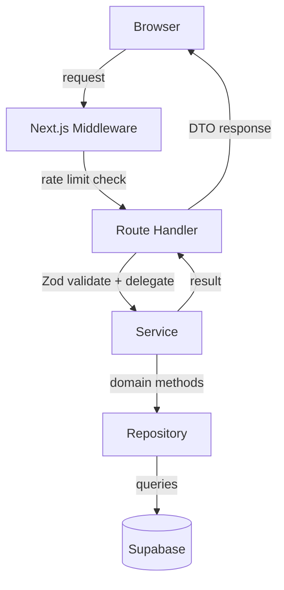

# Layered Architecture (ADR-007) Design

**Spec**: `.specs/features/layered-architecture/spec.md`
**Status**: Approved

---

## Architecture Overview

Adopt hexagonal-lite layered architecture within the Next.js App Router. Five layers with clear boundaries:

```
Browser → Next.js Middleware (rate limiting)
       → Route Handler (Zod validation only)
       → Service (business logic, orchestration)
       → Repository (Supabase queries, domain methods)
       → DTO (filtered response, no internal fields)
```



---

## Code Reuse Analysis

### Existing Components to Leverage

| Component | Location | How to Use |
|-----------|----------|------------|
| `getServiceClient()` | `src/lib/supabase/server.ts` | Singleton Supabase client; injected into repositories |
| `verifyInternalApiKey()` | `src/lib/auth/internal-key.ts` | Keep in route handlers for proxy auth |
| `requireManager()` | `src/lib/auth/guard.ts` | Keep in admin route handlers |
| `checkRateLimit()` | `src/lib/rate-limit.ts` | Move from inline handlers to middleware |
| `hashToken()`, `generateToken()` | `src/lib/auth/token.ts` | Use in TokenService |
| `sendTokenEmail()` | `src/lib/email/send-token.ts` | Inject into TokenService for email sending |
| Zod schemas | `src/lib/schemas/` | Keep in route handlers for input validation |
| `proxyToInternal()` | `src/lib/auth/proxy.ts` | Keep for proxy routes |

### Integration Points

| System | Integration Method |
|--------|-------------------|
| Supabase | Repository layer wraps `getServiceClient()` calls |
| Ollama Cloud | Harness delegates directly (unchanged) |
| Resend | Injected into TokenService via callback |

---

## Components

### DTO (`src/lib/dto/`)

- **Purpose**: Define typed response shapes that filter internal fields
- **Location**: `src/lib/dto/admin.ts`, `src/lib/dto/token.ts`
- **Interfaces**:
  - `AdminLeadRowDTO` - lead + token status for admin dashboard (no tokenPlain)
  - `AdminKpisDTO` - dashboard KPIs
  - `AdminTokensResponseDTO` - combined KPIs + rows
  - `ValidateTokenResponseDTO` - `{ redirect: string }`
  - `GenerateTokenResponseDTO` - `{ token: string }`
  - `TokenActionDTO` - send/cancel/regenerate response
- **Dependencies**: None (pure types)
- **Reuses**: None

### Repository (`src/lib/repository/`)

- **Purpose**: Encapsulate all Supabase access behind domain methods
- **Location**: `src/lib/repository/token-repo.ts`, `src/lib/repository/lead-repo.ts`, `src/lib/repository/session-repo.ts`
- **Interfaces**:
  - `TokenRepository` - `findByHash`, `findById`, `markExpired`, `consume`, `cancel`, `cancelActiveByLeadId`, `create`, `updateSentAt`, `markExpiredTokens`, `findAll`
  - `LeadRepository` - `findById`, `findByEmailAndStatus`, `create`, `updateStatus`, `findAll`, `findNameAndEmail`
  - `SessionRepository` - `create`, `findActiveByHash`
- **Dependencies**: `@supabase/supabase-js`
- **Reuses**: `getServiceClient()` from `src/lib/supabase/server.ts`

### Service (`src/lib/service/`)

- **Purpose**: Business logic and orchestration — the heart of the application
- **Location**: `src/lib/service/token-service.ts`, `src/lib/service/lead-service.ts`, `src/lib/service/admin-service.ts`
- **Interfaces**:
  - `TokenService` - `validateAndCreateSession`, `generateForLead`, `regenerate`, `cancel`, `sendTokenEmail`
  - `LeadService` - `createLead`
  - `AdminService` - `getTokensDashboard`
- **Dependencies**: TokenRepository, LeadRepository, SessionRepository, auth/token utilities
- **Reuses**: `generateToken()`, `hashToken()`, `createSessionToken()`, `hashSessionToken()` from `src/lib/auth/token.ts`

### Middleware (`src/middleware.ts`)

- **Purpose**: Centralized rate limiting for public-proxy routes
- **Location**: `src/middleware.ts`
- **Interfaces**: Matches `config.matcher` = `/api/public-proxy/:path*`
- **Dependencies**: `checkRateLimit()` from `src/lib/rate-limit.ts`
- **Reuses**: Existing rate limiter

---

## Data Models

### TokenRow (Repository internal)

```typescript
interface TokenRow {
  id: string;
  lead_id: string;
  status: string;
  expires_at: string;
  sent_at: string | null;
  created_at: string;
}
```

### LeadRow (Repository internal)

```typescript
interface LeadRow {
  id: string;
  name: string;
  company: string;
  email: string;
  phone: string;
  role: string;
  status: string;
  created_at: string;
}
```

---

## Error Handling Strategy

| Error Scenario | Handling | User Impact |
|---------------|----------|-------------|
| Token not found | TokenServiceError(401) | "Token inválido" |
| Token expired | TokenServiceError(401) + lazy markExpired | "Token expirado. Solicite um novo token." |
| Token already used | TokenServiceError(401) | "Token já utilizado. Solicite um novo token." |
| Token hash collision | Retry up to 5 times | Transparent to user |
| Lead not found | TokenServiceError(404) | "Cliente não encontrado" |
| Email send failure | Return mailto fallback | "Falha no envio de email" + mailto link |
| Invalid session | 401 on evaluate | "Sessão expirada ou inválida." |

---

## Risks & Concerns

| Concern | Location | Impact | Mitigation |
|---------|----------|--------|------------|
| In-memory rate limiter resets on restart | `src/lib/rate-limit.ts` | Rate limits not shared across instances | Acceptable for current single-instance deployment |
| token_plain not stored in DB | Design decision | Admin must capture token at generation time; if lost, must regenerate | UX decision: admin stores token in memory after generate |

---

## Tech Decisions (only non-obvious ones)

| Decision | Choice | Rationale |
|----------|--------|-----------|
| No ORM | Keep Supabase JS client | Repository layer provides sufficient abstraction without ORM complexity |
| Rate limiting in middleware vs handlers | Middleware | Single point of enforcement; less duplication |
| token_plain not in DB | Ephemeral only | ADR-003: "o token em texto puro nunca é persistido" |
| Service receives repository via factory function | `createTokenService({ tokenRepo, leadRepo, sessionRepo })` | Enables testing with mock repositories |
