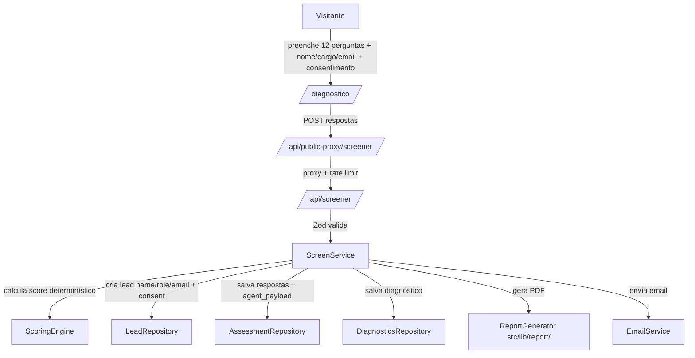

# Lead-gen Formulário — Design

**Spec**: `.specs/features/leadgen-formulario/spec.md`
**Context**: `.specs/features/leadgen-formulario/context.md`
**Status**: Draft

---

## Architecture Overview

Fluxo público (ADR-008) sem o agente de análise: o visitante preenche o formulário em `/diagnostico` (12 perguntas + nome/cargo/email + consentimento), o client valida e envia via proxy, o Service calcula o score determinístico a partir do contrato, persiste (leads + assessment_responses com `agent_payload` + diagnostics), gera o PDF e envia ao comercial.



### Camadas (ADR-007)

| Camada | Arquivos | Responsabilidade |
| --- | --- | --- |
| Middleware | `src/middleware.ts` | Rate limit `/api/public-proxy/screener` |
| Route Handler | `src/app/api/screener/route.ts` + `public-proxy/screener/route.ts` | Zod + delega ao Service |
| Service | `src/lib/service/screen-service.ts` | Orquestra scoring, persistência, PDF, email |
| Repository | `src/lib/repository/assessment-repo.ts` (+ lead/diagnostics) | Supabase |
| DTO | `src/lib/dto/screener.ts` | Filtra resposta (ok, sem campos internos) |
| Report | `src/lib/report/report-generator.ts` | PDF via @react-pdf/renderer (injeta no service) |
| Email | `src/lib/email/send-report.ts` | Resend com anexo PDF |

---

## Code Reuse Analysis

### Existing Components to Leverage

| Component | Location | How to Use |
| --- | --- | --- |
| `getServiceClient()` | `src/lib/supabase/server.ts` | Injetar nos repositórios |
| `verifyInternalApiKey()` | `src/lib/auth/internal-key.ts` | Rota interna `/api/screener` |
| `proxyToInternal()` | `src/lib/auth/proxy.ts` | Rota pública `/api/public-proxy/screener` |
| `createLeadRepository()` | `src/lib/repository/lead-repo.ts` | `findByEmailAndStatus`, `create`, `updateStatus` |
| `leadSchema`/`sanitizeText` | `src/lib/schemas/lead.ts` | Validação do payload + sanitização |
| `checkRateLimit()` | `src/lib/rate-limit.ts` | Middleware |
| Design system Rhema | `src/app/globals.css` | `btn-primary`, `card`, `input-field`, `status-pill` |
| `RhemaLogo`/`WaveDivider` | `src/app/components/` | Layout das páginas |
| JSON contrato | `docs/snapshot-maturidade-dados.json` | Fonte de conteúdo (importado como módulo) |

### Integration Points

| System | Integration Method |
| --- | --- |
| Supabase | Repositórios via `getServiceClient()` |
| Resend | `sendReportEmail()` com attachment do PDF |
| @react-pdf/renderer | Injetado no ScreenService como `ReportGenerator` |

---

## Components

### Contrato (`src/lib/screener/contract.ts`)

- **Purpose**: Tipar e exportar o contrato JSON `docs/snapshot-maturidade-dados.json` para client e server.
- **Location**: `src/lib/screener/contract.ts`
- **Interfaces**:
  - `SCREENER_CONTRACT` — objeto importado do JSON com tipos inferidos.
  - Types: `ScreenerContract`, `ScreenerDimension`, `ScreenerContextQuestion`, `ScreenerCommercialQuestion`, `ScoringConfig`, `ScoreBand`.
- **Dependencies**: zod (schema de validação do contrato).
- **Reuses**: `docs/snapshot-maturidade-dados.json`.

### Schema de validação (`src/lib/schemas/screener.ts`)

- **Purpose**: Zod schemas para o payload de entrada da API, para o contrato e para o `agent_payload`.
- **Location**: `src/lib/schemas/screener.ts`
- **Interfaces**: `screenerSubmissionSchema` (name, role, email, context, answers, commercialAnswer, consent, company, consentText, honeypot), `screenerContractSchema`, `agentPayloadSchema`.
- **Dependencies**: zod.
- **Reuses**: `sanitizeText` de `lead.ts`.

### ScoringEngine (`src/lib/screener/scoring.ts`)

- **Purpose**: Cálculo determinístico puro (sem I/O).
- **Location**: `src/lib/screener/scoring.ts`
- **Interfaces**: `computeScores(contract, answers, context)` → `ScreenerResult` (score, band, riskDimension, imbalance, cLevel, dimensionScores, chartData).
- **Dependencies**: contrato tipado.
- **Reuses**: nada externo (função pura).

### AgentPayloadBuilder (`src/lib/screener/agent-payload.ts`)

- **Purpose**: Monta o documento JSON estruturado que será enviado ao agente de análise (Ollama) em rodada futura.
- **Location**: `src/lib/screener/agent-payload.ts`
- **Interfaces**: `buildAgentPayload(params)` → `AgentPayload` (solicitante {nome, cargo}, contexto, respostas pontuadas, resposta comercial, score/faixa, risco, desequilíbrio).
- **Dependencies**: contrato tipado + resultado do scoring.
- **Reuses**: nada externo (função pura).

### AssessmentRepository (`src/lib/repository/assessment-repo.ts`)

- **Purpose**: Persistir respostas brutas, `agent_payload` e resultado.
- **Location**: `src/lib/repository/assessment-repo.ts`
- **Interfaces**: `createAssessmentResponse`, `findByLeadId`, `createDiagnostic`.
- **Dependencies**: `getServiceClient()`.
- **Reuses**: padrão dos repositórios existentes.

### ScreenService (`src/lib/service/screen-service.ts`)

- **Purpose**: Orquestra a pipeline: validação, scoring, `agent_payload`, persistência, PDF, email.
- **Location**: `src/lib/service/screen-service.ts`
- **Interfaces**: `submitScreener(params)` → `ScreenSubmissionResult`.
- **Dependencies**: LeadRepository, AssessmentRepository, ReportGenerator, sendEmail callback, contrato.
- **Reuses**: `createLeadRepository`, `sanitizeText`, DTO.

### ReportGenerator (`src/lib/report/report-generator.ts`)

- **Purpose**: Gera o PDF com identidade Rhema Data.
- **Location**: `src/lib/report/report-generator.ts`
- **Interfaces**: `generate(result: ScreenerResult & { respondent })` → `{ pdf: Buffer, filename }`.
- **Dependencies**: `@react-pdf/renderer`.
- **Reuses**: cores Rhema do globals.css.

### EmailService (`src/lib/email/send-report.ts`)

- **Purpose**: Envia o PDF ao comercial.
- **Location**: `src/lib/email/send-report.ts`
- **Interfaces**: `sendReportEmail({ to, subject, html, attachment })`.
- **Dependencies**: `resend`.
- **Reuses**: `getResend()` pattern de `send-token.ts`.

### Página do formulário (`src/app/diagnostico/page.tsx`)

- **Purpose**: UI do formulário público (client component).
- **Location**: `src/app/diagnostico/page.tsx`
- **Interfaces**: renderiza contrato, valida client (nome/cargo/email/consentimento/dimensões), localStorage, envia via `submitScreener`.
- **Dependencies**: `src/lib/api/client.ts` (novo `submitScreener`), contrato (client-safe).
- **Reuses**: design system Rhema.

### Rotas API

- `src/app/api/screener/route.ts` — rota interna (verifyInternalApiKey → schema → service).
- `src/app/api/public-proxy/screener/route.ts` — proxy público (proxyToInternal).
- `src/middleware.ts` — adicionar rate limit para `/api/public-proxy/screener`.

---

## Data Models

### `leads` (alterada)

```sql
-- + consent boolean not null default false
-- + consent_at timestamptz nullable
-- + company, phone passam a nullable
-- (name e role permanecem NOT NULL - coletados no formulário)
```

### `assessment_responses` (nova)

```sql
create table if not exists public.assessment_responses (
  id                uuid primary key default gen_random_uuid(),
  lead_id           uuid not null references public.leads(id) on delete cascade unique,
  context           jsonb not null,
  answers           jsonb not null,       -- [{dimensionId, dimensionName, nivel, peso, pergunta}]
  commercial_answer jsonb not null,
  consent           jsonb not null,       -- {accepted, text, acceptedAt}
  agent_payload     jsonb not null,       -- documento JSON pronto para envio ao agente de análise
  created_at        timestamptz not null default now()
);
```

### `diagnostics` (existente)

Usada com `overall_score`, `overall_level`, `dimension_scores`, `narrative`, `chart_data`, `pdf_path`.

### Resposta da API (DTO)

```typescript
interface ScreenSubmissionResult {
  ok: true;
}
```

---

## Error Handling Strategy

| Scenario | Handling | User Impact |
| --- | --- | --- |
| Payload inválido (Zod) | 400 com issues | "Dados inválidos" + campo pendente |
| Nome/cargo curtos ou email inválido | 400 | Mensagem de campo específico |
| Consentimento ausente | 400 | "É necessário consentir" |
| Dimensão sem resposta | 400 | "Responda todas as perguntas" |
| Lead duplicado (email pendente) | 409 | "Já existe uma solicitação pendente para este email" |
| Falha na persistência | 500, sem email | "Erro ao salvar diagnóstico" |
| Falha na geração do PDF | 500 | "Erro ao gerar relatório" |
| Falha no envio do email | 502, loga | "Erro ao enviar relatório" |
| Faixa não encontrada | Erro tipado `ScoringError` | 500 (nunca faixa vazia) |

---

## Risks & Concerns

| Concern | Location | Impact | Mitigation |
| --- | --- | --- | --- |
| JSON importado no client aumenta bundle | `src/app/diagnostico/page.tsx` | Bundle maior | Contrato é pequeno (10 dimensões); aceitável; server também o carrega |
| `pdf_path` aponta para Storage | `diagnostics.pdf_path` | Storage não usado hoje | Nesta entrega, o PDF é anexo ao email; `pdf_path` fica null (não obrigatório) |
| Escala do score vs faixas no JSON | `scoring.faixas` | Faixa pode não cobrir | Validação do contrato + erro tipado se não cobrir |
| `agent_payload` pode divergir do que o agente espera | contrato | Envio futuro falha | Schema Zod do `agent_payload` + testes; reuso do contrato JSON |
| Conteúdo hardcoded pode divergir do JSON | frontend | Perguntas duplicadas | Renderizar sempre do contrato; teste compara com o JSON |

---

## Tech Decisions

| Decision | Choice | Rationale |
| --- | --- | --- |
| Importar JSON como módulo | `import contract from docs/snapshot-maturidade-dados.json` | Contrato tipado, build falha se JSON inválido (ADR-008) |
| Onde vive o scoring | `src/lib/screener/scoring.ts` função pura | Determinístico, testável sem I/O |
| Coleta de nome/cargo | `leads.name`/`leads.role` (campos já existentes) | Decisão do usuário; reutiliza cadastro da página inicial |
| Tabela de respostas | `assessment_responses` (jsonb + `agent_payload`) | Decisão do usuário; padrão jsonb do projeto |
| Agente de análise | **Fora desta rodada**; `agent_payload` persistido pronto | Decisão do usuário; sem integração Ollama agora |
| leads.company/phone nullable | Migration | Fluxo público não coleta esses campos |
| PDF via @react-pdf/renderer | `src/lib/report/report-generator.ts` | ADR-004; injetado no service (ADR-005) |
| Email ao comercial | `MANAGER_NOTIFICATION_EMAIL` | Decisão do usuário; padrão existente |
| Rota pública | `/diagnostico` (sem token) | Fluxo público (ADR-008) |
| localStorage para anti-abandono | Client-only | Decisão do usuário; sem server-side nesta entrega |
