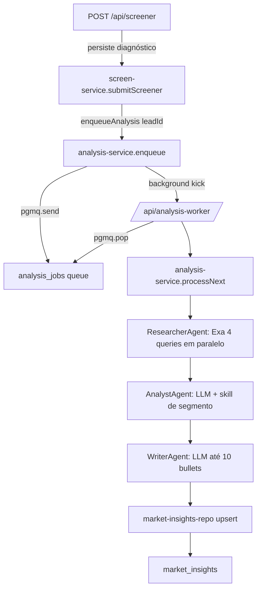

# Market Insights Agents — Slice 1 Design

**Spec**: `.specs/features/market-insights-agents/spec.md`
**Status**: Draft

---

## Architecture Overview

Pipeline assíncrono pós-submit. O submit enfileira um job em `analysis_jobs` (Supabase Queue/pgmq) e responde imediatamente. O worker `/api/analysis-worker` (rota Next interna, protegida por `INTERNAL_API_KEY`) drena a fila e orquestra 3 agentes, persistindo em `market_insights`.



Falha em qualquer etapa: `market_insights.status = 'falha'` com erro registrado. Reprocessamento manual = fatia 3.

---

## Code Reuse Analysis

### Existing Components to Leverage

| Component | Location | How to Use |
| --- | --- | --- |
| `createScreenService` + `submitScreener` | `src/lib/service/screen-service.ts` | Injeta `enqueueAnalysis` como dependência (após persistir diagnóstico) |
| `buildAgentPayload` + `AgentPayload` | `src/lib/screener/agent-payload.ts` | Fonte da empresa/segmento/porte/faturamento + scores para o pipeline |
| `verifyInternalApiKey` | `src/lib/auth/internal-key.ts` | Protege `/api/analysis-worker` |
| `ScreenServiceError` (pattern de erro tipado) | `src/lib/service/screen-service.ts` | Padrão de erro tipado por serviço |
| Repos com `createXRepository(supabase)` | `src/lib/repository/*-repo.ts` | Padrão de repositório Supabase com seleção explícita |
| Zod `.strict()` nas fronteiras | `src/lib/schemas/*.ts` | Schemas dos agentes validados com `.strict()` |

### Integration Points

| System | Integration Method |
| --- | --- |
| Supabase Queue (pgmq) | Wrapper `public.analysis_queue_enqueue(uuid)` / `public.analysis_queue_pop()` chamados via `supabase.rpc(...)` no service-role |
| Exa | SDK `exa-js`: `new Exa()` lê `EXA_API_KEY`; `exa.search(query, { type, numResults, contents: { highlights: true } })` |
| LLM (Command Code / OllamaCloud) | `@ai-sdk/openai-compatible` + `generateObject` — baseURL/API key/model por env |
| `market_insights` | `createMarketInsightsRepository(supabase)` — upsert por `lead_id` |

---

## Components

### `agents/types.ts`

- **Purpose**: Tipos de domínio dos agentes + schemas Zod estritos.
- **Location**: `src/lib/agents/types.ts`
- **Interfaces**:
  - `MarketResearch`, `ResearchSection`, `ResearchResult`
  - `MarketAnalysis`, `AnalysisPain`, `CompetitorContext`
  - `InsightsBrief`, `InsightBullet`
  - Schemas: `marketResearchSchema`, `marketAnalysisSchema`, `insightsBriefSchema` (todos `.strict()`)
- **Dependencies**: `zod`
- **Reuses**: `AgentPayload` type (import de `agent-payload.ts`)

### `agents/llm.ts`

- **Purpose**: Fábrica do modelo LLM via `@ai-sdk/openai-compatible` apontando para baseURL/API key/model de env.
- **Location**: `src/lib/agents/llm.ts`
- **Interfaces**:
  - `getLlmModel(): LanguageModel` — usa `createOpenAICompatible({ name: "llm", apiKey, baseURL })`
- **Dependencies**: `@ai-sdk/openai-compatible`, `ai`; env `LLM_BASE_URL`, `LLM_API_KEY`, `LLM_MODEL` (fallback: Command Code provider)
- **Reuses**: n/a

### `agents/segment-skills.ts`

- **Purpose**: Carrega skill Markdown de segmento (5 segmentos) com fallback genérico.
- **Location**: `src/lib/agents/segment-skills.ts`
- **Interfaces**:
  - `loadSegmentSkill(segmento: string): string` — lê `docs/agents/skills/segmentos/<slug>.md` via `node:fs`; sem arquivo → retorna prompt genérico
  - `SEGMENT_SKILL_MAP: Record<string, string>` — `Indústria` → `industria.md`, etc.
- **Dependencies**: `node:fs`, `node:path`
- **Reuses**: n/a

### `agents/researcher.ts`

- **Purpose**: Pesquisa Exa em 4 queries paralelas (segmento, faturamento, porte, concorrentes) e consolida `MarketResearch`.
- **Location**: `src/lib/agents/researcher.ts`
- **Interfaces**:
  - `createResearcherAgent(deps: { exa: Exa }): { run(payload: AgentPayload): Promise<MarketResearch> }`
- **Dependencies**: `exa-js`
- **Reuses**: `types.ts`
- **Notas**: `Promise.allSettled` — falha de query vira `status: "erro"`, não aborta. Queries em PT+EN.

### `agents/analyst.ts`

- **Purpose**: Correlaciona scores + pesquisa via LLM com skill de segmento → `MarketAnalysis`.
- **Location**: `src/lib/agents/analyst.ts`
- **Interfaces**:
  - `createAnalystAgent(deps: { llm: LanguageModel; skillLoader: typeof loadSegmentSkill }): { run(input: { research: MarketResearch; payload: AgentPayload }): Promise<MarketAnalysis> }`
  - `AnalystError extends Error` — JSON inválido / validação falha
- **Dependencies**: `ai` (`generateObject`), `zod`
- **Reuses**: `types.ts`, `segment-skills.ts`
- **Notas**: `generateObject` com `marketAnalysisSchema`; falha de parse → `AnalystError`.

### `agents/writer.ts`

- **Purpose**: Formata `InsightsBrief` (até 10 bullets em PT-BR com prioridade) via LLM.
- **Location**: `src/lib/agents/writer.ts`
- **Interfaces**:
  - `createWriterAgent(deps: { llm: LanguageModel }): { run(input: { analysis: MarketAnalysis; payload: AgentPayload }): Promise<InsightsBrief> }`
- **Dependencies**: `ai`, `zod`
- **Reuses**: `types.ts`
- **Notas**: truncar para 10; prioridade `alta|media|baixa`.

### `agents/orchestrator.ts`

- **Purpose**: Orquestra researcher → analyst → writer e retorna `{ research, analysis, insights }`.
- **Location**: `src/lib/agents/orchestrator.ts`
- **Interfaces**:
  - `createAgentOrchestrator(deps: { researcher; analyst; writer }): { run(payload: AgentPayload): Promise<AgentOutput> }`
  - `AgentOutput = { research: MarketResearch; analysis: MarketAnalysis; insights: InsightsBrief }`
- **Dependencies**: researcher/analyst/writer
- **Reuses**: `types.ts`

### `repository/market-insights-repo.ts`

- **Purpose**: Acesso a `market_insights` (upsert, find, update status).
- **Location**: `src/lib/repository/market-insights-repo.ts`
- **Interfaces**:
  - `createMarketInsightsRepository(supabase)`: `upsert(params)`, `findByLeadId(leadId)`, `markStatus(leadId, status, error?)`
- **Dependencies**: `@supabase/supabase-js`
- **Reuses**: padrão dos demais repos

### `repository/analysis-queue-repo.ts`

- **Purpose**: Wrapper das RPCs de fila (`analysis_queue_enqueue`, `analysis_queue_pop`).
- **Location**: `src/lib/repository/analysis-queue-repo.ts`
- **Interfaces**:
  - `createAnalysisQueueRepository(supabase)`: `enqueue(leadId)`, `pop(): Promise<{ msgId: string; leadId: string } | null>`
- **Dependencies**: `@supabase/supabase-js`
- **Reuses**: n/a

### `service/analysis-service.ts`

- **Purpose**: Orquestra o pipeline de análise por lead e gerencia status na `market_insights`.
- **Location**: `src/lib/service/analysis-service.ts`
- **Interfaces**:
  - `createAnalysisService(deps: { queueRepo; insightsRepo; orchestrator; payloadLoader }): { enqueue(leadId): Promise<void>; processNext(): Promise<{ processed: boolean }> }`
- **Dependencies**: queueRepo, insightsRepo, orchestrator
- **Reuses**: `AgentPayload` (via payloadLoader), padrão de erro tipado
- **Notas**: `enqueue` nunca lança para o caller (log interno). `processNext` faz upsert com `status` `analisado`/`falha`.

### `api/analysis-worker/route.ts`

- **Purpose**: Rota interna (worker) que drena até N jobs.
- **Location**: `src/app/api/analysis-worker/route.ts`
- **Interfaces**: `POST(req)` — `verifyInternalApiKey` → `analysisService.processNext()` × N → `{ ok, processed }`
- **Dependencies**: `analysis-service`, `internal-key`
- **Reuses**: `verifyInternalApiKey`

### `screen-service.ts` (modificação)

- **Purpose**: Injetar `enqueueAnalysis` e chamar após persistir diagnóstico.
- **Location**: `src/lib/service/screen-service.ts`
- **Interfaces**: `deps.enqueueAnalysis(leadId: string): Promise<void>` (novo, obrigatório)
- **Notas**: chamada dentro de try/catch — falha de enfileiramento não quebra a resposta (AC INS-03).

---

## Data Models

### `market_insights` (nova tabela — migration `0007`)

```sql
create extension if not exists pgmq;

select pgmq.create('analysis_jobs');

create table if not exists public.market_insights (
  id         uuid primary key default gen_random_uuid(),
  lead_id    uuid not null unique references public.leads(id) on delete cascade,
  research   jsonb not null default '{}'::jsonb,
  analysis   jsonb not null default '{}'::jsonb,
  insights   jsonb not null default '[]'::jsonb,
  sources    jsonb not null default '[]'::jsonb,
  status     text not null default 'pendente'
             check (status in ('pendente','processando','analisado','falha')),
  error      text,
  created_at timestamptz not null default now(),
  updated_at timestamptz not null default now()
);

create index if not exists market_insights_lead_id_idx on public.market_insights(lead_id);
alter table public.market_insights enable row level security;

-- Wrappers de fila (service-role via supabase.rpc)
create or replace function public.analysis_queue_enqueue(p_lead_id uuid)
returns void language plpgsql security definer as $$
begin
  perform pgmq.send('analysis_jobs', jsonb_build_object('lead_id', p_lead_id::text));
end $$;

create or replace function public.analysis_queue_pop()
returns jsonb language plpgsql security definer as $$
declare
  msg record;
begin
  select * into msg from pgmq.pop('analysis_jobs');
  if msg.msg_id is null then return null; end if;
  return jsonb_build_object('msg_id', msg.msg_id, 'lead_id', msg.message->>'lead_id');
end $$;
```

**Relationships**: 1:1 com `diagnostics`/`leads` (via `lead_id` unique).

### TypeScript shapes (inferidos dos schemas Zod)

```typescript
interface ResearchResult { title: string; url: string; snippet: string }
interface ResearchSection { key: "segmento"|"faturamento"|"porte"|"concorrentes"; query: string; results: ResearchResult[]; status: "ok"|"erro"; error?: string }
interface MarketResearch { empresa: { segmento: string|null; faturamento: string|null; funcionarios: string|null; nome: string|null }; sections: ResearchSection[]; sources: string[] }
interface AnalysisPain { dimensao_id: string; dimensao: string; dor: string; evidencia_mercado: boolean; confianca: number }
interface CompetitorContext { nome: string; contexto: string }
interface MarketAnalysis { resumo: string; dores: AnalysisPain[]; contexto_concorrentes: CompetitorContext[] }
interface InsightBullet { texto: string; prioridade: "alta"|"media"|"baixa" }
interface InsightsBrief { bullets: InsightBullet[] }
```

---

## Error Handling Strategy

| Error Scenario | Handling | User Impact |
| --- | --- | --- |
| Exa query falha (timeout/erro) | `Promise.allSettled`; seção `status:"erro"`, pipeline segue | Análise parcial, nunca aborta |
| LLM devolve JSON inválido | `AnalystError`; worker marca `falha` | Lead fica pendente para reprocessamento (fatia 3) |
| LLM fora do ar / timeout | `AnalystError`/`WriterError`; worker marca `falha` | Idem |
| Fila indisponível no enqueue | `analysis-service.enqueue` captura e loga; não lança ao submit | Submit responde sucesso normal |
| `market_insights` upsert falha | Worker marca `falha` (tentativa de upsert do erro) | Idem |
| Worker sem INTERNAL_API_KEY | 401 | Nenhum |
| Fila vazia | `pop` retorna null; `processNext` retorna `{processed:false}` | Nenhum |

---

## Risks & Concerns

| Concern | Location | Impact | Mitigation |
| --- | --- | --- | --- |
| Worker em serverless não sobrevive a background kick | `/api/analysis-worker` | Em prod serverless, o kick pós-submit pode não completar | Rota processa até N jobs por invocação; em prod adicionar agendador (Vercel Cron / pg_cron) — assunção na spec, follow-up ops |
| `pgmq.pop` sem RLS default | migrations/0007 | Acesso direto via anon | Wrappers `security definer` só chamam `pgmq.*`; `market_insights` tem RLS sem policies (service-role only), padrão do repo |
| Custo LLM/Exa por diagnóstico | agents/* | Custo incremental | Limitar `numResults` (5) e tamanho de prompt; fallback `falha` evita retry infinito |
| Exa `numResults` máx 10 em plano básico | researcher.ts | Cobertura limitada | Usar `numResults: 5`; aceitar |
| `generateObject` em provider compat pode não suportar JSON schema estrito | analyst/writer | Parse falha → `falha` | `AnalystError` trata; revisar se `supportsStructuredOutputs` precisa de ajuste |
| Injeção de prompt (skill de segmento é conteúdo curado) | segment-skills.ts | Prompt injection via segmento? Segmento vem de opções fechadas do contrato | Segmento validado por opções fechadas; skill é arquivo local, não input do usuário |

---

## Tech Decisions

| Decision | Choice | Rationale |
| --- | --- | --- |
| Fila | Supabase Queue (pgmq) com wrappers `public.*` | ADR-009; service-role chama `supabase.rpc`; sem expor pgmq_public via PostgREST |
| LLM client | `@ai-sdk/openai-compatible` + `generateObject` | Command Code e OllamaCloud expõem OpenAI-compat; config por env (`LLM_BASE_URL`, `LLM_API_KEY`, `LLM_MODEL`) |
| Exa client | `exa-js` SDK | Lê `EXA_API_KEY` do env; `contents.highlights` para snippets |
| Skills de segmento | Arquivos Markdown em `docs/agents/skills/segmentos/` + fallback genérico | ADR-009 híbrido; curadoria simples, carregadas via `node:fs` |
| Enqueue não bloqueia submit | `enqueue` captura erro e loga; kick em background | AC INS-03 |

**Project-level decision** (a registrar em `.specs/STATE.md` como AD-005): providers LLM/Exa configurados via env (`LLM_*`, `EXA_API_KEY`) e chamados server-side por service-role; nunca em cliente.
