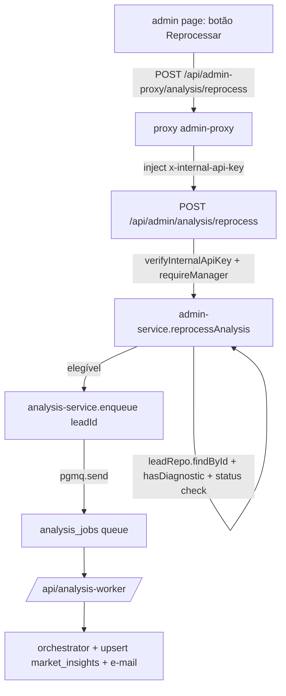

# PDF Radar de Aranha + Admin Reprocessar — Fatia 3 Design

**Spec**: `.specs/features/pdf-radar-e-reprocessamento/spec.md`
**Status**: Draft

---

## Architecture Overview

Duas frentes independentes:

1. **Radar no PDF**: novo componente `<RadarChart>` (SVG puro) renderizado dentro de `buildReportChildren` como seção "Radar de Maturidade". Nenhuma dependência nova — usa `Svg`, `Polygon`, `Line`, `Circle`, `Text` de `@react-pdf/renderer`.
2. **Admin reprocessar**: rota interna `POST /api/admin/analysis/reprocess` + proxy `POST /api/admin-proxy/analysis/reprocess` + método no `admin-service` + client `reprocessAnalysis` + botão na página `/admin`. Reusa `analysisService.enqueue` e as regras de elegibilidade.



Radar: `buildReportChildren` → `h(Svg, {...})` com grid 5 anéis + eixos + polígono + labels.

---

## Code Reuse Analysis

### Existing Components to Leverage

| Component | Location | How to Use |
| --- | --- | --- |
| `buildReportChildren` | `src/lib/report/report-generator.ts` | Insere a seção Radar como item da lista de children |
| `generateScreenerPdf` / `ScreenerReport` | idem | Já renderiza os children; radar entra automaticamente |
| `GeneratePdfInput.dimensionScores` | `src/lib/service/screen-service.ts:20-29` | Fonte dos níveis/names do radar (sem mudança de tipo) |
| `SCREENER_CONTRACT` / `getDimensionById` | `src/lib/screener/contract.ts` | Labels oficiais das dimensões (fallback para `name` do input) |
| `createAnalysisService` + `enqueue` | `src/lib/service/analysis-service.ts:86-97` | Reutilizado diretamente no `admin-service` para enfileirar |
| `createLeadRepository.findById` | `src/lib/repository/lead-repo.ts` | Busca o lead e seu `status` |
| `createAssessmentRepository.existsForLead` | `src/lib/repository/assessment-repo.ts` | Checa se o lead tem diagnóstico |
| `verifyInternalApiKey` + `requireManager` | `src/lib/auth/*` | Auth do endpoint admin (padrão existente) |
| `proxyToInternal` | `src/lib/auth/proxy.ts` | Proxy admin-proxy → admin (padrão existente) |
| `apiFetch` + `ApiError` | `src/lib/api/client.ts` | Client `reprocessAnalysis` |
| DTOs | `src/lib/dto/admin.ts` | Adicionar `ReprocessAnalysisDTO` (opcional) |

### Integration Points

| System | Integration Method |
| --- | --- |
| Fila `analysis_jobs` | `analysisService.enqueue(leadId)` (via `queueRepo.enqueue` → `pgmq.send`) |
| `leads` status | `leadRepo.findById(id)` → `.status` |
| Diagnóstico | `assessmentRepo.existsForLead(leadId)` |
| `market_insights` upsert | Fluxo existente do worker (Fatia 2) — sem mudança |

---

## Components

### `report/radar-chart.ts` (novo)

- **Purpose**: Componente `<RadarChart>` que desenha o radar de aranha (SVG) para o PDF.
- **Location**: `src/lib/report/radar-chart.ts`
- **Interfaces**:
  - `interface RadarChartProps { dimensions: { name: string; nivel: number }[] }`
  - `function RadarChart({ dimensions }: RadarChartProps): ReturnType<typeof h>` — usa `h(Svg, ...)` com `viewBox`.
  - `const RADAR_LEVELS = [1, 2, 3, 4, 5]` (grid).
- **Detalhes de desenho**:
  - `SIZE = 320`, `CENTER = SIZE / 2`, `RADIUS = 130`, `startAngle = -90°`.
  - `clamp(n) = Math.min(5, Math.max(1, n))`.
  - `pointFor(level, index, total)`: `angle = startAngle + (index * 360 / total)`; `r = RADIUS * (clamp(level) - 1) / (RADAR_LEVELS.length - 1)`.
  - Grid: 5 `Polygon` (um por nível, conectando todos os eixos) em cinza claro `#D9D5E0`.
  - Eixos: `Line` do centro até `RADIUS`, cinza claro.
  - Polígono do nível: `Polygon` com `points` dos eixos, `fill: rgba(74,44,125,0.2)` + `stroke: #4A2C7D`.
  - Labels: `Text` posicionado em `pointFor(5, ...)` + deslocamento radial, `fontSize 6`, `textAnchor`/`textAlign` conforme o lado.
- **Dependencies**: `@react-pdf/renderer` (`Svg`, `Polygon`, `Line`, `Circle`, `Text`), `react`.
- **Reuses**: padrão `h = React.createElement` do `report-generator.ts`.
- **Notas**: pure function (não é componente de estado). Exportada para teste unitário direto.

### `report/report-generator.ts` (modificar)

- **Purpose**: Inserir a seção "Radar de Maturidade" nos children.
- **Changes**:
  - Importar `RadarChart`.
  - Após a seção `band`, adicionar (se `dimensionScores.length > 0`):
    ```
    h(View, { key: "radar", style: styles.section },
      h(Text, { style: styles.sectionTitle }, "Radar de Maturidade"),
      h(RadarChart, { dimensions: input.dimensionScores }),
    )
    ```
  - Adicionar estilo `radarBox` (centralizado) se necessário.
- **Dependencies**: `RadarChart`.
- **Reuses**: estrutura de seções existente.

### `service/admin-service.ts` (modificar)

- **Purpose**: Adicionar `reprocessAnalysis(leadId)`.
- **Changes**:
  - Expandir deps: `assessmentRepo`, `analysisService: { enqueue(leadId: string): Promise<void> }`.
  - `async reprocessAnalysis(leadId): Promise<{ ok: true }>`:
    1. `const lead = await leadRepo.findById(leadId)` → se `!lead` → `AdminServiceError("Lead não encontrado", 400)`.
    2. `const hasDiagnostic = await assessmentRepo.existsForLead(leadId)` → se `false` → `AdminServiceError("Lead sem diagnóstico", 400)`.
    3. `if (!["analisado", "falha", "analise_pendente"].includes(lead.status))` → `AdminServiceError("Lead sem análise reprocessável", 400)`.
    4. `await analysisService.enqueue(leadId)` (propaga erro).
    5. `return { ok: true }`.
  - Novos deps obrigatórios no contrato; testes existentes do `admin-service` atualizam os mocks.
- **Dependencies**: `LeadRepository`, `AssessmentRepository`, `AnalysisService`.
- **Notas**: erro tipado `AdminServiceError` (novo, com `status`) mapeado na rota.

### `schemas/analysis.ts` (novo)

- **Purpose**: Schema Zod `.strict()` do body de reprocessar.
- **Location**: `src/lib/schemas/analysis.ts`
- **Interfaces**: `reprocessAnalysisSchema = z.object({ leadId: z.string().uuid() }).strict()`
- **Dependencies**: `zod`.
- **Reuses**: padrão dos demais schemas de fronteira.

### `api/admin/analysis/reprocess/route.ts` (novo)

- **Purpose**: Endpoint interno `POST /api/admin/analysis/reprocess`.
- **Flow**: `verifyInternalApiKey` → `requireManager` → `reprocessAnalysisSchema.safeParse(body)` → `adminService.reprocessAnalysis` → 200 `{ ok: true }`; erros tipados → 400; desconhecido → 500.
- **Dependencies**: `admin-service`, `internal-key`, `guard`, `reprocessAnalysisSchema`.
- **Reuses**: padrão de `api/admin/tokens/generate/route.ts`.

### `api/admin-proxy/analysis/reprocess/route.ts` (novo)

- **Purpose**: Proxy `POST /api/admin-proxy/analysis/reprocess` → `proxyToInternal(req, { target: "admin/analysis/reprocess" })`.
- **Dependencies**: `proxyToInternal`.

### `api/client.ts` (modificar)

- **Purpose**: Expor `reprocessAnalysis(leadId, authToken): Promise<{ ok: true }>` via `apiFetch("/admin-proxy/analysis/reprocess", { method: "POST", body: { leadId }, token })`.
- **Reuses**: `apiFetch`.

### `app/admin/page.tsx` (modificar)

- **Purpose**: Botão "Reprocessar análise" na ação do cliente quando `leadStatus` for `analise_pendente`/`falha`/`analisado`.
- **Changes**:
  - Adicionar `onReprocess(leadId)` no handler; `reprocessAnalysis(leadId, token)`; toast de sucesso/erro; `loadData()` após sucesso.
  - `RowActionMenu` ganha item (quando elegível) com estado de loading.
- **Reuses**: padrão de `onGenerate`/`onSend` (toast + refresh).

---

## Data Models

Nenhuma mudança de schema (migration) — reusa:
- `leads.status` (text) — já aceita `analise_pendente`/`analisado`/`falha`.
- `market_insights` (jsonb) — upsert do worker.
- `analysis_jobs` (pgmq) — fila existente.

---

## Error Handling Strategy

| Error Scenario | Handling | User Impact |
| --- | --- | --- |
| Lead inexistente | `AdminServiceError(400)` | Admin vê "Lead não encontrado ou sem diagnóstico" |
| Lead sem diagnóstico | `AdminServiceError(400)` | idem |
| Status inelegível | `AdminServiceError(400)` | Admin vê "Lead sem análise reprocessável" |
| Fila indisponível no enqueue | `enqueue` propaga erro → rota responde 500 genérico | Admin pode tentar de novo |
| Auth inválida (proxy/manager) | 401 | Nenhuma operação |
| Body inválido (uuid malformado / campos extras) | 400 (schema `.strict()`) | Nenhuma operação |
| Radar com `dimensionScores` vazio | Seção omitida | PDF sem radar (dados ausentes) |
| Nível fora de 1–5 | `clamp` | Polígono dentro do grid |

---

## Risks & Concerns

| Concern | Location | Impact | Mitigation |
| --- | --- | --- | --- |
| `@react-pdf/renderer` SVG suporta `Text` aninhado em `Svg`? | radar-chart.ts | Labels podem não renderizar em alguns viewers | Usar `Text` dentro do `<Svg>` com `x`/`y` + `textAnchor`; testes via `buildReportChildren` + render do PDF (`generateScreenerPdf`) confirmam buffer; se Text dentro de SVG não funcionar, labels saem para `View` absoluto fora do SVG (fallback documentado) |
| Labels sobrepostos com 10 eixos | radar-chart.ts | Leitura ruim | `fontSize 6`, deslocamento radial, `textAnchor` por quadrante |
| `clamp` com níveis decimais | radar-chart.ts | Coordenadas fora do grid | Fórmula usa `clamp(level)`; testes de 0/6 |
| `enqueue` não deve lançar para o admin | admin-service | 500 no admin | Admitido: admin precisa saber que falhou (REPRO-04) |
| Rota admin exige `requireManager` + internal key | route | Dupla autenticação | Já é o padrão de `api/admin/tokens/*` |

---

## Tech Decisions

| Decision | Choice | Rationale |
| --- | --- | --- |
| Radar com SVG manual | `Svg`/`Polygon`/`Line`/`Circle`/`Text` de `@react-pdf/renderer` | ADR-009: "SVG manual, sem lib extra"; componentes nativos já disponíveis |
| `RadarChart` como pure function | Retorna `ReturnType<typeof h>`; testável via `buildReportChildren` | Segue padrão do gerador; sem estado |
| Reprocessar síncrono | Rota valida + `enqueue` + responde `{ ok: true }` | Escolha do usuário; ADR-009 (submit não espera análise) |
| Elegibilidade por status | `analisado`/`falha`/`analise_pendente` + exige diagnóstico | Escolha do usuário; ADR-009 fallback/reprocessamento |
| Fila indisponível → 500 no admin | Erro propagado (não capturado como no submit) | O admin precisa saber que a tentativa falhou (REPRO-04) |

**Project-level decision** (registrar em `.specs/STATE.md` como AD-006): radar de aranha renderizado com componentes SVG nativos do `@react-pdf/renderer` (sem lib extra) e reprocessamento de análise via enfileiramento reutilizando `analysis-service.enqueue`.
