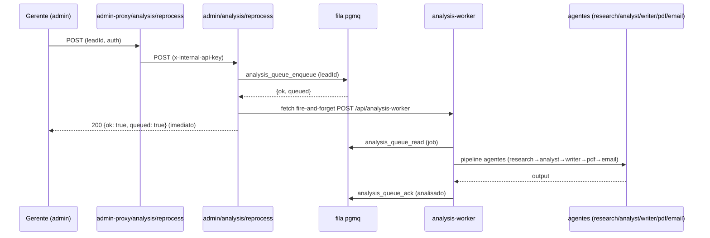

# Relatório Sob Demanda — Design

**Spec**: `.specs/features/relatorio-sob-demanda/spec.md`
**Status**: Draft

---

## Architecture Overview

O gatilho de processamento deixa de ser um cron externo e passa a ser **o próprio clique do gerente**. O endpoint `POST /api/admin/analysis/reprocess` mantém o fluxo atual (enfileirar na pgmq) e, em seguida, **dispara em background** a rota `POST /api/analysis-worker` (fire-and-forget, fetch não-await), que roda o pipeline completo dos agentes via `analysis-service.processNext()`.

O `fetch` é disparado **sem `await`** (fire-and-forget): a resposta ao gerente não espera o pipeline. O worker é chamado com o header `x-internal-api-key` (server-side), mesma rota e autenticação já testadas.

---

## Code Reuse Analysis

### Existing Components to Leverage

| Component | Location | How to Use |
| --------- | -------- | ---------- |
| `analysis-worker` route | `src/app/api/analysis-worker/route.ts` | Rota de destino do fire-and-forget; já implementa `processNext()` + `failStale` + auth (internal key / cron secret) |
| `analysis-service.processNext()` | `src/lib/service/analysis-service.ts` | Pipeline completo dos agentes (research/analyst/writer/pdf/email) com log por etapa |
| `queueRepo.enqueue()` | `src/lib/repository/analysis-queue-repo.ts` | Enfileira o job (dedup) antes do disparo |
| `adminService.generateReport()` | `src/lib/service/admin-service.ts` | Valida lead (existe/diagnóstico/status) e enfileira; mantém dedup 409 |
| `verifyInternalApiKey` | `src/lib/auth/internal-key.ts` | Header do fire-and-forget (server-side) |
| `NEXT_PUBLIC_APP_URL` env | `.env.local` / Vercel | Base URL para montar a rota worker em produção (`https://diagnosdata.rhemadata.com`) |

### Integration Points

| System | Integration Method |
| ------ | ------------------ |
| Admin proxy → internal | `src/lib/auth/proxy.ts` (`proxyToInternal`) já injeta `x-internal-api-key` e repassa o `authorization` do gerente |
| Internal reprocess → worker | Novo fetch fire-and-forget no route, com `x-internal-api-key` |
| Worker → fila | `analysis_queue_read` / `analysis_queue_ack` (pgmq) — inalterado |

---

## Components

### Fire-and-forget dispatch (novo, no route `reprocess`)

- **Purpose**: Após enfileirar, dispara o worker em background sem bloquear a resposta.
- **Location**: `src/app/api/admin/analysis/reprocess/route.ts`
- **Interfaces**:
  - `dispatchWorker(origin: string): void` — monta a URL `${base}/api/analysis-worker` e faz `fetch(url, { method: "POST", headers: { "x-internal-api-key": key } })` sem `await`; engole erros.
- **Dependencies**: `process.env.INTERNAL_API_KEY`, `process.env.NEXT_PUBLIC_APP_URL`.
- **Reuses**: nada novo; usa `fetch` nativo e a rota worker existente.
- **Comportamento**:
  - Base = `process.env.NEXT_PUBLIC_APP_URL` (prod) ou origem da requisição (dev/fallback).
  - `void fetch(...)` — sem `await`, sem `.catch` que propague.
  - Se `INTERNAL_API_KEY` ausente → pula o disparo (job fica na fila; resposta segue `200`).
  - Se o fetch rejeitar → erro engolido (job fica na fila para retry manual/worker).

### Rota worker (`analysis-worker`) — **inalterada**

- **Purpose**: Drenar a fila e rodar o pipeline.
- **Location**: `src/app/api/analysis-worker/route.ts`
- **Nota**: já autentica com internal key ou cron secret e chama `processNext()` até 5 jobs. Nada a mudar. O fire-and-forget apenas **chama essa rota**; não duplica lógica.

### Admin front-end — **inalterado**

- `generateReport()` (client) já chama `/admin-proxy/analysis/reprocess` e trata `{ok, queued}`; o dashboard já tem auto-refresh de 15s para refletir `processando` → `analisado`.

---

## Data Models

Nenhuma mudança de schema. A fila pgmq, `market_insights` (estado por job) e `analysis_job_logs` (log por etapa) continuam como estão (ADR-008).

---

## Error Handling Strategy

| Error Scenario | Handling | User Impact |
| -------------- | -------- | ----------- |
| `INTERNAL_API_KEY` ausente | Disparo pulado; job permanece na fila | Resposta `200`; relatório só sai quando houver worker ativo |
| `fetch` do worker rejeita (rede/erro) | Erro engolido (catch vazio) | Resposta `200`; job na fila para retry |
| Lead já `pendente`/`processando` | `AdminServiceError` 409 (mantido) | `409 { error: "Relatório já está na fila ou em processamento" }` |
| Lead inválido / sem diagnóstico | `AdminServiceError` 400 (mantido) | `400` |
| Erro inesperado no reprocess | `500 { error: "Erro interno" }` (mantido) | `500` genérico |

---

## Risks & Concerns

| Concern | Location (file:line) | Impact | Mitigation |
| ------- | -------------------- | ------ | ---------- |
| Fire-and-forget pode ser morto pelo runtime se a função terminar antes | `reprocess/route.ts` (novo) | Em serverless, o processo pode ser congelado após a resposta | Aceito: o worker é outra invocação serverless (independente); mesmo que o fetch não complete, o job permanece na fila. O objetivo é não depender de cron; para processamento garantido, o pg_cron continua disponível como camada opcional. |
| `NEXT_PUBLIC_APP_URL` aponta para o domínio custom que ainda não tem DNS | env Vercel | O fetch pode falhar até o DNS apontar | Erro engolido → job fica na fila; quando o DNS/subdomínio resolver, o clique volta a funcionar. Sem bloqueio do deploy. |
| Teste de rota precisa mockar o `fetch` | `reprocess/route.test.ts` | Teste flaky se tocar rede | Mockar `globalThis.fetch` no teste; asserção em que foi chamado com URL/headers corretos e sem `await` forçado |

---

## Tech Decisions (only non-obvious ones)

| Decision | Choice | Rationale |
| -------- | ------ | --------- |
| Fire-and-forget (fetch não-await) no route | Reusa a rota worker testada; resposta imediata | Evita timeout Hobby; sem refactor do pipeline |
| Base URL do disparo | `NEXT_PUBLIC_APP_URL` (prod) / origem da request (fallback) | Funciona em prod e dev; env já setada na Vercel |
| Erros do disparo engolidos | Job permanece na fila | Não falha o clique do gerente por problema de background |
