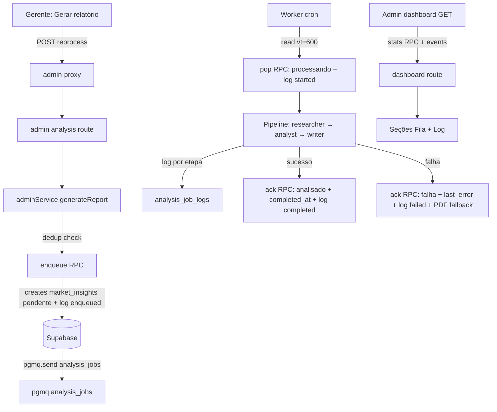

# Observabilidade do Pipeline de Relatórios — Design

**Spec**: `.specs/features/report-observability/spec.md`
**Status**: Draft

---

## Architecture Overview

A fila de análise sai da entrega *at-most-once* (`pgmq.pop`, que apaga a mensagem ao ler) e passa a usar o padrão *read + ack/archive*: `pgmq.read` com visibility timeout de 600s, `pgmq.archive` no sucesso/falha (preserva histórico em `pgmq_archived`) e `pgmq.set_vt(0)` para retry manual. O estado por job deixa de ser implícito (ausência de linha = "nunca pedido") e passa a ser explícito em `market_insights` com timestamps; cada etapa do pipeline grava um evento em `analysis_job_logs`. O painel admin ganha duas seções — "Fila de relatórios" e "Log de processamentos" — alimentadas por um dashboard expandido.



## Code Reuse Analysis

### Existing Components to Leverage

| Component | Location | How to Use |
| --- | --- | --- |
| `createAnalysisQueueRepository` | `src/lib/repository/analysis-queue-repo.ts` | Estender: `enqueue` retorna `{ok,queued}`; `pop`→`read`; novos `ack`/`requeue`/`stats` |
| `createMarketInsightsRepository` | `src/lib/repository/market-insights-repo.ts` | `markStatus` ganha upsert por `lead_id` + novos campos |
| `createAnalysisService` | `src/lib/service/analysis-service.ts` | `processNext` usa read→pipeline→ack; grava log por etapa |
| `createAdminService` | `src/lib/service/admin-service.ts` | `getDashboard` inclui fila + log; `generateReport` dedup |
| `createLeadRepository` | `src/lib/repository/lead-repo.ts` | Reuso p/ join de nome do lead no log |
| `AdminDashboardResponseDTO` | `src/lib/dto/admin.ts` | Estender shape |
| `AdminLeadRow`/client | `src/lib/api/client.ts` | Espelhar novos campos |
| `DashboardView`/badges | `src/app/admin/page.tsx` | Novas seções + auto-refresh |
| `proxyToInternal` | `src/lib/auth/proxy.ts` | Reuso (nenhuma mudança no proxy) |

### Integration Points

| System | Integration Method |
| --- | --- |
| `market_insights` | upsert por `lead_id` no enqueue/read/finalização |
| `analysis_job_logs` (nova) | insert por evento, RLS service-role only |
| `pgmq` | RPCs `security definer` (`enqueue`/`read`/`ack`/`requeue`/`stats`) |
| Admin dashboard | mesmo endpoint `GET /api/admin/dashboard` expandido |
| Worker | `POST /api/analysis-worker` mantém auth e loop |

---

## Components

### Migração `supabase/migrations/0009_report_observability.sql`

- **`market_insights`**: `add column queued_at timestamptz`, `processing_started_at timestamptz`, `completed_at timestamptz`, `attempts int not null default 0`.
- **`analysis_job_logs`** (nova): `id uuid pk default gen_random_uuid()`, `lead_id uuid not null references leads(id) on delete cascade`, `step text not null`, `message text`, `duration_ms int`, `created_at timestamptz not null default now()`. `create index analysis_job_logs_lead_created_idx on analysis_job_logs(lead_id, created_at)`. RLS enable, sem policies (service-role only).
- **RPCs** (security definer, idempotente com `create or replace`):
  - `analysis_queue_enqueue(p_lead_id uuid)` → `jsonb {ok bool, queued bool}`. Cria/atualiza linha `market_insights` (upsert por `lead_id`) com `status='pendente'`, `queued_at=now()`, `attempts=0`, `error=null`; faz `pgmq.send('analysis_jobs', jsonb_build_object('lead_id', p_lead_id::text))`; insere log `enqueued`. Se já existe linha `status in ('pendente','processando')` para o lead → retorna `{ok:true, queued:false}` sem re-enfileirar. Erro de fila propaga (plpgsql exception → RPC falha → 500 no admin).
  - `analysis_queue_read()` → `jsonb {msg_id, lead_id}`: `pgmq.read('analysis_jobs', 600, 1)`; se vazio → `null`; senão marca linha `market_insights` `status='processando'`, `processing_started_at=now()`, `attempts=attempts+1`; insere log `started` com `duration_ms` do tempo de espera.
  - `analysis_queue_ack(p_msg_id bigint, p_lead_id uuid, p_status text, p_error text default null, p_duration_ms int default null)` → arquiva via `pgmq.archive('analysis_jobs', p_msg_id)`; atualiza `market_insights` (`analisado`+`completed_at` / `falha`+`last_error`); insere log `completed`/`failed` com `duration_ms`.
  - `analysis_queue_requeue(p_msg_id bigint)` → `pgmq.set_vt('analysis_jobs', p_msg_id, 0)`; usado em retry manual (não no fluxo principal nesta feature).
  - `analysis_queue_stats()` → `jsonb {queue_length, pendente, processando, analisado, falha, orfaos}` via `pgmq.metrics('analysis_jobs')` + contagens de `market_insights`.
- **`docs/data-model.md`** atualizado no mesmo commit.

### `src/lib/repository/analysis-queue-repo.ts`

- `enqueue(leadId): Promise<{ok: boolean; queued: boolean}>` — chama RPC `analysis_queue_enqueue`, não lança quando `queued=false`.
- `read(): Promise<{msgId: string; leadId: string} | null>` — chama `analysis_queue_read`.
- `ack(msgId: string, leadId: string, status: MarketInsightsStatus, error?: string, durationMs?: number)` — chama RPC.
- `requeue(msgId: string)` — chama RPC (retry manual).
- `stats(): Promise<AnalysisQueueStats>` — chama RPC.

### `src/lib/repository/market-insights-repo.ts`

- `markStatus` passa a usar `.upsert(..., {onConflict: "lead_id"})` para criar a linha se não existir (curinga do pipeline falho sem enqueue) — atualiza `updated_at`.
- Novo `logEvent(leadId, step, message?, durationMs?)` → insert em `analysis_job_logs`.
- `MarketInsightsRow` ganha os novos campos; `findByLeadId` seleciona `queued_at, processing_started_at, attempts, completed_at`.

### `src/lib/service/analysis-service.ts`

- `enqueue(leadId)` → retorna `{ok, queued}` do repo (sem engolir erro; o admin route mapeia erro → 500).
- `processNext()`:
  1. `queueRepo.read()` → `null` se vazio.
  2. `payloadLoader(leadId)`; se `null` → `ack(msgId, leadId, "falha", "agent_payload não encontrado")` + log `failed`; retorna.
  3. Orchestrator `researcher`→`analyst`→`writer`, logando cada etapa com `duration_ms`.
  4. Sucesso: `insightsRepo.upsert` com `status:"analisado"` + `ack(..., "analisado", undefined, durationTotal)` + email com PDF enriquecido.
  5. Falha: `ack(msgId, leadId, "falha", message)` + log `failed`; se payload existe → PDF básico fallback + `leadRepo.updateStatus("analise_pendente")` (mantido).
  - Email continua com falha isolada (EMAIL-04): log `email` após envio, sem derrubar o worker.

### `src/lib/service/admin-service.ts`

- `getDashboard()`:
  - Busca `analysisQueueStats` (RPC) em paralelo.
  - Por linha: `analysisStatus, analysisQueuedAt, processingStartedAt, attempts, errorMessage, ageSeconds` (de `queued_at`).
  - Novo KPI `relatoriosEmProcessamento` (status `processando`).
  - `logs`: últimos 50 eventos de `analysis_job_logs` com nome do lead (join).
- `generateReport(leadId)`:
  - Valida lead + diagnóstico + status elegível (mantém `ENQUEUEABLE_STATUSES`).
  - `enqueue` retorna `{ok, queued}`; se `queued===false` → `AdminServiceError(409, "Relatório já está na fila ou em processamento")`.

### Rotas

- `src/app/api/admin/dashboard/route.ts`: reusa o `analysisService` real (worker) com `enqueue` no lugar do stub; injeta `queueRepo` e `insightsRepo`; retorna DTO expandido. (Hoje o stub engole tudo → "sucesso" falso.)
- `src/app/api/admin/analysis/reprocess/route.ts`: mesmo wiring; mapeia 409 de `AdminServiceError`.

### DTO/client

- `dto/admin.ts`: `AdminLeadRowDTO` + `analysisQueuedAt, processingStartedAt, attempts, errorMessage, ageSeconds`; `AdminKpisDTO.relatoriosEmProcessamento`; novo `AdminLogEntryDTO { leadId, leadName, step, message, durationMs, createdAt }`; `AdminQueueStatsDTO { queueLength, pendente, processando, analisado, falha, orfaos }`; `AdminDashboardResponseDTO { kpis, rows, queue, logs }`.
- `src/lib/api/client.ts`: espelha.

### Admin UI (`src/app/admin/page.tsx`)

- **Seção "Fila de relatórios"**: cards resumo (Em fila, Em processamento, Concluídos, Falhas, Profundidade da fila) + tabela de jobs com status, enfileirado, início, tempo na fila, tentativas, erro.
- **Seção "Log de processamentos"**: timeline dos eventos com etapa, lead, timestamp, duração, erro.
- Auto-refresh a cada 15s enquanto houver `pendente`/`processando`; pausa quando idle.
- `AnalysisBadge`: animação pulse em `processando`; tooltip com `errorMessage` em falha.
- Toast de dedup: "Relatório já está na fila ou em processamento" quando `queued=false`.

---

## Data Models

### `analysis_job_logs`

```typescript
interface AnalysisJobLogRow {
  id: string;
  lead_id: string;
  step: "enqueued" | "started" | "researcher" | "analyst" | "writer" | "pdf" | "email" | "completed" | "failed";
  message: string | null;
  duration_ms: number | null;
  created_at: string;
}
```

**Relationships**: `lead_id` FK → `leads(id)` on delete cascade.

### `market_insights` (delta)

```typescript
interface MarketInsightsRow {
  // ...existing
  queued_at: string | null;
  processing_started_at: string | null;
  completed_at: string | null;
  attempts: number;
}
```

---

## Error Handling Strategy

| Error Scenario | Handling | User Impact |
| --- | --- | --- |
| Fila pgmq indisponível no enqueue | RPC lança; admin route → 500 | Gerente vê "Erro interno"; log em Vercel |
| Pipeline falha | `ack("falha")` + log `failed` + PDF fallback | Badge "Falha" + erro visível no log |
| Worker cai no meio | mensagem retorna após VT 600s; reprocessa (attempts++) | Relatório eventualmente entregue |
| `market_insights` sem linha | `read()` faz upsert criando a linha | Estado consistente |
| Email falha | isolado (EMAIL-04), log `email` com erro | Sem impacto no status |
| Duplicado no enqueue | `queued:false` → 409 no admin | Toast claro |

---

## Risks & Concerns

| Concern | Location (file:line) | Impact | Mitigation |
| --- | --- | --- | --- |
| `pgmq.pop()` entrega *at-most-once* — job perdido em falha do worker | `src/app/api/analysis-worker/route.ts` (via `analysis_queue_pop` RPC) | Relatório nunca gerado, invisível | Trocar para `read` + `ack/archive` (VT 600s) — OBS-01/02/04 |
| `processando` é código morto — nenhum caminho o escreve | `src/lib/repository/market-insights-repo.ts:25` | Badge "Processando" nunca aparece | `read()` escreve `processando` — OBS-02 |
| `enqueue` engole erros → admin vê "sucesso" falso | `src/lib/service/analysis-service.ts:87-97` | Gerente confia em relatório que não existe | `enqueue` propaga erro; rota mapeia 500 — edge case 1 |
| `analise_pendente` viola check de `leads.status` (`pendente,concluido`) | `src/lib/service/analysis-service.ts:154` + migration 0008 | Escrita falharia no banco real | Não faz parte desta feature (fallback mantido); risco documentado, follow-up separado |
| RPCs reescritas quebram testes existentes do repo | `src/lib/repository/analysis-queue-repo.test.ts` | Suíte vermelha | Atualizar testes na mesma task da migration |
| `getDashboard` hoje usa N+1 (findByLeadId por lead) | `src/lib/service/admin-service.ts:39-42` | Degrada com volume; piora com stats/log | Manter; `analysis_queue_stats` e log em 1 query cada; N+1 é pré-existente |
| Migração aplicada em prod sem validação | — | Quebra de schema | Rodar `validate_data_model.sql` estendido antes de merge (gate manual) |
| Mudança de semântica read+ack introduz retry duplicado se `ack` falhar após sucesso | `analysis_queue_ack` | Relatório duplicado | `upsert` por `lead_id` idempotente; `attempts` limita impacto |

---

## Tech Decisions

| Decision | Choice | Rationale |
| --- | --- | --- |
| Semântica de entrega | `read()` + `ack()`/`archive()` com VT 600s | Confirmado com o usuário; retry automático + histórico |
| Registro do log | `analysis_job_logs` (tabela) com um insert por etapa | Confirmado com o usuário; consultável no admin sem infra externa |
| Deduplicação | upsert no enqueue + check `pendente/processando` | Confirmado com o usuário; evita custo duplo de LLM |
| `ack` arquiva | `pgmq.archive` (não `delete`) | Preserva rastro em `pgmq_archived` para auditoria |
| Retry | VT expira → mensagem volta à fila; `requeue` RPC p/ manual | Backoff exponencial é follow-up (out of scope) |
