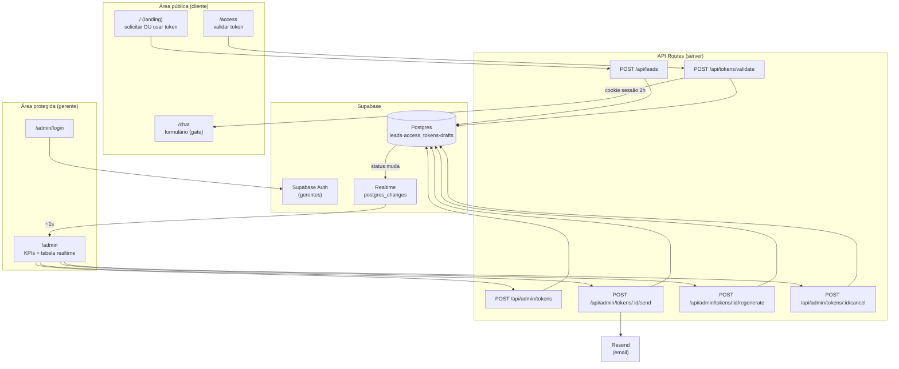
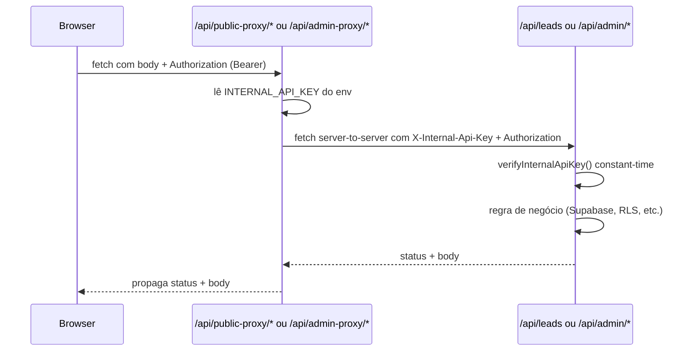

# Token Authentication Design

**Spec**: `.specs/features/token-auth-archived/spec.md`
**Status**: Approved (escopo: backend + APIs + schema; UI adiada) — **SUPERSEDED em 2026-08-31** (ver banner no spec).

> **⚠️ SUPERSEDED — Não aplicar.** Este design descreve o fluxo antigo de token de acesso único, removido do produto na migration `0008_remove_token_flow` (2026-08-31). O lead agora se cadastra na landing e inicia o diagnóstico direto, sem token nem sessão; o relatório passa a ser gerado sob demanda pelo gerente no painel admin. Veja `docs/decisions/003-usar-token-de-acesso-unico.md` (status: Superseded), `docs/architecture.md` e `AGENTS.md` (seção 4). Este arquivo é mantido apenas por razões históricas.

> **Escopo desta entrega (decisão do usuário):** implementar **somente backend + APIs + schema** — sem as páginas Next.js e sem inicializar o app `src/app/**` de UI. O banco é aplicado via **supabase-mcp** pelo agente. As rotas de API (`src/app/api/**`) são implementadas como módulos server-side, mas a camada de UI (landing, /access, /admin) fica para uma entrega futura.

---

## Architecture Overview

Next.js (App Router) com Supabase como backend. Duas áreas: pública (cliente) e protegida (gerente). Segurança concentrada em API Routes server-side — o token nunca é persistido em texto puro (só hash SHA-256) e nunca toca storage do navegador.



---

## Code Reuse Analysis

### Existing Components to Leverage

| Component | Location | How to Use |
| --- | --- | --- |
| Zod | (dep a adicionar) | Validação de todos os bodies das rotas (padrão AGENTS.md §7) |
| Typed errors | `harness/core/errors.ts` | Padrão de erro tipado a espelhar em `src/lib/errors.ts` |
| ADRs de stack | `docs/decisions/001,002,003` | Supabase, Resend, token-hash já decididos |

### Integration Points

| System | Integration Method |
| --- | --- |
| Supabase Postgres | `@supabase/supabase-js` service-role nas API Routes; RLS nega acesso anon |
| Supabase Auth | email/senha do gerente; sessão verificada server-side nas rotas `/api/admin/*` |
| Supabase Realtime | `postgres_changes` em `access_tokens` → atualiza painel |
| Resend | SDK `resend` para envio de token por email |

> **Nota**: este é o primeiro código `src/**` do projeto (greenfield). Não há padrões de app existentes para reutilizar — os padrões vêm de `AGENTS.md` e dos ADRs.

---

## Components

### Database schema (Supabase migration)

- **Purpose**: Tabelas e constraints que sustentam o fluxo.
- **Location**: `supabase/migrations/0001_token_auth.sql`
- **Interfaces**: DDL (ver Data Models)
- **Dependencies**: Supabase project
- **Reuses**: ADR-001 (Supabase), ADR-003 (token hash)

### Token crypto lib

- **Purpose**: Gerar token de 6 chars, hash SHA-256, comparar hash, criar/verificar sessão.
- **Location**: `src/lib/auth/token.ts`
- **Interfaces**:
  - `generateToken(): string` - token alfanumérico de 6 caracteres (sem chars ambíguos)
  - `hashToken(token: string): string` - SHA-256 hex
  - `createSession(clientId: string): string` - token de sessão opaco (2h)
  - `verifySession(token: string): { clientId: string } | null`
- **Dependencies**: `node:crypto`
- **Reuses**: nenhum (novo)

### Supabase server client

- **Purpose**: Cliente service-role único para as API Routes (bypassa RLS com segurança no servidor).
- **Location**: `src/lib/supabase/server.ts`
- **Interfaces**: `getServiceClient(): SupabaseClient`
- **Dependencies**: `@supabase/supabase-js`, env vars
- **Reuses**: ADR-001

### Rate limiter

- **Purpose**: Limitar tentativas por IP (cadastro 5/10min, validação 10/10min, login 5/10min).
- **Location**: `src/lib/rate-limit.ts`
- **Interfaces**: `checkRateLimit(key: string, limit: number, windowMs: number): { allowed: boolean }`
- **Dependencies**: Map em memória (single instance) com fallback documentado
- **Reuses**: nenhum

### API: solicitar acesso (lead)

- **Purpose**: Receber cadastro do cliente, validar, anti-spam, persistir lead `pendente`.
- **Location**: `src/app/api/leads/route.ts`
- **Interfaces**: `POST { name, company, phone, email, role, website? }` → `201 | 400 | 409 | 429`
- **Dependencies**: Supabase, Zod, rate-limit
- **Reuses**: Zod (padrão), token crypto (não)

### API: validar token

- **Purpose**: Validar token do cliente, consumir (usado), criar sessão 2h, lazy-expire.
- **Location**: `src/app/api/tokens/validate/route.ts`
- **Interfaces**: `POST { token }` → `200 { redirect: "/chat" } + Set-Cookie | 401 | 429`
- **Dependencies**: Supabase, token crypto, rate-limit
- **Reuses**: token crypto

### API: gestão de tokens (admin)

- **Purpose**: Gerar, enviar, regerar, cancelar tokens; listar para o painel.
- **Location**: `src/app/api/admin/tokens/route.ts`, `src/app/api/admin/tokens/[id]/{send,regenerate,cancel}/route.ts`
- **Interfaces**:
  - `POST /api/admin/tokens { leadId }` → `201 { token, id }`
  - `POST .../send` → `200 { sentAt } | 502 (fallback mailto)`
  - `POST .../regenerate` → `201 { token, id }`
  - `POST .../cancel` → `200`
  - `GET /api/admin/tokens` → `200 { kpis, rows }`
- **Dependencies**: Supabase, token crypto, Resend, auth do gerente
- **Reuses**: token crypto, Resend (ADR-002)

### Auth guard (admin)

- **Purpose**: Verificar sessão do gerente nas rotas/páginas admin.
- **Location**: `src/lib/auth/guard.ts` + `src/middleware.ts`
- **Interfaces**: `requireManager(req): Promise<Manager | null>`
- **Dependencies**: Supabase Auth
- **Reuses**: Supabase Auth

### UI: Landing (solicitar / usar token)

- **Purpose**: Duas opções — formulário de solicitação OU campo de token.
- **Location**: `src/app/page.tsx` + `src/components/RequestAccessForm.tsx` + `src/components/UseTokenForm.tsx`
- **Interfaces**: componentes React controlados
- **Dependencies**: design system (Tailwind + Poppins/Inter)
- **Reuses**: frontend-design skill

### UI: Login do gerente

- **Purpose**: Form email/senha → Supabase Auth.
- **Location**: `src/app/admin/login/page.tsx` + `src/components/ManagerLoginForm.tsx`
- **Interfaces**: POST client-side para Supabase Auth
- **Dependencies**: Supabase Auth client
- **Reuses**: frontend-design skill

### UI: Painel gerencial

- **Purpose**: KPIs + tabela com ações, atualização realtime.
- **Location**: `src/app/admin/page.tsx` + `src/components/admin/{KpiCards,TokenTable,TokenActions,ConfirmDialog}.tsx`
- **Interfaces**: dados via `GET /api/admin/tokens` + canal Realtime
- **Dependencies**: Supabase Realtime, design system
- **Reuses**: frontend-design skill

---

## Data Models

### `leads`

```sql
id          uuid pk default gen_random_uuid()
name        text not null
company     text not null
phone       text not null
email       citext not null
role        text not null
status      text not null default 'pendente'  -- pendente | token_gerado | concluido
created_at  timestamptz not null default now()
unique (email)  -- um cadastro pendente por email corporativo
```

### `access_tokens`

```sql
id          uuid pk default gen_random_uuid()
lead_id     uuid not null references leads(id) on delete cascade
token_hash  text not null unique              -- SHA-256 hex; nunca texto puro
status      text not null default 'disponivel' -- disponivel | cancelado | usado | expirado
expires_at  timestamptz not null              -- now() + 20min na geração
used_at     timestamptz
sent_at     timestamptz
created_at  timestamptz not null default now()
-- um token "ativo" por lead: partial unique index
create unique index one_active_token on access_tokens(lead_id) where status = 'disponivel';
```

### `session_drafts` (rascunho do formulário)

```sql
id          uuid pk default gen_random_uuid()
lead_id     uuid not null references leads(id) on delete cascade
answers     jsonb not null default '{}'
updated_at  timestamptz not null default now()
unique (lead_id)
```

### `sessions` (sessão do cliente, 2h)

```sql
token_hash  text pk                           -- hash do token de sessão opaco
lead_id     uuid not null references leads(id) on delete cascade
expires_at  timestamptz not null              -- now() + 2h
created_at  timestamptz not null default now()
```

### Gerentes

Gerenciados pelo **Supabase Auth** (tabela `auth.users`), sem tabela própria — unicidade de email garantida pelo provedor.

---

## Error Handling Strategy

| Error Scenario | Handling | User Impact |
| --- | --- | --- |
| Campo inválido no cadastro | Zod → 400 com mensagem por campo | Inline no formulário |
| Email já cadastrado | 409 Conflict | "Solicitação já existe para este email" |
| Honeypot preenchido | 200 silencioso, sem persistir | Bot vê sucesso falso |
| Rate limit (cadastro/validação/login) | 429 + Retry-After | "Muitas tentativas, tente em alguns minutos" |
| Token inexistente | 401 genérico | "Token inválido" |
| Token cancelado/usado/expirado | 401 com mensagem específica | Orienta a solicitar novo token |
| Sessão expirada no submit | 401 | "Sessão expirada, solicite novo token" |
| Resend indisponível | 502 + fallback mailto | Gerente envia manualmente |
| Colisão de hash na geração | Regerar até 5x, senão 500 | Transparente ao usuário |
| Gerente não autenticado | 401 / redirect login | Redireciona para `/admin/login` |
| Realtime desconectou | Reconnect + refetch | Painel ressincroniza sozinho |

---

## Risks & Concerns

| Concern | Location | Impact | Mitigation |
| --- | --- | --- | --- |
| Token de 6 chars tem espaço pequeno (~2 bi) | `src/lib/auth/token.ts` | Brute-force | Hash SHA-256 + rate limit 10/10min + expiração 20min + sem reuso |
| Token em texto puro na resposta da geração | `src/app/api/admin/tokens/route.ts` | Exposição se logada | Retornar uma única vez; nunca persistir/logar; show/hide só na memória da sessão admin |
| Rate limiter em memória não escala multi-instância | `src/lib/rate-limit.ts` | Bypass em deploy multi-instância | Documentar limitação; para produção mover para Supabase/Upstash (deferred) |
| RLS bypass pelo service-role | `src/lib/supabase/server.ts` | Acesso total se a chave vazar | Chave só no servidor (env), nunca no client; RLS nega anon |
| Sessão do cliente sem rascunho pode perder progresso | `src/app/chat` | UX ruim em queda | Persistir rascunho por resposta em `session_drafts` |
| Lazy expiry pode mostrar "disponível" vencido | `GET /api/admin/tokens` | KPI temporariamente errado | Normalizar status para `expirado` na leitura (query filtra `expires_at > now()` e atualiza) |

> **Decisão de transporte**: "credenciais não detectáveis no transporte" é satisfeito por **HTTPS/TLS** em produção (Vercel/infra) — não há criptografia de aplicação extra sobre a senha, pois TLS é o mecanismo correto e suficiente.

---

## Tech Decisions (only non-obvious ones)

| Decision | Choice | Rationale |
| --- | --- | --- |
| Onde guardar o hash do token | `access_tokens.token_hash` (SHA-256) | ADR-003: nunca texto puro |
| Sessão do cliente | Tabela `sessions` + cookie httpOnly opaco | Revogável, não depende de JWT; 2h |
| Um token ativo por lead | Partial unique index `where status='disponivel'` | Garante no DB a regra "regerar invalida anterior" |
| Tempo real | Supabase Realtime `postgres_changes` | Nativo, ~1s, sem polling |
| Rate limit | Map em memória (single instance) | Simples para MVP; upgrade path documentado |
| Envio de email | Resend + fallback `mailto:` | Robusto; registra `sent_at` quando via Resend |
| Auth do gerente | Supabase Auth (email/senha) | Não reinventar; unicidade de email nativa |
| Design system | Tailwind + paleta roxo profundo/branco, Poppins (títulos) + Inter (texto) | Requisito do usuário; frontend-design skill |
| Harness | **Intocado** — feature vive toda em `src/**` | Preserva pureza do harness (ADR-005) |
| Autenticação de chamadas à API | Internal API Key + proxy backend | Evita que a URL do Next.js seja suficiente para sondar APIs; chave real nunca chega ao browser |
| Onde guardar `INTERNAL_API_KEY` | Env var server-only + proxy que adiciona o header | Chave real fica só no servidor; `NEXT_PUBLIC_INERT_API_KEY` (dummy) é a única env pública |
| Comparação da chave | `crypto.timingSafeEqual` sobre SHA-256 | Constant-time; sem early-return por comprimento |
| Quem exige a chave | **Todas** as APIs (públicas + admin) | Decisão do usuário: cliente também passa pelo proxy |
| Repasse de Authorization no proxy | Repassa o Bearer do gerente sem modificação | Compatível com Supabase Auth |

---

## Internal API Key (mTLS-light)



**Comportamento:**

- Toda API rejeita sem `X-Internal-Api-Key` válido (status 401).
- O navegador nunca conhece `INTERNAL_API_KEY` — passa por `/api/*-proxy/*` que adiciona o header.
- `Authorization` (Bearer do gerente) é repassado sem alteração.
- Erros do backend (4xx/5xx) são propagados com mesmo status e body; falha de rede → 502.

**Mitigações:**

- Chave vazada → rotacionar `INTERNAL_API_KEY` no env e redeploy (janela de ~5min até o browser recarregar a chave dummy, que não tem valor real).
- A chave dummy (`NEXT_PUBLIC_INERT_API_KEY`) é pública mas inútil: o proxy a ignora e usa a do servidor.
- Constant-time evita timing attack para adivinhar a chave caractere por caractere.

---

## Frontend Design Direction (frontend-design skill)

**Direção**: *Refined minimalism* com toque editorial. Paleta **roxo profundo + branco** (evitando o clichê "roxo→azul gradiente" e glow neon). Fundo branco levemente tingido de roxo; roxo profundo como cor dominante de ação/hierarquia.

- **Tipografia**: `Poppins` 600/700 para títulos e números de KPI; `Inter` 400/500 para texto e tabela. Escala fluida com `clamp()`.
- **Cor**: neutros tingidos de roxo (nunca cinza puro); roxo profundo `#3b1d5e`-equivalente em oklch como primário; acento quente para ações destrutivas (cancelar).
- **Layout**: assimétrico, generoso em espaço; KPIs como números grandes sem "cards dentro de cards"; tabela densa mas respirável; ações por linha com hover reveal.
- **Motion**: um momento de entrada escalonada (KPIs → tabela); transições com `ease-out-quart`; confirmação de cancelar como inline-popover, não modal genérico.
- **Anti-slop**: sem glassmorphism, sem gradiente roxo-azul, sem ícones grandes acima de títulos, sem sombras genéricas.

---

## Environment variables (a adicionar em `.env.example`)

```
NEXT_PUBLIC_SUPABASE_URL=
NEXT_PUBLIC_SUPABASE_ANON_KEY=
SUPABASE_SERVICE_ROLE_KEY=
RESEND_API_KEY=
MANAGER_NOTIFICATION_EMAIL=
```
